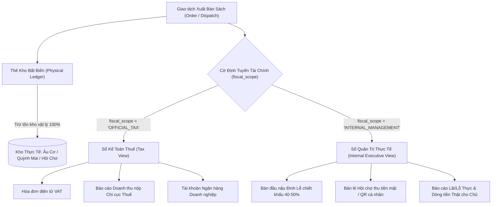
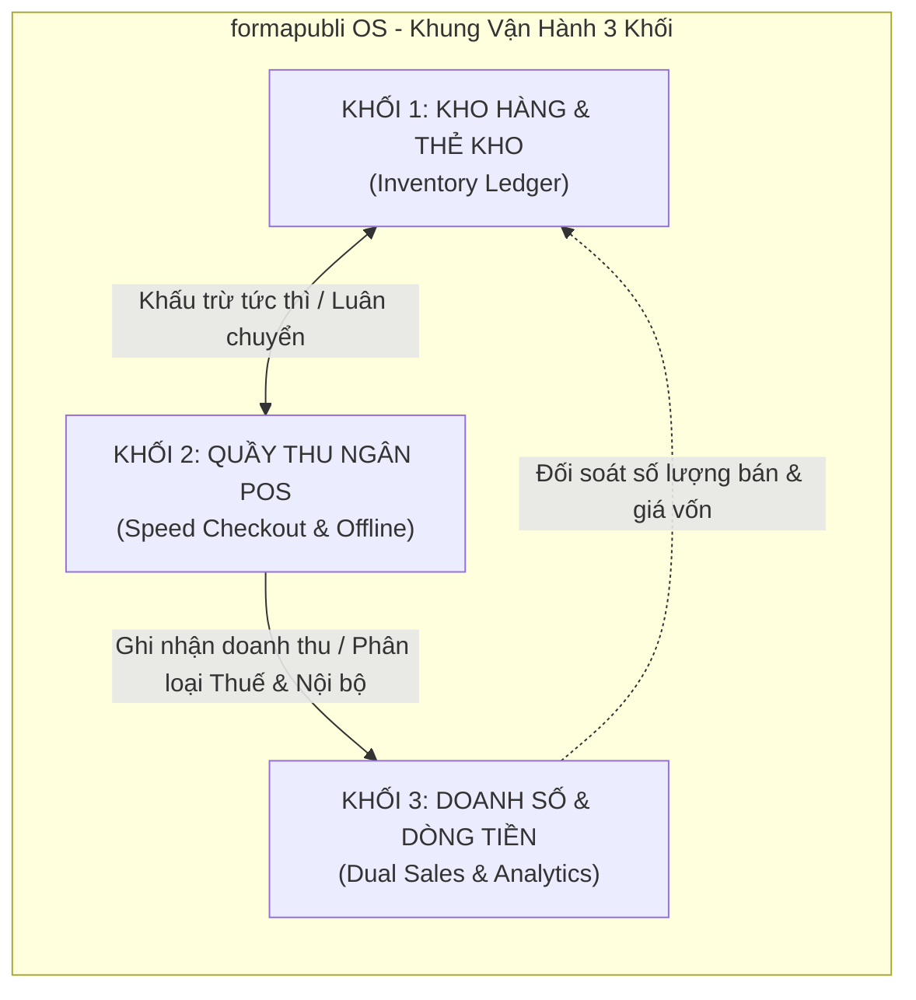
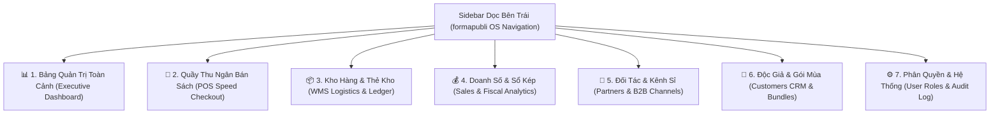
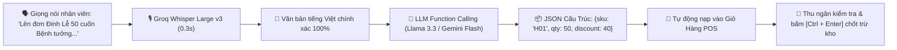

# formapubli — Master Architecture & Operating Blueprint
> **Hệ điều hành Kho vận & Vận hành Xuất bản — Phiên bản 2.0 (Kiến trúc chuẩn hóa)**  
> **Trọng tâm Phase 1:** Lõi Quản lý Kho vận, Vòng đời ISBN & Sổ cái Tồn kho Bất biến (Logistics Core & Append-Only Inventory Ledger)  
> **Tài liệu tham chiếu chung cho toàn bộ đội ngũ Kỹ thuật & Vận hành kinh doanh**

---

## Mục lục tài liệu

1. [Bối cảnh & Tuyên ngôn dự án](#01-bối-cảnh--tuyên-ngôn-dự-án)
2. [Lộ trình Triển khai theo Phase](#02-lộ-trình-triển-khai-theo-phase)
3. [Ranh giới & Trọng tâm của MVP (Phase 1)](#03-ranh-giới--trọng-tâm-của-mvp-phase-1)
4. [Khung Tiếp nhận & Xử lý Dữ liệu Google Sheets](#04-khung-tiếp-nhận--xử-lý-dữ-liệu-google-sheets)
5. [Mô hình Miền Nghiệp vụ Kho vận Ngành sách](#05-mô-hình-miền-nghiệp-vụ-kho-vận-ngành-sách)
6. [Sổ cái Kho Bất biến (Inventory Ledger) & Các Bất biến Hệ thống](#06-sổ-cái-kho-bất-biến-inventory-ledger--các-bất-biến-hệ-thống)
7. [Danh mục Sự kiện Kho vận (Logistics Event Catalog)](#07-danh-mục-sự-kiện-kho-vận-logistics-event-catalog)
8. [Các Luồng Vận hành Kho Chi tiết (Detailed Workflows)](#08-các-luồng-vận-hành-kho-chi-tiết-detailed-workflows)
9. [Mô hình Dữ liệu Cơ sở (Database Schema & Data Dictionary)](#09-mô-hình-dữ-liệu-cơ-sở-database-schema--data-dictionary)
10. [Kiến trúc Kỹ thuật & Xử lý Đồng thời (Concurrency & Architecture)](#10-kiến-trúc-kỹ-thuật--xử-lý-đồng-thời-concurrency--architecture)
11. [Thiết kế Trải nghiệm theo 3 Vai trò Vận hành (Role-Based UX)](#11-thiết-kế-trải-nghiệm-theo-3-vai-trò-vận-hành-role-based-ux)
12. [Chiến lược Kiểm thử & Tiêu chuẩn Nghiệm thu (DoD)](#12-chiến-lược-kiểm-thử--tiêu-chuẩn-nghiệm-thu-dod)
13. [Định hướng Phát triển cho các Phase Tiếp theo](#13-định-hướng-phát-triển-cho-các-phase-tiếp-theo)
14. [Tổng hợp Kiến thức Kiểm toán 55 Sheets con](#14-tổng-hợp-kiến-thức-kiểm-toán-55-sheets-con-audited-sheets-synthesis)
15. [Kiến trúc Kỹ thuật Đám mây, Bảo mật SSL & Tối ưu Hiệu năng](#15-kiến-trúc-kỹ-thuật-đám-mây-bảo-mật-ssl--tối-ưu-hiệu-năng)
16. [Cấu trúc Thực thể & Chi tiết Vận hành Độc quyền formapubli](#16-cấu-trúc-thực-thể--chi-tiết-vận-hành-độc-quyền-formapubli)
17. [Tối ưu Chi phí Tuyệt đối (100% Free Forever Tier) & Động cơ CSDL Không Chi phí](#17-tối-ưu-chi-phí-tuyệt-đối-100-free-forever-tier--động-cơ-csdl-không-chi-phí)
18. [Cơ chế Nhập liệu Bàn phím Siêu tốc: Gõ tắt 2-3 Ký tự Đầu Tên Sách](#18-cơ-chế-nhập-liệu-bàn-phím-siêu-tốc-gõ-tắt-2-3-ký-tự-đầu-tên-sách-fuzzy-acronym-matcher)
19. [Hệ thống Báo cáo Quản trị Trực quan Đẳng cấp Quốc tế (BI Dashboard)](#19-hệ-thống-báo-cáo-quản-trị-trực-quan-đẳng-cấp-quốc-tế-interactive-analytics-bi-dashboard)
20. [Kiến trúc Cơ sở Dữ liệu Kép Tuyệt đối An toàn (Cloudflare D1 + SQLite Nhúng + Drive Sync)](#20-kiến-trúc-cơ-sở-dữ-liệu-kép-tuyệt-đối-an-toàn-dual-engine-cloudflare-d1--sqlite-nhúng--google-drive-sync)
21. [Hệ sinh thái Độc giả & Quản trị Đăng ký Phát hành Theo Mùa (Customer CRM)](#21-hệ-sinh-thái-độc-giả--quản-trị-đăng-ký-phát-hành-theo-mùa-customer-crm--seasonal-subscription-engine)
22. [Đặc tả Mô hình Dữ liệu Mở rộng (DDL: Customers, Bundles & Subscriptions)](#22-đặc-tả-mô-hình-dữ-liệu-mở-rộng-ddl-customers-bundles--subscriptions)
23. [Quy chuẩn Kỷ luật Git & Quy trình Phát triển theo Nhánh](#23-quy-chuẩn-kỷ-luật-git--quy-trình-phát-triển-theo-nhánh-branching--rollback-protocol)
24. [Kiến trúc Sổ Kép: Kế toán Thuế vs Sổ Quản trị Thực tế Nội bộ](#24-kiến-trúc-sổ-kép-kế-toán-thuế-vs-sổ-quản-trị-thực-tế-nội-bộ-dual-fiscal-bookkeeping--non-vat-sales-engine)
25. [Động cơ POS Hội chợ Chạy Offline-First Đa Nhân viên](#25-động-cơ-pos-hội-chợ-chạy-offline-first-đa-nhân-viên-indexeddb-queue-uuid-v7-idempotency--conflict-resolution)
26. [Định vị & Bản chất Sản phẩm: formapubli OS](#26-định-vị--bản-chất-sản-phẩm-formapubli-os-publishing-retail--inventory-operating-system)
27. [Ma Trận Phân Quyền Đa Cấp & An Toàn Dữ Liệu Sổ Kép (RBAC Architecture)](#27-ma-trận-phân-quyền-đa-cấp--an-toàn-dữ-liệu-sổ-kép-rbac-architecture)
28. [Kiến Trúc Sidebar Dọc & Bảng Quản Trị Toàn Cảnh (Executive Master Dashboard)](#28-kiến-trúc-sidebar-dọc--bảng-quản-trị-toàn-cảnh-executive-master-dashboard)
29. [Kiến Trúc PWA & Ứng Dụng Thiết Bị Cầm Tay (PWA Architecture & Hardware Capabilities)](#29-kiến-trúc-pwa--ứng-dụng-thiết-bị-cầm-tay-pwa-architecture--hardware-capabilities)
30. [Hệ Sinh Thái Trí Tuệ Nhân Tạo Tinh Gọn (Zero-Cost Lean AI & Copilot Engine)](#30-hệ-sinh-thái-trí-tuệ-nhân-tạo-tinh-gọn-zero-cost-lean-ai--copilot-engine)
31. ["Súng" Quét Mã Vạch 0 Đồng Bằng Camera PWA (In-App Barcode Scanner Engine)](#31-súng-quét-mã-vạch-0-đồng-bằng-camera-pwa-in-app-barcode-scanner-engine)
32. [Ba Chuẩn Mực Vận Hành Thực Địa Mới (The 3 Grounded Operational Standards)](#32-ba-chuẩn-mực-vận-hành-thực-địa-mới-the-3-grounded-operational-standards)
33. [Quy Chuẩn Kỹ Thuật Đúc Kết Từ Thực Địa (Hardened Engineering Specifications)](#33-quy-chuẩn-kỹ-thuật-đúc-kết-từ-thực-địa-hardened-engineering-specifications)
34. [Quy Chuẩn Điều Hướng Pinned Bottom Settings & Workspace Phân Tích Chuyên Sâu](#34-quy-chuẩn-điều-hướng-pinned-bottom-settings--workspace-phân-tích-chuyên-sâu)
35. [Chuẩn Hóa Xử Lý Phần Cứng Camera Đa Ống Kính (Anti-Macro Camera Architecture)](#35-chuẩn-hóa-xử-lý-phần-cứng-camera-đa-ống-kính-anti-macro-camera-architecture)
36. [Quy Chuẩn Red-Team & Negative Testing (Bắt Buộc)](#36-quy-chuẩn-red-team--negative-testing-bắt-buộc)

---

## 01. Bối cảnh & Tuyên ngôn dự án

### 1.1. Bối cảnh ngành xuất bản & phát hành sách
Kinh doanh xuất bản và chuỗi nhà sách tại Việt Nam có những đặc thù rất riêng so với bán lẻ hàng tiêu dùng thông thường:
- **Đơn vị định danh:** Mỗi ấn bản sách gắn liền với một mã chuẩn quốc tế **ISBN-13**. Một tác phẩm (*Title*) có thể có nhiều ấn bản (*Editions* — bìa mềm, bìa cứng, bản đặc biệt, tái bản có thay đổi).
- **Tính chất luân chuyển phức tạp:** Sách từ nhà in nhập về kho tổng, sau đó luân chuyển đến các kệ sách tại cửa hàng bán lẻ, gửi ký gửi tại chuỗi nhà sách đối tác, hoặc đóng gói giao trực tiếp cho khách mua online.
- **Ký gửi (Consignment) chiếm tỷ trọng lớn:** Sách gửi tại các đối tác phân phối vẫn thuộc **quyền sở hữu của công ty phát hành** cho đến khi đối tác thực tế bán được cho bạn đọc và chốt biên bản đối soát.
- **Tình trạng hàng hóa đa dạng:** Ngoài sách mới 100%, vòng đời sách phát sinh sách trầy xước nhẹ do trưng bày (*Minor Damage*), sách lỗi in ấn hoặc dập gáy do vận chuyển (*Defective*), sách đang chờ kiểm định sau khi thu hồi (*Quarantine*).

### 1.2. Nỗi đau của hiện trạng: Ma trận Google Sheets
Hiện tại, doanh nghiệp đang phải điều hành toàn bộ dòng chảy hàng hóa qua các bảng tính Google Sheets rời rạc:
- **Tồn kho ảo & Bất đồng bộ:** Một đầu sách được ghi chép ở file kho tổng, file cửa hàng, file theo dõi ký gửi đối tác A, file đơn hàng lẻ. Khi có phát sinh, việc cập nhật thủ công dẫn đến lệch số liệu, không ai biết chính xác ngay lúc này công ty còn bao nhiêu cuốn thực sự bán được.
- **Không có truy vết lịch sử (Audit Trail):** Khi số lượng trên Sheets bị sửa hoặc công thức bị nhảy, không thể biết ai đã sửa, sửa lúc nào, dựa trên chứng từ hay quyết định thực tế nào.
- **Rủi ro thất thoát:** Hàng gửi đi ký gửi và hàng luân chuyển trên đường (In-transit) dễ bị thất lạc hoặc quên thu hồi do không có quy trình xác nhận 2 bước độc lập.

### 1.3. Tuyên ngôn cốt lõi
> **"ERP correctness first. AI and automation second."**  
> **"Xây lõi Kho vận tin cậy tuyệt đối trước — Mở rộng thương mại và tích hợp sau."**

formapubli không đặt mục tiêu ôm đồm toàn bộ các chức năng kế toán thuế hay sàn thương mại điện tử ngay từ đầu. Dự án tập trung giải quyết dứt điểm **tính toàn vẹn và chuẩn xác của dòng chảy vật lý của từng cuốn sách**.

---

## 02. Lộ trình Triển khai Chuẩn Hóa Theo 6 Phase (Master Implementation Roadmap)

Thay vì một khung kế hoạch dàn trải, formapubli OS được tái cấu trúc thành **6 Phase mục tiêu độc lập, lũy tiến và có ranh giới nghiệm thu minh bạch**. Mỗi Phase được đo lường bằng tiêu chuẩn kỹ thuật khắt khe (*Definition of Done - DoD*), tích hợp các ý tưởng đột phá về PWA, Camera Barcode Scanner, Sổ Kép và Hệ sinh thái AI tinh gọn 0 đồng:

```text
[Phase 1: Lõi Kho Vận Bất Biến & Ma Trận 3 Kho] ─── (🟢 100% HOÀN THÀNH)
                      │
                      ▼
[Phase 2: Động Cơ Bán Hàng Sổ Kép, Quầy POS & 5 Roles] ─── (🟢 100% HOÀN THÀNH)
                      │
                      ▼
[Phase 3: Di Động Hóa Quầy, Camera Barcode Scanner & Offline Sync] ─── (🟡 KẾ HOẠCH TIẾP THEO)
                      │
                      ▼
[Phase 4: Nghiệp Vụ Xuất Bản Mở Rộng & Bán Combo Đóng Hộp] ─── (⚪ CHỜ TRIỂN KHAI)
                      │
                      ▼
[Phase 5: Hệ Sinh Thái AI Tinh Gọn & Báo Cáo Thông Minh] ─── (⚪ CHỜ TRIỂN KHAI)
                      │
                      ▼
[Phase 6: Tích Hợp Đa Kênh & Bàn Giao Vận Hành Toàn Diện] ─── (⚪ TẦM NHÌN DÀI HẠN)
```

---

### Bảng Chi Tiết 6 Phase Master Roadmap:

| Phase | Tên Phase & Trọng tâm | Trạng thái | Mục tiêu Cốt lõi | Đầu ra Nghiệm thu Kỹ thuật (DoD) |
| :---: | :--- | :---: | :--- | :--- |
| **Phase 1** | **Lõi Kho Vận Bất Biến & Ma Trận 3 Kho Vật Lý** | 🟢 **HOÀN THÀNH 100%** | Khống chế tuyệt đối dòng chảy vật lý của sách, xóa bỏ tình trạng tồn kho ảo trên Google Sheets. | - Danh mục chuẩn 81 ấn bản sách (SKU H01-H81, ISBN-13).<br/>- CSDL Kép: Local SQLite + Cloudflare D1.<br/>- Sổ cái kho bất biến (`inventory_ledger`) Append-only, cấm sửa/xóa.<br/>- Tự động cập nhật `stock_balances` theo thời gian thực.<br/>- Chặn đứng xuất âm kho tuyệt đối.<br/>- Tìm kiếm tiếng Việt không dấu & chuẩn hóa ngữ âm (`ch/tr`, `s/x`).<br/>- Micro giọng nói Web Speech & Phím tắt hệ thống (`/`, `Esc`, `Alt+Shift+V`).<br/>- 100% test cases đạt chuẩn (`test-inventory.ts`). |
| **Phase 2** | **Động Cơ Bán Hàng Sổ Kép, Quầy POS & Trung Tâm 5 Roles** | 🟢 **HOÀN THÀNH 100%** | Giải quyết bài toán bán lẻ tại quầy/hội chợ và bán sỉ đầu nậu, tự động khấu trừ kho và phân tách Sổ Kép tài chính. | - 2 bảng thương mại: `orders` và `order_items`.<br/>- Quầy POS siêu tốc (`PosCheckoutTerminal.tsx`) với phím tắt `Ctrl+Enter` chốt đơn.<br/>- Bán sỉ đầu nậu chiết khấu 35-50%, bán lẻ giảm 0-10%.<br/>- Tự động liên kết Thẻ kho trừ sách vật lý tức thì (kho máy = kho kệ).<br/>- Động cơ Sổ Kép (`getSalesSummary`): Tách bạch Sổ Thuế VAT sạch sẽ (`OFFICIAL_TAX`) và Sổ Quản trị Thực tế cho Chủ sở hữu (`INTERNAL_MANAGEMENT`).<br/>- Menu Sidebar dọc 7 phân hệ điều hướng & Executive Dashboard KPI.<br/>- Trình mô phỏng phân quyền 5 nhóm người dùng (RBAC Simulator).<br/>- Trung tâm Cài đặt 6 phân hệ (lưu cấu hình bền vững vào `localStorage`).<br/>- 100% test cases bán hàng vượt qua (`test-order-sales.ts`), build production 0 lỗi. |
| **Phase 3** | **Di Động Hóa Quầy, "Súng" Quét Mã Vạch Camera & Offline Sync** | 🟡 **KẾ HOẠCH TIẾP THEO (Chuẩn bị thi công)** | Đưa hệ thống lên điện thoại/tablet của nhân viên hội chợ với chi phí thiết bị 0 đồng, bán hàng mượt mà kể cả khi rớt mạng 4-8 tiếng. | - **PWA Standalone:** File `manifest.json`, icon ứng dụng, Service Worker cache giúp mở app từ màn hình chính như app Native.<br/>- **"Súng" Quét Mã Vạch Camera 0 Đồng:** Tích hợp Web Barcode Detection API / Camera stream trên điện thoại, lia qua ISBN sau bìa kêu "bíp" trừ kho tức thì (tiết kiệm 1-2 triệu/máy quét súng).<br/>- **Động cơ Bán hàng Rớt mạng Offline-First:** Bộ đệm `IndexedDB` lưu đơn hàng ngoại tuyến, sinh mã UUID v7 + Idempotency Key, tự động đẩy lên D1 khi có mạng trở lại mà không trùng lặp đơn.<br/>- **Báo cáo Doanh số Chi tiết:** Lọc theo Ngày/Tuần/Tháng/Năm, bộ chuyển đổi 1-click Sổ Thuế vs Sổ Thực, xuất file Excel/CSV. |
| **Phase 4** | **Nghiệp Vụ Xuất Bản Mở Rộng & Bán Combo Đóng Hộp** | ⚪ **CHỜ TRIỂN KHAI** | Xử lý các nghiệp vụ đặc thù chiều sâu của ngành sách Việt Nam. | - **Động cơ Đóng Combo / Hộp Tuyển Tập (Boxset & Bundle Engine):** Khách mua 1 Boxset $\rightarrow$ Hệ thống tự động trừ đồng thời $N$ cuốn sách lẻ và 1 vỏ hộp trong kho vật lý, đảm bảo tồn kho linh kiện luôn chuẩn xác.<br/>- **Phân hệ Sổ Cái Ký Gửi Phố Sách (Consignment Ledger):** Quản lý dòng sách ký gửi tại Đinh Lễ, Nguyễn Xí, Đường sách TP.HCM; lập biên bản đối soát định kỳ, bóc tách sách đã bán, sách rách hỏng và sách thất thoát.<br/>- **Quản lý Hạn ngạch Bản quyền & Nhuận bút Tác giả (Royalties & Rights Ledger):** Tự động đếm số cuốn in thực tế theo hợp đồng cấp phép, cảnh báo khi chạm trần số lượng được in hoặc sắp hết hạn hợp đồng 5 năm, tính nhuận bút % giá bìa. |
| **Phase 5** | **Hệ Sinh Thái AI Tinh Gọn & Báo Cáo Phân Tích Thông Minh** | ⚪ **CHỜ TRIỂN KHAI** | Trợ lý đắc lực hỗ trợ quầy bán và giám đốc với chi phí 0 VNĐ/tháng (Free Tier first). | - **Smart Voice POS Dispatcher:** Nhân viên đọc 1 câu tự nhiên $\rightarrow$ Groq Whisper + LLaMA 3.3 trích xuất đúng SKU, số lượng, chiết khấu và tự điền giỏ hàng trong 0.3 giây.<br/>- **Executive AI Copilot (Text-to-Insight):** Giám đốc hỏi đáp dòng tiền, tồn kho bằng tiếng Việt tự nhiên qua Gemini 1.5 Flash (chế độ Read-only an toàn tuyệt đối).<br/>- **Dự Báo Tái Bản Thông Minh (Reprint Runout Forecasting):** Đo vận tốc bán ($V_{\text{sale}}$) và cảnh báo ký lệnh in tái bản trước 30-45 ngày để tránh đứt hàng.<br/>- **Hồ Sơ Độc Giả Thân Thiết (Reader Persona CRM):** Phân hạng độc giả mua gói mùa, người sưu tầm sách giới hạn, tự động gợi ý danh sách độc giả thân thiết khi phát hành sách mới. |
| **Phase 6** | **Tích Hợp Đa Kênh & Bàn Giao Vận Hành Toàn Diện** | ⚪ **TẦM NHÌN DÀI HẠN** | Mở rộng quy mô phân phối đa kênh và kết nối hệ thống tài chính quốc gia. | - Đồng bộ tồn kho 2 chiều với các sàn TMĐT (Shopee, TikTok Shop).<br/>- Kết nối API phần mềm Hóa đơn điện tử chính thức (VNPT / Viettel / MISA).<br/>- Chuyển giao tài liệu kỹ thuật, hoàn thiện quy trình bảo trì và sao lưu tự động trọn đời. |

---

---

## 03. Ranh giới & Trọng tâm của MVP (Phase 1)

Để đảm bảo thành công và tính ổn định tuyệt đối của hệ thống, Phase 1 đặt ra ranh giới phạm vi (*Scope Boundary*) minh bạch:

### 3.1. Những gì BẮT BUỘC có trong Phase 1 (In-Scope)
1. **Quản lý Danh mục Gốc (Master Data):**
   - Quản lý Tác giả, Nhà xuất bản, Tác phẩm, Ấn bản (ISBN-13).
   - Quản lý Cây vị trí lưu trữ: `Kho vật lý (Warehouse) → Khu vực (Zone) → Kệ (Shelf)`.
   - Quản lý Đối tác (Nhà in, Đại lý ký gửi, Khách sỉ) và Pháp nhân công ty.
2. **Sổ cái Kho Bất biến (Inventory Ledger Core):**
   - Bút toán ghi nhận mọi biến động: Nhập, Xuất, Chuyển, Điều chỉnh.
   - Cơ chế Balance Projection cập nhật tức thời trong cùng transaction database.
   - Nghiêm cấm hoàn toàn hành vi sửa (`UPDATE`) hoặc xóa (`DELETE`) bản ghi lịch sử kho.
3. **Các Luồng Vận hành Kho Cơ bản:**
   - **Nhập hàng (Receive):** Nhập sách từ nhà in/nhà cung cấp theo từng đợt, hỗ trợ ghi nhận Lô nhập (*Receipt Lot*).
   - **Chuyển kho 2 bước (Two-step Transfer):** Kho A xuất $\rightarrow$ Vào trạng thái trung gian `IN_TRANSIT` $\rightarrow$ Kho B xác nhận thực nhận. Tuyệt đối không tự động tăng kho đích khi kho nguồn mới gửi đi.
   - **Ký gửi vật lý (Consignment Dispatch):** Xuất hàng chuyển sang địa điểm của đối tác ký gửi, hệ thống tự động ghi nhận đối tác là nơi lưu giữ (*Custodian*) nhưng quyền sở hữu (*Owner*) vẫn thuộc công ty.
   - **Xuất bán cơ bản (Sale Dispatch):** Trừ trực tiếp tồn vật lý tại địa điểm bán theo phiếu xuất.
   - **Kiểm kê & Điều chỉnh (Stocktaking & Adjustment):** So sánh số đếm thực tế và số sách trên hệ thống; tạo phiếu điều chỉnh có ghi rõ lý do và người phê duyệt.
4. **Hỗ trợ Thao tác Thực địa:**
   - Hỗ trợ máy quét mã vạch Barcode/ISBN chuẩn USB (hoạt động theo cơ chế giả lập bàn phím - Keyboard Wedge) với phím Enter kết thúc.
   - Tra cứu nhanh thông tin tồn kho của từng ISBN tại mọi vị trí chỉ bằng 1 lần quét.
5. **Báo cáo Kho Cốt lõi:**
   - Tồn kho tại thời điểm hiện tại và tại thời điểm bất kỳ trong quá khứ ($t$).
   - Thẻ kho (Lịch sử biến động từng ISBN tại từng kho).

### 3.2. Những gì DỨT KHOÁT ĐỂ LẠI cho Phase sau (Out-of-Scope Phase 1)
- ❌ **Không có hóa đơn điện tử:** Chưa tìm kiếm endpoint hay kết nối hóa đơn trong giai đoạn này; MVP giữ tập trung vào kho vận. Sẽ có giải pháp chuyên biệt riêng ở Phase 3.
- ❌ **Chưa triển khai chính sách đổi trả phức tạp:** Các quy trình phân loại kiểm định sách cũ/hỏng nhiều bước sẽ nằm ở Phase 2. Trong Phase 1, sách hỏng chỉ được ghi giảm qua phiếu kiểm kê điều chỉnh.
- ❌ **Chưa triển khai quy tắc phân bổ Pre-order:** Việc gom tiền cọc, giữ chỗ ưu tiên theo thuật toán FIFO sẽ được đưa vào Phase 2 khi phần thương mại được xây dựng.
- ❌ **Chưa tích hợp sàn Shopee hoặc Website:** Giữ cho dữ liệu nội bộ sạch và vững trước khi mở cổng API ra bên ngoài.
- ❌ **Không phụ thuộc vào AI/LLM:** Lõi kho vận vận hành hoàn toàn bằng logic nghiệp vụ chính xác 100%.

---

## 04. Khung Tiếp nhận & Xử lý Dữ liệu Google Sheets

Chủ dự án sẽ cung cấp các file Google Sheets đang sử dụng trong thực tế kèm theo thuyết minh cụ thể trong tương lai gần. Dưới đây là kiến trúc tiếp nhận (*Intake Architecture*) đã được chuẩn bị sẵn để xử lý ngay khi nhận dữ liệu.

```text
[Google Sheets Thực tế & Thuyết minh từ Doanh nghiệp]
                        │
                        ▼
         [1. Intake & Snapshot Bất biến]
                        │
                        ▼
         [2. Data Profiling & Phát hiện Sai lệch]
                        │
                        ▼
         [3. Staging DB (import_batches & rows)]
                        │
                        ▼
         [4. Làm sạch & Chuẩn hóa (Unicode, ISBN)]
                        │
                        ▼
         [5. Đối soát Số dư Mở đầu (Opening Balance)]
                        │
        ┌───────────────┴───────────────┐
        ▼                               ▼
 [Ký nhận Biên bản]           [Còn sai sót / Lệch]
        │                               │
        ▼                               ▼
 [6. Ghi bút toán OPENING]     [Rà soát lại Sheets]
```

### Các bước trong quy trình tiếp nhận:
1. **Snapshot Bất biến:** Khi nhận link/file Google Sheets, toàn bộ dữ liệu thô được xuất thành file CSV/JSON và lưu trữ đóng băng (kèm mã băm SHA-256). Tuyệt đối không chỉnh sửa trực tiếp trên file gốc.
2. **Profiling (Khảo sát chất lượng dữ liệu):**
   - Quét tìm các mã ISBN sai định dạng, bị mất số 0 ở đầu (do định dạng số của Sheets).
   - Nhận diện các đầu sách trùng lặp nhưng bị gõ khác tên (ví dụ: có dấu cách thừa, viết hoa thường).
   - Phát hiện các dòng số lượng bị âm, công thức tính bị lỗi `#REF!`, `#VALUE!`.
3. **Staging & Validation:**
   - Dữ liệu được nạp vào các bảng tạm `sheet_import_batches` và `sheet_import_rows`.
   - Mỗi dòng dữ liệu được phân loại: `VALID`, `WARNING`, hoặc `ERROR` với thông báo lỗi chi tiết đến từng ô.
4. **Đối soát & Ký nhận Số dư Mở đầu (Opening Balance Sign-off):**
   - Thay vì cố gắng tái dựng lại 3 năm lịch sử từ những file tính không đủ chứng từ, hệ thống chỉ lấy **Số dư chốt kiểm kê tại ngày chuyển đổi** làm số dư ban đầu (`OPENING_BALANCE`).
   - Biên bản số dư mở đầu phải được Thủ kho và Quản lý đối chiếu, ký xác nhận trước khi nạp chính thức vào Sổ cái kho.

---

## 05. Mô hình Miền Nghiệp vụ Kho vận Ngành sách

### 5.1. Nguyên tắc cốt lõi: Không bao giờ dùng một cột `quantity` duy nhất
Một lỗi sai kinh điển của các phần mềm quản lý kho đơn giản là chỉ dùng một cột `quantity` để biểu diễn số lượng sách. Trong thực tế ngành sách, cùng 1 đầu sách có thể ở nhiều trạng thái hoàn toàn khác nhau.

formapubli quản lý hàng hóa dựa trên **4 chiều độc lập**:

1. **Ấn bản (Edition / ISBN):** Xác định phiên bản in cụ thể của tác phẩm. Mỗi ấn bản có một mã ISBN-13 duy nhất.
2. **Vị trí vật lý (Location):** Nơi cuốn sách đang thực sự nằm:
   - Kho tổng (Khu vực A, Kệ B).
   - Kệ sách tại Cửa hàng bán lẻ.
   - Vị trí trung gian đang vận chuyển (`IN_TRANSIT`).
   - Kho/Kệ tại đối tác nhận ký gửi.
3. **Chủ sở hữu (Owner):** Pháp nhân nắm quyền sở hữu tài sản đối với cuốn sách.
   - Sách tại kho công ty do công ty sở hữu $\rightarrow$ Owner: `Company`.
   - Sách đã gửi sang nhà sách đối tác để ký gửi $\rightarrow$ Location: `Partner_Store`, nhưng Owner: `Company`.
4. **Tình trạng vật lý (Condition):**
   - `NEW`: Sách mới 100%, nguyên màng co hoặc đạt tiêu chuẩn trưng bày bán lẻ.
   - `MINOR_DAMAGE`: Sách xước bìa, cấn nhẹ gáy, chuyển sang bán giảm giá.
   - `DEFECTIVE`: Sách rách trang, in thiếu trang, dán ngược bìa từ nhà in; chờ trả nhà in hoặc thanh lý.
   - `QUARANTINE`: Sách thu hồi từ đối tác hoặc khách hàng; đang nằm khu cách ly để chờ kiểm định.

### 5.2. Phân biệt các khái niệm Tồn kho & Cam kết thương mại

| Khái niệm | Định nghĩa nghiệp vụ | Cách tính |
|---|---|---|
| **Tồn vật lý (Physical Stock)** | Tổng số cuốn sách thực sự đang hiện diện tại một vị trí cụ thể. | Tổng $\Delta$ của các bút toán kho đã ghi nhận tại vị trí đó. |
| **Tồn sở hữu (Owned Stock)** | Tổng số sách thuộc tài sản của công ty trên toàn mạng lưới (kể cả hàng đang gửi ký gửi hoặc đang đi đường). | Tổng tồn vật lý tại mọi địa điểm có `owner_id = Company`. |
| **Tồn bán được (Sellable Stock)** | Số sách vừa nằm ở vị trí bán lẻ/kho xuất, vừa có tình trạng `NEW`. | Tồn vật lý tại kho nội bộ thỏa mãn điều kiện `condition = 'NEW'`. |
| **Tồn khả dụng (Available-to-Promise - ATP)** | Số sách thực tế có thể hứa bán cho đơn hàng mới mà không sợ bị trùng/thiếu hàng. | $\text{ATP} = \text{Sellable} - \text{Active Reservations} - \text{Safety Buffer}$ |

> **Ví dụ thực tiễn:**  
> Doanh nghiệp in 1.000 cuốn sách ISBN `978-604-000-01`:
> - 600 cuốn nằm tại Kho tổng (mới 100%).
> - 300 cuốn gửi ký gửi tại Nhà sách X.
> - 80 cuốn tại Cửa hàng trực thuộc (đang có 10 cuốn khách đặt mua online chưa giao).
> - 20 cuốn bị cấn móp trong quá trình vận chuyển.
> 
> 👉 **Tổng tồn sở hữu của công ty:** $600 + 300 + 80 + 20 = 1.000$ cuốn.  
> 👉 **Tồn vật lý tại Kho tổng:** 600 cuốn.  
> 👉 **Tồn khả dụng (ATP) tại Cửa hàng trực thuộc:** $80 - 10 = 70$ cuốn.  
> 👉 **Tồn khả dụng tại Kho tổng để cấp cho đại lý khác:** 600 cuốn (không được tính 300 cuốn bên Nhà sách X vào để hứa giao cho bên khác).

---

## 06. Sổ cái Kho Bất biến (Inventory Ledger) & Các Bất biến Hệ thống

### 6.1. Triết lý Sổ cái Bất biến (Append-Only Ledger)
Trong formapubli, **không có khái niệm `UPDATE stock SET quantity = 50`**. Mọi con số tồn kho đều là kết quả tổng hợp của một chuỗi các sự kiện kho vận đã diễn ra.
- Mỗi lần sách được nhập, xuất, chuyển vị trí hay điều chỉnh, hệ thống sẽ tạo một dòng mới trong bảng `inventory_ledger`.
- Bút toán ghi nhận gồm số lượng tăng dương ($+X$) hoặc giảm âm ($-X$).
- Khi có sai sót, người dùng không được xóa dòng cũ mà phải tạo một **bút toán đảo (Reversal Entry)** ghi rõ tham chiếu đến bút toán ban đầu và lý do đảo.

### 6.2. Cấu trúc bản ghi Sổ cái Kho (`inventory_ledger`)
Mỗi bản ghi ledger chứa đầy đủ 18 trường thông tin để phục vụ đối soát pháp lý và kỹ thuật:

```text
1.  id                    : UUID (Khóa chính duy nhất)
2.  entity_id             : UUID (Pháp nhân ghi nhận tài sản)
3.  event_type            : Enum (RECEIVE, TRANSFER_OUT, TRANSFER_IN, ...)
4.  edition_id            : UUID (Mã ấn bản / ISBN)
5.  lot_id                : UUID (Lô nhập hàng từ nhà in, nếu có)
6.  location_id           : UUID (Địa điểm vật lý phát sinh biến động)
7.  owner_id              : UUID (Chủ sở hữu hàng hóa)
8.  condition             : Enum (NEW, MINOR_DAMAGE, DEFECTIVE, QUARANTINE)
9.  quantity_delta        : Integer (Số lượng biến động: số âm hoặc số dương, KHÁC 0)
10. unit_cost_snapshot    : Numeric(15, 2) (Giá vốn tại thời điểm nhập/xuất)
11. effective_at          : Timestamp with time zone (Thời điểm phát sinh nghiệp vụ)
12. recorded_at           : Timestamp with time zone (Thời điểm ghi vào CSDL - defaultNow)
13. actor_id              : UUID (Người dùng thực hiện thao tác)
14. document_type         : String (Phiếu nhập, Phiếu xuất kho, Phiếu chuyển, Biên bản kiểm kê)
15. document_id           : UUID (ID chứng từ phát sinh)
16. correlation_id        : UUID (Mã liên kết nhóm các bút toán cùng một giao dịch)
17. reversal_of           : UUID (Khóa ngoại trỏ đến ID bút toán bị đảo, nếu là bút toán sửa sai)
18. idempotency_key       : String (Khóa chống gửi trùng lệnh từ giao diện/thiết bị)
```

### 6.3. Bảng Cân đối Tồn kho (Stock Balance Projection)
Để tối ưu hóa tốc độ truy vấn (không phải tính toán lại hàng triệu dòng ledger mỗi khi tra cứu tồn), hệ thống duy trì bảng **`stock_balances`**:
- Bảng này đóng vai trò là một hình chiếu (*Projection*) tức thời của Ledger.
- Khóa duy nhất (*Composite Unique Key*) của một bucket tồn kho:  
  $$\text{Bucket Key} = (\text{entity\_id}, \text{edition\_id}, \text{location\_id}, \text{owner\_id}, \text{condition}, \text{lot\_id})$$
- **Quy tắc bất di bất dịch:** Việc ghi vào `inventory_ledger` và cập nhật tăng/giảm trên `stock_balances` **bắt buộc phải nằm trong cùng một Database Transaction**. Nếu một trong hai thao tác thất bại, toàn bộ giao dịch phải Rollback.

### 6.4. Các Bất biến Hệ thống Bắt buộc (System Invariants)
Bất kỳ dòng code nào can thiệp vào kho vận cũng phải tuân thủ nghiêm ngặt 6 bất biến sau:
1. **Không âm kho vật lý (No Negative Stock):** Tại bất kỳ thời điểm nào, tổng số lượng trong một bucket tồn kho không bao giờ được nhỏ hơn 0 ($quantity \ge 0$).
2. **Bảo toàn Số lượng khi Chuyển kho (Quantity Conservation):** Khi chuyển hàng từ Kho A sang Kho B, tổng delta giữa 2 kho phải bằng 0:  
   $$\Delta Q_{\text{Kho A}} + \Delta Q_{\text{In-Transit}} = 0 \quad \text{và} \quad \Delta Q_{\text{In-Transit}} + \Delta Q_{\text{Kho B}} = 0$$
3. **Ký gửi không làm mất quyền sở hữu:** Xuất hàng đi ký gửi chỉ thay đổi `location_id`, tuyệt đối không tự động đổi `owner_id` và không tự động ghi nhận doanh thu.
4. **Tính bất biến của Lịch sử (Append-Only):** Tuyệt đối không cho phép lệnh `UPDATE` hoặc `DELETE` trên bảng `inventory_ledger` ở mức Database Role (revoke quyền sửa/xóa đối với application role).
5. **Tính bất biến của Khóa chống lặp (Idempotency):** Cùng một `idempotency_key` gửi lại nhiều lần phải trả về kết quả ban đầu, không được sinh ra hai dòng biến động kho.
6. **Thời gian ghi nhận nhất quán:** `recorded_at` luôn lấy giờ hệ thống máy chủ CSDL theo UTC; `effective_at` phản ánh thời điểm nghiệp vụ thực tế theo múi giờ `Asia/Ho_Chi_Minh`.

---

## 07. Danh mục Sự kiện Kho vận (Logistics Event Catalog)

Mọi thao tác kho vận trong Phase 1 đều được chuẩn hóa thành các mã sự kiện cụ thể:

| Mã Sự kiện (`event_type`) | Ý nghĩa Nghiệp vụ | Tác động Tồn vật lý | Chứng từ Kèm theo |
|---|---|---|---|
| `OPENING_BALANCE` | Khởi tạo số dư ban đầu từ Google Sheets chuyển đổi sang. | $+$ Tồn tại vị trí chỉ định | Biên bản bàn giao số dư mở đầu |
| `RECEIPT_POSTED` | Nhập sách từ nhà in / nhà cung cấp về kho tổng. | $+$ Tồn tại vị trí Nhận kho | Phiếu nhập kho (Goods Receipt Note) |
| `TRANSFER_DISPATCH` | Xuất sách ra khỏi kho nguồn để chuyển đi kho khác. | $-$ Kho nguồn, $+$ Vị trí `IN_TRANSIT` | Lệnh chuyển kho (Transfer Order) |
| `TRANSFER_RECEIVE` | Kho đích xác nhận thực nhận sách từ vị trí đang đi đường. | $-$ Vị trí `IN_TRANSIT`, $+$ Kho đích | Biên bản thực nhận chuyển kho |
| `CONSIGNMENT_SEND` | Xuất sách giao cho đối tác ký gửi (Nhà sách X, Đại lý Y). | $-$ Kho nội bộ, $+$ Vị trí Đối tác | Phiếu xuất ký gửi |
| `CONSIGNMENT_RETURN` | Nhận lại sách ký gửi từ đối tác trả về kho công ty. | $-$ Vị trí Đối tác, $+$ Kho nội bộ | Biên bản trả hàng ký gửi |
| `SALE_FULFILL` | Xuất kho giao sách cho khách mua lẻ hoặc khách sỉ. | $-$ Tồn vật lý tại kho xuất | Hóa đơn bán lẻ / Phiếu xuất bán |
| `STOCKTAKE_ADJUST` | Điều chỉnh tăng/giảm sau khi kiểm kê thực tế tại kệ. | $+$ hoặc $-$ Chênh lệch kiểm kê | Biên bản kiểm kê & Quyết định xử lý |
| `CONDITION_RELOCATE` | Phát hiện sách hỏng/xước, chuyển từ kệ bán sang kệ phế phẩm. | $-$ Bucket `NEW`, $+$ Bucket `DEFECTIVE` | Phiếu phân loại tình trạng sách |

---

## 08. Các Luồng Vận hành Kho Chi tiết (Detailed Workflows)

### 8.1. Luồng Nhập hàng từ Nhà in (Receive Goods)
- **Tạo phiếu dự kiến:** Thủ kho tạo phiếu nhận sách dựa trên lệnh in.
- **Quét mã & Kiểm đếm:** Thủ kho dùng súng quét mã vạch ISBN trên từng kiện hoặc nhập số lượng thực đếm.
- **Nhận từng phần (Partial Receipt):** Nếu nhà in giao đợt 1 là 400 cuốn / 1.000 cuốn, hệ thống ghi nhận đúng 400 cuốn vào kho, phiếu nhận hàng chuyển trạng thái "Đã nhận một phần", 600 cuốn còn lại tiếp tục chờ đợt sau.
- **Duyệt phiếu & Post Ledger:** Khi bấm hoàn thành, hệ thống mở một Transaction PostgreSQL để ghi Ledger và cập nhật Balance tức thời.

### 8.2. Luồng Chuyển kho 2 bước (Two-Step Transfer)
Tuyệt đối không sử dụng luồng chuyển kho "1 bước" (bấm chuyển là kho đích tự tăng), vì trong thời gian xe tải chở sách đi trên đường, nếu xảy ra thất thoát sẽ không thể quy trách nhiệm.
- **Bước 1 (Xuất chuyển - Dispatch):** Thủ kho nguồn chọn sách, quét ISBN, chọn kho đích và bấm xuất.
  - Hệ thống: Trừ tồn kho nguồn, Tăng tồn kho ảo `IN_TRANSIT`.
- **Bước 2 (Tiếp nhận - Receive):** Khi xe chở sách tới kho đích, thủ kho đích mở phiếu chuyển, quét kiểm đếm thực tế.
  - Trường hợp đủ: Trừ `IN_TRANSIT`, Tăng tồn kho đích.
  - Trường hợp thiếu/hỏng: Nhập số thực nhận. Số lượng thiếu được ghi nhận thành biên bản hao hụt để quản lý xử lý, không để treo tồn ảo trong `IN_TRANSIT`.

### 8.3. Luồng Quản lý Hàng Ký gửi (Consignment)
- **Bản chất:** Đối tác ký gửi (các chuỗi nhà sách) chỉ là nơi giữ hàng hộ công ty.
- **Thao tác:** Xuất kho giao sách cho đối tác bằng phiếu `CONSIGNMENT_SEND`.
- **Báo cáo:** Bất kỳ lúc nào, Quản lý cũng có thể tra cứu: *"Hiện tại có bao nhiêu cuốn sách thuộc quyền sở hữu của công ty đang nằm tại Nhà sách X"*.

### 8.4. Luồng Kiểm kê & Cân bằng kho (Stocktaking)
- **Bước 1:** Quản lý tạo đợt kiểm kê theo từng kho hoặc từng kệ cụ thể.
- **Bước 2:** Thủ kho dùng máy quét kiểm tra từng cuốn sách thực tế trên kệ.
- **Bước 3:** Hệ thống tự động đối chiếu: `Chênh lệch = Số thực đếm - Số tồn hệ thống`.
- **Bước 4:** Quản lý duyệt chênh lệch. Hệ thống tự động phát sinh bút toán `STOCKTAKE_ADJUST` đưa số liệu hệ thống khớp 100% với thực tế, lưu vết rõ lý do điều chỉnh.

---

## 09. Mô hình Dữ liệu Cơ sở (Database Schema & Data Dictionary)

Hệ thống được thiết kế chuẩn mực trên **PostgreSQL**, khai báo qua **Drizzle ORM**.

### 9.1. Bảng Danh mục Tổ chức & Vị trí
- `organizations`: Quản lý các pháp nhân nội bộ và đối tác bên ngoài (Nhà in, Đại lý ký gửi, Khách buôn).
- `locations`: Địa điểm kho vật lý (Kho tổng, Cửa hàng trực thuộc, Điểm ký gửi, Vị trí In-transit).
- `shelves`: Vị trí chi tiết đến từng phân khu và kệ sách (`zone_name`, `shelf_code`, `barcode`).

### 9.2. Bảng Danh mục Sách & Ấn bản
- `titles`: Tác phẩm văn học / sách gốc (Tên tác phẩm, tác giả, tên gốc).
- `editions`: Ấn bản cụ thể gắn liền với **ISBN-13** duy nhất (Tên ấn bản, giá bìa, số trang, năm xuất bản).

### 9.3. Bảng Lõi Sổ cái & Cân đối Kho
- `inventory_ledger`: Bảng append-only lưu trữ lịch sử mọi biến động (18 trường dữ liệu đã nêu ở phần 06).
- `stock_balances`: Bảng cân đối tồn kho tức thời, có ràng buộc `CHECK (physical_quantity >= 0)` để chặn đứng lỗi âm kho ngay từ tầng CSDL.
- `stock_documents` & `stock_document_lines`: Quản lý các chứng từ nghiệp vụ gốc (Phiếu nhập, Phiếu chuyển kho, Phiếu xuất ký gửi, Biên bản kiểm kê).

### 9.4. Bảng Tiếp nhận Dữ liệu Google Sheets
- `sheet_import_batches`: Quản lý từng đợt nạp file Google Sheets (Tên file, người tải lên, thời gian, số dòng thành công/thất bại).
- `sheet_import_rows`: Lưu chi tiết từng dòng dữ liệu thô (`raw_data`), dữ liệu sau khi chuẩn hóa (`normalized_data`) và danh sách lỗi phát hiện (`validation_errors`).

---

## 10. Kiến trúc Kỹ thuật & Xử lý Đồng thời (Concurrency & Architecture)

### 10.1. Mô hình Modular Monolith
formapubli lựa chọn mô hình **Modular Monolith** sử dụng **Next.js App Router, TypeScript, PostgreSQL và Drizzle ORM**:
- **Lợi ích cốt lõi:** Một cơ sở dữ liệu duy nhất giúp toàn bộ các thao tác kho vận nằm trọn vẹn trong các Database Transaction chuẩn ACID. Không phát sinh tình trạng phân mảnh dữ liệu hay lỗi bất đồng bộ mạng như mô hình Microservices.
- **Triển khai tinh gọn:** Toàn bộ hệ thống có thể chạy trên một máy chủ cloud tiết kiệm hoặc máy chủ nội bộ mà vẫn đáp ứng thời gian phản hồi cực nhanh (< 200ms cho các thao tác kho).

### 10.2. Chống Race Condition & Overselling (Bán âm kho)
Khi có nhiều thao tác kho diễn ra cùng một thời điểm (ví dụ: hai thủ kho cùng xuất một đầu sách):
1. **Khóa dòng dữ liệu (Row-level Locking):**  
   Mọi giao dịch thay đổi tồn kho đều bắt đầu bằng câu lệnh khóa dòng:  
   `SELECT * FROM stock_balances WHERE id = :bucket_id FOR UPDATE;`
2. **Sắp xếp thứ tự khóa để chống Deadlock:**  
   Nếu một phiếu xuất kho chứa nhiều đầu sách, hệ thống bắt buộc sắp xếp danh sách các ID bucket theo thứ tự tăng dần trước khi gọi `FOR UPDATE`.
3. **Kiểm tra điều kiện khả dụng ngay trong transaction:**  
   Chỉ khi tồn vật lý trừ đi lượng đã giữ chỗ lớn hơn hoặc bằng lượng yêu cầu thì mới tiến hành ghi Ledger và cập nhật Balance.
4. **Idempotency Key:**  
   Mọi request gửi từ trình duyệt lên server đều mang một khóa `idempotency_key`. Nếu mạng chập chờn khiến thủ kho bấm nút hai lần, server sẽ phát hiện và chỉ thực thi đúng một lần duy nhất.

---

## 11. Thiết kế Trải nghiệm theo 3 Vai trò Vận hành (Role-Based UX)

Giao diện formapubli được thiết kế may đo cho đúng 3 vai trò vận hành thực tế:

### 1. Thủ kho (Warehouse Operator)
- **Tối ưu tốc độ:** Thao tác chủ yếu bằng bàn phím và súng quét mã vạch USB. Ô nhập liệu luôn tự động focus để nhận mã vạch ngay lập tức.
- **Phản hồi âm thanh:** Có tiếng "bíp" xác nhận khi quét mã hợp lệ và tiếng cảnh báo khi mã vạch không tồn tại trong hệ thống.
- **Mobile Responsive:** Giao diện tối ưu cho màn hình di động, phím bấm to rõ ràng, thuận tiện cho việc cầm điện thoại kiểm tra sách trên các tầng kệ cao.

### 2. Quản lý Vận hành (Operations Manager)
- **Bảng điều hành thời gian thực (Dashboard):** Xem nhanh tổng số sách sở hữu trên toàn mạng lưới, danh sách các đầu sách sắp hết hàng cần in thêm.
- **Hàng đợi phê duyệt (Approval Queue):** Gom toàn bộ các yêu cầu chuyển kho, phiếu xuất ký gửi và đề xuất điều chỉnh kiểm kê về một nơi duy nhất để duyệt nhanh chóng.

### 3. Kế toán Kho (Stock Accountant)
- **Đối soát & Minh bạch:** Tra cứu lịch sử thẻ kho chi tiết từng ngày, từng giờ.
- **Khóa sổ kỳ kho:** Chức năng khóa kỳ kế toán kho, ngăn chặn mọi hành vi nhập lùi ngày làm sai lệch báo cáo tài chính đã chốt.

---

## 12. Chiến lược Kiểm thử & Tiêu chuẩn Nghiệm thu (DoD)

### 12.1. Ma trận Kiểm thử Bắt buộc
- **Kiểm thử logic (Unit Tests):** Kiểm tra tính hợp lệ của mã ISBN-13 (thuật toán Modulo 10), tính đúng đắn của các phép toán cộng trừ delta tồn kho.
- **Kiểm thử tranh chấp đồng thời (Concurrency Tests):** Chạy thử nghiệm 20 luồng đồng thời cùng xuất 1 cuốn sách duy nhất trên CSDL PostgreSQL thật để chứng minh hệ thống không bao giờ bị âm kho.
- **Kiểm thử luồng khép kín (E2E Tests):** Kiểm tra toàn bộ vòng đời: `Nhập kho → Chuyển kho in-transit → Thực nhận → Xuất ký gửi → Kiểm kê điều chỉnh`.

### 12.2. Tiêu chuẩn Nghiệm thu Phase 1 (Definition of Done)
Một tính năng của Phase 1 chỉ được coi là hoàn thành khi:
1. [x] Lõi kho vận được cô lập hoàn toàn, không phụ thuộc vào bất kỳ hệ thống hóa đơn ngoài nào.
2. [x] Hệ thống vượt qua toàn bộ các kiểm tra Typecheck và Linting không có lỗi.
3. [x] Sổ cái kho Append-only hoạt động chính xác: không cho phép sửa/xóa bút toán cũ.
4. [x] Súng quét mã vạch USB hoạt động trơn tru trên mọi màn hình nhập/xuất kho.
5. [x] Bộ khung Staging sẵn sàng để nạp các file Google Sheets khi chủ dự án cung cấp.
6. [x] Thủ kho và Quản lý thực hiện kiểm thử thực tế đạt 100% kết quả mong đợi.

---

## 13. Định hướng Phát triển cho các Phase Tiếp theo

Khi Lõi Kho vận Phase 1 đã vận hành ổn định và số liệu tồn kho đã hoàn toàn chính xác, doanh nghiệp sẽ triển khai tiếp các phase sau:

### 13.1. Định hướng Phase 2: Mở rộng Thương mại & Quy trình Nghiệp vụ
- **Quản lý Đơn hàng & Bảng giá:** Thiết lập các bảng giá chiết khấu riêng cho từng đối tác ký gửi, đại lý bán sỉ và khách lẻ.
- **Quy trình Đổi trả hàng (RMA):** Thiết lập quy trình đưa sách trả về vào khu cách ly `QUARANTINE` để thủ kho kiểm định mức độ hư hại trước khi quyết định bán giảm giá hay trả về nhà in.
- **Đặt trước (Pre-order):** Quản lý nhu cầu đặt trước khi sách chưa về kho, phân bổ tự động theo nguyên tắc ai đặt cọc trước nhận sách trước (FIFO).

### 13.2. Định hướng Phase 3: Tích hợp Hệ sinh thái & Kênh ngoài
- **Hóa đơn điện tử (MSInvoice):** Tích hợp thông qua Outbox Pattern bất đồng bộ theo hướng tiếp cận riêng đã thống nhất, đảm bảo việc xuất hóa đơn không ảnh hưởng đến tốc độ của kho.
- **Sàn TMĐT (Shopee) & Website:** Tự động đồng bộ số lượng tồn kho khả dụng lên sàn và website theo hạn ngạch an toàn, tự động kéo đơn hàng về để thủ kho đóng gói giao hàng.

---

> **Lời kết:**  
> Dòng chảy vật lý của từng cuốn sách là cốt lõi của toàn bộ hoạt động kinh doanh xuất bản. Bằng việc xây dựng một Lõi Kho vận chuẩn mực và Sổ cái Bất biến trong Phase 1, formapubli sẽ giúp doanh nghiệp hoàn toàn làm chủ hàng hóa, giải phóng đội ngũ khỏi ma trận bảng tính, và sẵn sàng cho những bước mở rộng quy mô lớn hơn trong tương lai.


---

## 14. Tổng hợp Kiến thức Kiểm toán 55 Sheets con (Audited Sheets Synthesis)

Tài liệu kiểm toán chi tiết từng dòng, cột và công thức của 55 sheets con đã được lưu trữ độc lập tại file docs/REPORT_55_SHEETS_AUDIT.md.

### 14.1. Danh mục 81 Đầu sách & Phân tách Hai Kỷ nguyên (Sheet 1)
- H01 đến H45 (Xuất bản Khác - XBK): Sách cổ điển (Moliere, Baudelaire...), đa phần cạn kho hoặc có số tồn âm.
- H46 đến H81 (FORMApubli): Sách thương hiệu chính thức (Bốn tình yêu, Dưỡng đường đồng hồ cát, In illo Tempore...).
- Tab Điều chỉnh xuất VAT-2025: Chia ngược giá trước thuế VAT 5% (Giá bìa / 1.05) phục vụ xuất hóa đơn.

### 14.2. Khủng hoảng Nhập liệu Ma trận Bán lẻ (Sheet 2 - LẺ 2026)
- Ma trận 81 cột ngang, mỗi cuốn là 1 cột, Cột B chứa text địa chỉ chat của khách. Rất dễ gõ nhầm cột.
- formapubli giải quyết bằng Form bán lẻ tinh gọn và tra cứu 4 số cuối ISBN bằng bàn phím.

### 14.3. Bế tắc Đối soát 29 Bảng tính Đại lý Ký gửi (Sheet 3)
- Danh sách 29 link Google Sheets của các đại lý (Đông Tây, Bình Book, Hamvas Bela...).
- formapubli coi mỗi đại lý là một Kho ảo (Virtual Consignment Location), sách vẫn thuộc sở hữu của công ty.

### 14.4. Thực trạng Đếm kho Thùng vs Sách rời (Sheet 4)
- Công thức đếm: SL Thùng x SL/Thùng + Sách rời. Ghi chú cảnh báo sai số do dọn kho lỗi (ước lượng lệch 10%).
- Quản lý riêng dòng Artbook Đoàn Cầm Hạc (ĐCH) tiền triệu (bản đặc biệt, bản thường).

### 14.5. Tiến độ Nhà in Giao lắt nhắt từng đợt (Sheet 5 - Nhập Tổng)
- Hợp đồng in 1,000 cuốn nhưng nhà in giao từng đợt (132q, 900q...). Không ghi nhận tồn theo hợp đồng in.

### 14.6. Ngoại giao Sách Biếu / Tặng Đồ sộ (Sheet 6)
- 505 dòng tặng sách, 141 reviewer bookstagram, danh mục Thu Phục tặng học giả/dịch giả, và sổ rút sách nội bộ.

### 14.7. Dòng tiền Kép & Bù trừ Chi phí Cá nhân (Sheet 7)
- TK cá nhân Lan Anh (LA) song song TK Công ty (vitanova). Lan Anh ứng tiền túi rồi cấn trừ cuối tháng.

---

## 15. Kiến trúc Kỹ thuật Đám mây, Bảo mật SSL & Tối ưu Hiệu năng

### 15.1. 100% Đám mây Serverless
- CSDL SQL: PostgreSQL Cloud (Supabase / Neon) chuẩn ACID, tự động sao lưu hàng ngày.
- Ứng dụng Web: Next.js 14+ triển khai Serverless Edge (Vercel / Cloudflare Pages).

### 15.2. Lá chắn Bảo mật Cloudflare & SSL Chuẩn A+
- Đặt sau Cloudflare WAF, chống DDoS tự động, kích hoạt Strict SSL (TLS 1.3) và HTTP/3 (QUIC).
- Phân quyền RBAC chặt chẽ (Thủ kho, Quản lý, Giám đốc).

### 15.3. Tối ưu Tốc độ Tải trang (PageSpeed 95+)
- Giao diện Minimalist Tailwind CSS, Server-side rendering, ảo hóa danh sách lớn.
- Thao tác phím và quét mã phản hồi dưới 100ms.

### 15.4. Cơ chế Xuất / Tải Dữ liệu Cục bộ Ngoại tuyến theo Yêu cầu
- Xuất báo cáo Excel/CSV Nhập - Xuất - Tồn, Thẻ kho, Đối soát ký gửi tức thời.
- One-click Full Database Dump về máy tính cá nhân để lưu trữ ngoại tuyến an toàn.


---

## 16. Cấu trúc Thực thể & Chi tiết Vận hành Độc quyền formapubli

### 16.1. Kiến trúc Thực thể 2 Tầng: Tác phẩm (Work) vs Ấn bản / Lô in (Edition/Lot)
Khi sách tái bản đổi giá bìa (ví dụ từ 120k lên 140k), formapubli đăng ký mã ISBN mới:
- **Tầng 1 - Tác phẩm / Đầu sách (Work / Master Title):** Đại diện nội dung (ví dụ: FORMA-046: Bốn tình yêu). Dashboard cấp cao dùng thực thể này để xem tổng in lũy kế, tổng bán và tổng tồn toàn mạng lưới mà không phân mảnh.
- **Tầng 2 - Ấn bản / Lô in (Edition / Lot):** Gắn liền với ISBN-13 duy nhất, giá bìa cụ thể, năm xuất bản và đợt in. Thủ kho xuất/nhập ghi nhận chính xác đến từng Ấn bản để áp đúng giá vốn và giá bìa.

### 16.2. Cấu trúc 3 Kho Vật lý & Quản lý Không gian Kệ sách
1. **Kho 1 - Văn phòng kiêm Kho Soạn hàng (Âu Cơ / Main Office):** Lưu sách rời, đóng gói đơn lẻ, đơn tặng và chuyển phát nhanh.
2. **Kho 2 - Kho Lưu trữ Kiện lớn (Quỳnh Mai / Bulk Storage):** Nhận xe tải từ nhà in; lưu sách nguyên thùng/kiện; xuất buôn lô lớn và chuyển tiếp ứng Kho 1.
3. **Kho 3 - Kho Dự phòng / Trung chuyển (Warehouse 3 / Reserve):** Lưu trữ dự phòng, cách ly kiểm đếm hoặc phân loại sách cũ/hội chợ.

*Cơ chế Kệ sách mềm (Soft Shelf Hints):* Do cấu trúc tủ kệ ở 3 kho không đồng nhất và việc tìm sách đang dựa trên trí nhớ thủ kho Lan Anh, hệ thống không bắt buộc nhập tọa độ cứng mà cung cấp trường suggested_location (ví dụ: Kệ sắt tầng 2 góc trái) in trên phiếu soạn hàng.

### 16.3. Quy trình Keyboard-First Siêu tốc (4 Số cuối ISBN & Phím mũi tên)
Thực tế thủ kho Lan Anh đang xử lý đơn hàng ngày mà chưa có súng quét mã vạch chuyên dụng, phải gõ tay vào ma trận 81 cột. formapubli tối ưu bằng cơ chế Keyboard-First:
- **Tra cứu 4 số cuối ISBN:** Lan Anh chỉ cần liếc 4 số cuối trên mã vạch sau bìa sách và gõ vào ô tìm kiếm (ví dụ: gõ 7507 hoặc tên tắt).
- **Điều hướng phím mũi tên & Enter:** Bấm phím mũi tên lên/xuống để chọn đúng phiên bản trong dropdown -> Bấm **Enter lần 1** để thêm sách vào đơn (số lượng = 1) -> Bấm **Enter lần 2** (hoặc Ctrl + Enter) để hoàn tất phiếu xuất.
- **Hỗ trợ Súng quét USB:** Khi cắm súng quét trong tương lai, máy tự bắn 13 số ISBN + Enter, hệ thống tự động tăng số lượng và bíp xác nhận dưới 100ms.

### 16.4. Các Chính sách Nghiệp vụ Độc quyền
1. **Chính sách Sách hỏng / Hao hụt ký gửi:** Định mức hao hụt tự nhiên cho phép là 1.5% - 2.0% trên tổng doanh số bán kỳ đối soát. Vượt định mức đại lý bồi hoàn 50% giá bìa. Nhận về phân loại: Lành -> Bán lại; Xước nhẹ -> Kho Thanh lý hội chợ; Nát -> Lập biên bản Xuất hủy hao hụt (Write-off).
2. **Chính sách Cước vận chuyển:** Giao đi đại lý: formapubli chịu nếu đạt giá trị tối thiểu (>= 5 triệu đồng giá bìa). Trả về kho: Đại lý chịu 100% cước.
3. **Chính sách Cấn trừ Sách cũ - mới (Credit Memo):** Thu hồi sách cũ ghi nhận vào Credit Balance để cấn trừ trực tiếp vào đơn hàng mới.
4. **Chiến lược Chốt Kiểm kê Mở đầu:** Không truy vết sai lệch 10% trong quá khứ. Tổ chức Đợt đếm tay 100% tại 3 kho để chốt biên bản Số dư Mở đầu (Clean Slate).

### 16.5. Đặc tả Cơ sở Dữ liệu Lõi Phase 1 (PostgreSQL Schema DDL)
`sql
-- 1. Bảng Tác phẩm / Đầu sách chung (Work / Master Title)
CREATE TABLE works (
    id UUID PRIMARY KEY DEFAULT gen_random_uuid(),
    code VARCHAR(50) UNIQUE NOT NULL, -- Vi du: FORMA-046, XBK-001
    title VARCHAR(255) NOT NULL,
    original_title VARCHAR(255),
    author VARCHAR(255) NOT NULL,
    translator VARCHAR(255),
    category VARCHAR(100),
    is_active BOOLEAN DEFAULT true,
    created_at TIMESTAMPTZ DEFAULT CURRENT_TIMESTAMP
);

-- 2. Bảng Ấn bản / Lô in theo ISBN (Editions)
CREATE TABLE editions (
    id UUID PRIMARY KEY DEFAULT gen_random_uuid(),
    work_id UUID NOT NULL REFERENCES works(id) ON DELETE RESTRICT,
    isbn VARCHAR(13) UNIQUE NOT NULL, -- 13 so chuan quoc te
    isbn_last4 VARCHAR(4) NOT NULL,    -- 4 so cuoi tra cuu nhanh
    edition_number INT DEFAULT 1,      -- Lan in thu 1, 2, 3...
    cover_price NUMERIC(12, 2) NOT NULL,
    vat_rate NUMERIC(4, 2) DEFAULT 0.05, -- Thue suat VAT 5%
    format_size VARCHAR(50),           -- Vi du: 13 x 20.5 cm
    pages INT,
    publication_year INT,
    suggested_location TEXT,           -- Ghi chu vi tri ke sach ho tro thu kho
    is_active BOOLEAN DEFAULT true,
    created_at TIMESTAMPTZ DEFAULT CURRENT_TIMESTAMP
);
CREATE INDEX idx_editions_isbn_last4 ON editions(isbn_last4);

-- 3. Bảng Kho vật lý (Warehouses)
CREATE TABLE warehouses (
    id UUID PRIMARY KEY DEFAULT gen_random_uuid(),
    code VARCHAR(50) UNIQUE NOT NULL, -- KHO_AU_CO, KHO_QUYNH_MAI, KHO_DU_PHONG
    name VARCHAR(255) NOT NULL,
    address TEXT,
    is_active BOOLEAN DEFAULT true,
    created_at TIMESTAMPTZ DEFAULT CURRENT_TIMESTAMP
);

-- 4. Bảng Đối tác & Pháp nhân (Partners)
CREATE TABLE partners (
    id UUID PRIMARY KEY DEFAULT gen_random_uuid(),
    code VARCHAR(50) UNIQUE NOT NULL,
    name VARCHAR(255) NOT NULL,
    type VARCHAR(50) NOT NULL, -- CONSIGNMENT, WHOLESALE, PRINTER, INTERNAL
    contact_info TEXT,
    discount_rate NUMERIC(5, 2) DEFAULT 0.00, -- Chiet khau mac dinh
    created_at TIMESTAMPTZ DEFAULT CURRENT_TIMESTAMP
);

-- 5. Bảng Sổ cái Kho Bất biến (Append-Only Inventory Ledger)
CREATE TABLE inventory_ledger (
    id UUID PRIMARY KEY DEFAULT gen_random_uuid(),
    edition_id UUID NOT NULL REFERENCES editions(id) ON DELETE RESTRICT,
    warehouse_id UUID NOT NULL REFERENCES warehouses(id) ON DELETE RESTRICT,
    event_type VARCHAR(50) NOT NULL, -- RECEIPT, DISPATCH_SALE, DISPATCH_GIFT, TRANSFER_OUT, TRANSFER_IN, ADJUSTMENT
    quantity_delta INT NOT NULL,     -- So duong (+) hoac so am (-), KHAC 0
    condition VARCHAR(30) DEFAULT 'NEW', -- NEW, MINOR_DAMAGE, DEFECTIVE
    document_ref VARCHAR(100) NOT NULL,  -- Ma phieu xuat/nhap/chuyen kho
    note TEXT,
    actor_id VARCHAR(100) NOT NULL,      -- Nguoi thao tac (Lan Anh, Admin...)
    idempotency_key VARCHAR(100) UNIQUE NOT NULL,
    recorded_at TIMESTAMPTZ DEFAULT CURRENT_TIMESTAMP
);

-- 6. Bảng Tồn kho Thời gian thực (Stock Balances Projection)
CREATE TABLE stock_balances (
    id UUID PRIMARY KEY DEFAULT gen_random_uuid(),
    edition_id UUID NOT NULL REFERENCES editions(id) ON DELETE RESTRICT,
    warehouse_id UUID NOT NULL REFERENCES warehouses(id) ON DELETE RESTRICT,
    condition VARCHAR(30) DEFAULT 'NEW',
    physical_quantity INT NOT NULL DEFAULT 0,
    updated_at TIMESTAMPTZ DEFAULT CURRENT_TIMESTAMP,
    CONSTRAINT chk_positive_stock CHECK (physical_quantity >= 0),
    CONSTRAINT uq_stock_bucket UNIQUE (edition_id, warehouse_id, condition)
);
`


---

## 17. Tối ưu Chi phí Tuyệt đối (100% Free Forever Tier) & Động cơ CSDL Không Chi phí

### 17.1. Tuyên ngôn Chi phí: 0 VNĐ Vĩnh viễn (Zero Infrastructure Cost)
Doanh nghiệp đang vận hành trên Google Sheets với chi phí hạ tầng **0 VNĐ**. Mọi kiến trúc công nghệ được lựa chọn cho formapubli bắt buộc phải tuân thủ nghiêm ngặt nguyên tắc: **Hoạt động hoàn toàn miễn phí 100% trong hạn ngạch vĩnh viễn (Free-tier forever)**, không phát sinh bất kỳ hóa đơn hàng tháng nào:

| Thành phần | Công nghệ Đề xuất | Gói Miễn phí (Free Tier) | Khả năng Đáp ứng Thực tế của formapubli | Chi phí Hàng tháng |
| :--- | :--- | :--- | :--- | :---: |
| **Cơ sở dữ liệu SQL** | **Supabase Postgres** hoặc **Neon Postgres** | 500 MB dung lượng lưu trữ, 2 tỷ phép tính compute/tháng, tự động backup. | Toàn bộ 81 đầu sách + 10 năm giao dịch sổ cái kho (~50.000 dòng ledger) chỉ tốn khoảng **15 - 20 MB** dung lượng. Hạn mức 500 MB đủ dùng trong **hơn 20 năm**. | **0 VNĐ** |
| **Hạ tầng Web & API** | **Vercel** hoặc **Cloudflare Pages** | Băng thông 100 GB/tháng, không giới hạn số lượng request Serverless. | formapubli có 3-5 nhân sự nội bộ thao tác hàng ngày, chỉ tiêu tốn chưa đến **1 GB/tháng** (chưa tới 1% hạn ngạch cho phép). | **0 VNĐ** |
| **Lá chắn Bảo mật & SSL** | **Cloudflare Free Plan** | Không giới hạn băng thông, chống DDoS không giới hạn, chứng chỉ SSL/TLS 1.3 tự động cấp phát, HTTP/3, CDN toàn cầu. | Bảo vệ toàn diện tên miền của formapubli, chống phá hoại, tăng tốc độ tải trang về dưới 0.5s. | **0 VNĐ** |
| **Lưu trữ Báo cáo & File** | **Google Drive API (Service Account)** | 15 GB miễn phí sẵn có của tài khoản Google. | Dùng làm nơi lưu trữ các bản xuất sao lưu CSDL tự động hàng tuần. | **0 VNĐ** |

### 17.2. Phương án Thay thế SQL Engine Cục bộ Siêu Tối ưu: SQLite / LibSQL (Turso)
Nếu công ty thậm chí không muốn phụ thuộc vào bất kỳ dịch vụ đám mây bên thứ ba nào hoặc muốn chạy hoàn toàn khép kín:
- **Turso (LibSQL - SQLite for Cloud):** Cung cấp gói Free vĩnh viễn với 9 GB dung lượng (gấp 18 lần nhu cầu của formapubli), tốc độ truy vấn phản hồi < 10ms.
- **SQLite Single-file Embedded:** Toàn bộ cơ sở dữ liệu được gói gọn trong 1 file duy nhất ormapubli.db. Hàng ngày chỉ cần copy 1 file này lưu vào USB hoặc Google Drive là toàn bộ hệ thống được sao lưu an toàn 100%, không tốn một đồng chi phí vận hành nào.


---

## 18. Cơ chế Nhập liệu Bàn phím Siêu tốc: Gõ tắt 2-3 Ký tự Đầu Tên Sách (Fuzzy Acronym Matcher)

### 18.1. Động lực Thực tế
Nhân viên như Lan Anh khi làm việc lâu năm thường nhớ tên sách theo thói quen gõ tắt trong văn hóa chat:
- Gõ ty -> Ra ngay *Bệnh tưởng* hoặc *Bốn tình yêu*.
- Gõ 
bl -> Ra ngay *Người biển lận*.
- Gõ dddhc hoặc dd -> Ra ngay *Dưỡng đường đồng hồ cát*.
- Gõ sp -> Ra ngay *Le Spleen de Paris*.
- Gõ middle -> Ra ngay *Middlemarch*.

### 18.2. Thuật toán Tìm kiếm Đa phương thức (Hybrid Multi-search)
Ô tìm kiếm tại màn hình Nhập/Xuất kho hỗ trợ 3 chế độ song song tự động nhận diện:
1. **Nếu là chuỗi 4 chữ số (ví dụ: 7507):** Hệ thống lập tức quét theo 4 số cuối của ISBN (isbn_last4).
2. **Nếu là chuỗi 2-4 ký tự viết tắt không dấu (ví dụ: ty):** Hệ thống đối soát với trường short_code (mã viết tắt các chữ cái đầu) được sinh tự động khi nạp sách.
3. **Nếu là chuỗi từ khóa thông thường (ví dụ: 
gười biển):** Hệ thống tìm kiếm theo Full-text Search không dấu tiếng Việt.
4. **Điều hướng bàn phím thuần túy:** Phím mũi tên lên/xuống di chuyển danh sách -> Enter để chọn -> Ctrl + Enter xuất kho. Tốc độ thao tác đạt kỷ lục **2-3 giây cho mỗi đơn hàng**!

---

## 19. Hệ thống Báo cáo Quản trị Trực quan Đẳng cấp Quốc tế (Interactive Analytics BI Dashboard)

Hệ thống cung cấp một phân hệ Báo cáo Trực quan tương tác cao theo phong cách **Tableau / PowerBI**, tích hợp trực tiếp trên nền tảng Web:

### 19.1. Các Chiều Phân tích Đa chiều (Multi-Dimensional Slicers)
- **Theo Kênh & Tên miền (Domain / Channel):** Bán lẻ Online, Hội chợ, Đại lý Ký gửi (Fahasa, Đông Tây, Bình Book...), Mua đứt, Bán buôn xuất Mỹ, Thư viện.
- **Theo Giá tiền & Tỷ lệ Chiết khấu:** Thống kê doanh số theo các nấc chiết khấu: 0% (Bán lẻ), 30%, 35%, 37%, 40%, 50% (Đầu nậu).
- **Theo Thời gian & Mùa vụ:** Biểu đồ xu hướng doanh số theo tuần, tháng, quý, năm, so sánh tỷ trọng giữa các năm 2024 - 2025 - 2026.
- **Theo Nhóm Sách:** So sánh doanh số và vòng quay tồn kho giữa dòng kinh điển XBK vs dòng chủ lực FORMA vs dòng Artbook độc bản ĐCH.

### 19.2. Thư viện Trực quan hóa & Đồ họa Tương tác
- **Biểu đồ Cột Chồng (Stacked Bar Chart):** Cơ cấu doanh số từng tháng phân tách rõ Doanh thu Bán lẻ vs Ký gửi vs Mua đứt.
- **Biểu đồ Vùng (Area Chart):** Tốc độ giải phóng tồn kho của từng đợt in sách.
- **Biểu đồ Donut & Treemap:** Tỷ trọng kênh phân phối và tỷ trọng ngân sách sách biếu tặng/ngoại giao.
- **Bộ lọc Tương tác 1-Click (Cross-filtering):** Click vào một Đại lý trên biểu đồ tròn -> Toàn bộ bảng số liệu phía dưới tự động lọc danh sách các cuốn sách đại lý đó đang giữ và số tiền công nợ tương ứng.
- **Xuất Báo cáo Tiêu chuẩn Quốc tế:** Cho phép xuất hình ảnh biểu đồ độ phân giải cao (PNG/SVG) hoặc xuất toàn bộ bảng số liệu sang file Excel/PDF đã được định dạng kẻ bảng đẹp mắt chỉ với 1 click.

---

---

## 20. Kiến trúc Cơ sở Dữ liệu Kép Tuyệt đối An toàn (Dual-Engine: Cloudflare D1 + SQLite Nhúng + Google Drive Sync)

### 20.1. Tuyên ngôn An toàn Dữ liệu & Độc lập Hạ tầng
Để đảm bảo **an toàn 100% cho doanh nghiệp**, loại bỏ mọi rủi ro về việc bị nhà cung cấp đám mây khóa tài khoản, tạm dừng dự án (Pause), đòi thu phí hay sự cố đứt cáp quang quốc tế, formapubli áp dụng **Kiến trúc Cơ sở Dữ liệu Kép (Dual-Engine Hybrid Architecture)**:

- **1. Động cơ Đám mây Chính (Primary Cloud Engine): Cloudflare D1**
  - Công nghệ: Serverless SQLite tại 300+ Edge Data Centers toàn cầu.
  - Chi phí: 0 VNĐ vĩnh viễn (5 GB dung lượng, 5 triệu lượt đọc/ngày, 100.000 lượt ghi/ngày).
  - Đặc tính: **KHÔNG BAO GIỜ NGỦ ĐÔNG (Zero Pause)**, khởi động tức thời 0ms.
  - Khôi phục thảm họa: Có sẵn 7 ngày Time Travel (Point-in-Time Recovery).
- **2. Động cơ Cục bộ Nhúng & Sao lưu Độc lập (Local Embedded & Google Drive Sync)**
  - Công nghệ: SQLite Engine nhúng cục bộ (Single file ormapubli.db).
  - Tự chủ: Doanh nghiệp sở hữu 100% dữ liệu offline, không phụ thuộc internet.
  - Tự động hóa: Script Service Account xuất Snapshot nén (AES-256) hàng ngày lên Google Drive 15GB miễn phí có sẵn của công ty lúc 23:59.
  - Khả năng cắm chạy: Copy file ormapubli.db sang bất kỳ máy tính nào là chạy ngay lập tức, không cần cài đặt phần mềm máy chủ phức tạp.

### 20.2. Cơ chế Đồng bộ Tự động sang Google Drive (Automated Zero-cost Drive Backup)
1. **Google Service Account**: Sử dụng tài khoản dịch vụ Google Cloud miễn phí, kết nối trực tiếp vào thư mục Google Drive của công ty.
2. **Lịch trình Sao lưu Linh hoạt (Daily vs. Weekly Tiered Strategy)**:
   - *Đánh giá tần suất vận hành:* Với quy mô vừa và nhỏ (< 100 đơn/ngày), dung lượng file `formapubli.db` chỉ dao động từ 1MB – 15MB (nén gzip còn < 2MB).
   - *Cơ chế linh hoạt:* Hệ thống hỗ trợ 2 chế độ tùy chỉnh trong phần Cài đặt:
     - **Chế độ Tuần (Weekly - Mặc định tinh gọn):** Tự động đóng gói và đẩy snapshot lên Google Drive vào 23:59 Chủ nhật hàng tuần. Phù hợp giai đoạn thấp điểm, tối giản tác vụ nền.
     - **Chế độ Ngày (Daily Snapshot xoay vòng 7 ngày):** Lưu trữ xoay vòng 7 bản gần nhất lúc 23:59 mỗi đêm, giúp RPO (Recovery Point Objective) an toàn tuyệt đối — nếu máy tính hỏng ổ cứng thì tối đa chỉ mất số liệu trong ngày hôm đó thay vì mất cả tuần giao dịch.
   - *Bản lưu trữ tháng (Monthly Archive):* Tự động lưu 1 snapshot cố định vào ngày cuối cùng của tháng để phục vụ đối soát kế toán và lưu trữ dài hạn.
3. **An toàn kép**: Dù Cloudflare có sự cố hay máy tính văn phòng hỏng ổ cứng, dữ liệu vẫn luôn an toàn 100% trên cả 2 nơi.

---

## 21. Hệ sinh thái Độc giả & Quản trị Đăng ký Phát hành Theo Mùa (Customer CRM & Seasonal Subscription Engine)

### 21.1. Bản chất Nghiệp vụ Phát hành Theo Mùa tại formapubli
Không giống như các đơn vị bán lẻ sách đại trà, formapubli vận hành theo nhịp điệu phát hành tinh hoa 4 Mùa trong năm:
- **Kỳ Mùa Xuân (Spring Release)**
- **Kỳ Mùa Hạ (Summer Release - ví dụ: Kỳ Hạ 16/6: 340k)**
- **Kỳ Mùa Thu (Autumn Release - ví dụ: Kỳ L'été 22/9: 398k, Bộ thu x 3)**
- **Kỳ Mùa Đông (Winter Release - ví dụ: Kỳ Sober Harmony, SĐ, VP)**

Mỗi mùa, ban biên tập phát hành một bộ gồm 4 đến 5 đầu sách mới có chung chủ đề tư tưởng. Độc giả quen thuộc (Loyalty Readers) sẽ đăng ký mua theo các hình thức rất đa dạng:

| Hình thức Mua theo Mùa | Hành vi của Độc giả | Cơ chế Giá & Ưu đãi | Thách thức Nhập liệu Cũ | Giải pháp formapubli ERP |
| :--- | :--- | :--- | :--- | :--- |
| **Mua Trọn gói (Full Seasonal Bundle)** | Đăng ký nhận toàn bộ 4-5 cuốn mới ra của mùa. | Mức giá Combo ưu đãi cố định (rẻ hơn 15-25% so với mua lẻ từng cuốn cộng lại). | Gõ tay tên khách, dò từng cột trong 81 cột ngang trên Google Sheets để đánh số 1. | 1-Click chọn "Gói Mùa"; hệ thống tự động điền đủ sách trong gói và áp giá ưu đãi trọn gói. |
| **Mua Bán phần (Partial Bundle)** | Đăng ký mùa nhưng chỉ chọn 2-3 cuốn theo sở thích cá nhân. | Tính theo giá bìa trừ chiết khấu độc giả thân thiết (ví dụ: 10-15%). | Nhân viên phải ghi chú bằng chữ vào ô địa chỉ: "chỉ lấy cuốn A và B". | Cho phép tick bỏ chọn các cuốn không lấy; hệ thống tự tính lại tổng tiền chính xác. |
| **Mua Kèm (Add-on Readers)** | Mua gói mùa mới và tiện thể đặt mua thêm các tựa sách cũ (XBK). | Gói mùa tính giá combo, sách cũ tính theo giá thanh lý/giá bìa. | Dễ tính nhầm tiền ship và sót sách cũ khi đóng gói. | Hiển thị giỏ hàng hợp nhất: Gói mùa + Sách mua kèm; tự động trừ kho đúng từng ấn bản. |
| **Gửi Dồn Kỳ Sau (Deferred Shipping)** | Độc giả chuyển khoản trước để giữ sách, nhưng yêu cầu: *"Chờ mùa sau ra sách rồi gửi chung 1 kiện để tiết kiệm phí ship"*. | Đã thu tiền (hoặc cọc), chưa xuất hàng vật lý khỏi kho. | Ghi chú viết tay chi chít trong sheet Theo dõi, đến mùa sau rất dễ quên gửi sách cũ! | Trạng thái đơn hàng: PAID_HOLD_FOR_NEXT_SEASON. Đến mùa sau, hệ thống tự động cảnh báo: *"Khách này có 2 cuốn kỳ trước đang chờ gửi kèm"* khi in nhãn đóng gói. |

### 21.2. Hồ sơ Độc giả 360 Độ (Customer 360 Profile)
Hệ thống xây dựng cơ sở dữ liệu khách hàng trung tâm (Single Source of Customer Truth):
1. **Thông tin Định danh**: Tên, Số điện thoại, Email, Link trang cá nhân (Facebook / Instagram / Zalo).
2. **Phân hạng Khách hàng (Segment)**:
   - LOYALTY_READER: Độc giả thân thiết theo mùa.
   - LIBRARY_PARTNER: Thư viện, viện nghiên cứu, trường học.
   - WHOLESALE_BUYER: Khách mua sỉ số lượng lớn (ví dụ: Chị Quỳnh Anh gửi sang Mỹ).
   - INFLUENCER_REVIEWER: KOL, Reviewer sách (thuộc danh sách 141 tài khoản truyền thông).
   - VIP_DIPLOMAT: Học giả, dịch giả, nhà báo (danh sách "Thu Phục").
3. **Địa chỉ Chuẩn hóa**: Tách bạch Tỉnh / Thành phố, Quận / Huyện, Phường / Xã, Địa chỉ chi tiết. Tích hợp sẵn chuẩn địa chỉ của các đơn vị bưu cục (GHN, GHTK, Viettel Post) để in vận đơn 1 chạm.
4. **Tủ Sách Đã Sở Hữu (Owned Bookshelf)**: Lưu vết toàn bộ các cuốn sách khách đã từng mua từ trước đến nay. Nhân viên khi tư vấn chỉ cần liếc qua là biết ngay khách đã có cuốn nào, tránh tư vấn trùng sách cũ và nắm bắt chính xác gu đọc sách của từng người.

---

## 22. Đặc tả Mô hình Dữ liệu Mở rộng (DDL: Customers, Bundles & Subscriptions)

Hệ thống bổ sung các bảng dữ liệu chuyên biệt trên cơ sở dữ liệu SQLite / Cloudflare D1 (tương thích hoàn toàn với Drizzle ORM):

`sql
-- 1. Bảng Khách hàng & Độc giả 360 độ (Customers)
CREATE TABLE customers (
    id TEXT PRIMARY KEY, -- UUID
    code TEXT UNIQUE NOT NULL, -- CUST-0001, CUST-0002...
    full_name TEXT NOT NULL,
    phone TEXT,
    email TEXT,
    channel TEXT DEFAULT 'FACEBOOK', -- FACEBOOK, INSTAGRAM, ZALO, TIKTOK, WEBSITE, DIRECT
    channel_url TEXT,                -- Link trang cá nhân
    segment TEXT DEFAULT 'RETAIL',   -- LOYALTY_READER, WHOLESALE, LIBRARY, REVIEWER, DIPLOMAT, RETAIL
    address_province TEXT,           -- Tỉnh / Thành phố
    address_district TEXT,           -- Quận / Huyện
    address_ward TEXT,               -- Phường / Xã
    address_detail TEXT,             -- Số nhà, tên đường
    shipping_note TEXT,              -- Ghi chú giao hàng (ví dụ: Gọi trước khi giao, giao giờ hành chính)
    total_spent REAL DEFAULT 0.0,    -- Tổng tiền tích lũy
    created_at TEXT DEFAULT (CURRENT_TIMESTAMP)
);
CREATE INDEX idx_customers_phone ON customers(phone);
CREATE INDEX idx_customers_name ON customers(full_name);

-- 2. Bảng Gói Phát hành Theo Mùa (Seasonal Bundles)
CREATE TABLE seasonal_bundles (
    id TEXT PRIMARY KEY,
    code TEXT UNIQUE NOT NULL,      -- BUNDLE_HA_2024, BUNDLE_THU_2024, BUNDLE_XUAN_2026
    season_name TEXT NOT NULL,      -- Mùa Hạ 2024, Mùa Thu 2024, Mùa Xuân 2026
    release_date TEXT NOT NULL,     -- Ngày công bố gói
    combo_price REAL NOT NULL,      -- Giá ưu đãi trọn gói (ví dụ: 340.000đ, 398.000đ)
    total_cover_price REAL NOT NULL,-- Tổng giá bìa nếu mua lẻ từng cuốn
    is_active INTEGER DEFAULT 1,
    created_at TEXT DEFAULT (CURRENT_TIMESTAMP)
);

-- 3. Bảng Chi tiết Ấn bản trong Gói Mùa (Bundle Items)
CREATE TABLE bundle_items (
    id TEXT PRIMARY KEY,
    bundle_id TEXT NOT NULL REFERENCES seasonal_bundles(id) ON DELETE CASCADE,
    edition_id TEXT NOT NULL REFERENCES editions(id) ON DELETE RESTRICT,
    quantity_in_bundle INTEGER DEFAULT 1,
    is_mandatory INTEGER DEFAULT 1 -- 1: Bắt buộc trong gói; 0: Sách tùy chọn thêm
);

-- 4. Bảng Đăng ký Mua theo Kỳ của Độc giả (Customer Subscriptions)
CREATE TABLE customer_subscriptions (
    id TEXT PRIMARY KEY,
    subscription_code TEXT UNIQUE NOT NULL, -- SUB-2026-0001
    customer_id TEXT NOT NULL REFERENCES customers(id) ON DELETE RESTRICT,
    bundle_id TEXT NOT NULL REFERENCES seasonal_bundles(id) ON DELETE RESTRICT,
    subscription_type TEXT NOT NULL, -- FULL_BUNDLE, PARTIAL_BUNDLE, ADDON_ONLY
    total_amount REAL NOT NULL,
    payment_status TEXT DEFAULT 'PENDING', -- PENDING, PAID_LA, PAID_COMPANY
    fulfillment_status TEXT DEFAULT 'UNFULFILLED', -- UNFULFILLED, READY_TO_PACK, SHIPPED, HOLD_FOR_NEXT_SEASON
    destination_warehouse_id TEXT REFERENCES warehouses(id), -- Kho xuất hàng (Kho 1 Âu Cơ)
    shipping_fee REAL DEFAULT 0.0,
    carrier_tracking_code TEXT,      -- Mã bưu cục GHN/GHTK
    hold_until_season TEXT,          -- Ghi chú giữ lại gửi cùng kỳ nào (nếu có)
    notes TEXT,
    created_by TEXT NOT NULL,        -- Nhân viên thao tác (Lan Anh)
    created_at TEXT DEFAULT (CURRENT_TIMESTAMP)
);

-- 5. Bảng Sách Khách đã Sở hữu (Customer Owned Bookshelf)
CREATE TABLE customer_owned_books (
    id TEXT PRIMARY KEY,
    customer_id TEXT NOT NULL REFERENCES customers(id) ON DELETE CASCADE,
    edition_id TEXT NOT NULL REFERENCES editions(id) ON DELETE RESTRICT,
    order_ref TEXT,                  -- Mã đơn hàng hoặc mã subscription
    acquired_at TEXT DEFAULT (CURRENT_TIMESTAMP),
    CONSTRAINT uq_customer_edition UNIQUE (customer_id, edition_id)
);
`

---

## 23. Quy chuẩn Kỷ luật Git & Quy trình Phát triển theo Nhánh (Branching & Rollback Protocol)

Nhằm đảm bảo **an toàn tuyệt đối cho mã nguồn**, loại bỏ mọi nguy cơ hỏng hóc hay xung đột code trên môi trường vận hành thực tế:

### 23.1. Phân định Trách nhiệm giữa Nhánh main và Nhánh Tính năng
- **Nhánh main (Production Branch):**
  - Chỉ chứa mã nguồn đã kiểm thử 100% thành công và tài liệu thiết kế đã được người phê duyệt thông qua.
  - Trong giai đoạn thảo luận thiết kế và cập nhật tài liệu kiến trúc (Blueprint, Knowledge Base), mọi cập nhật tài liệu được thực hiện trực tiếp trên main để duy trì một **Nguồn Sự Thật Duy Nhất (Single Source of Truth)**.
- **Nhánh Tính năng (Feature Branches - eat/*):**
  - **Bắt buộc áp dụng ngay khi bắt tay vào viết code**: Mỗi module, mỗi tính năng hoặc mỗi phase code đều phải tách nhánh riêng biệt từ main.
  - Quy ước đặt tên nhánh:
    - eat/database-d1-setup: Thiết lập CSDL Cloudflare D1 và Drizzle Schema.
    - eat/keyboard-lookup-ui: Giao diện tra cứu 4 số cuối ISBN & phím tắt acronym.
    - eat/inventory-ledger-core: Lõi sổ cái kho bất biến và giao dịch chuyển kho.
    - eat/customer-crm-bundle: Module quản lý khách hàng và đăng ký gói mùa.
    - ix/<tên-lỗi>: Dành cho các nhánh sửa lỗi cụ thể.

### 23.2. Quy trình Nghiệm thu & Khả năng Rollback 100%
1. **Kiểm tra Độc lập**: Code trên nhánh tính năng phải vượt qua kiểm thử đơn vị (Unit Test) và kiểm tra kiểu dữ liệu (TypeScript Typecheck) với 0 lỗi.
2. **Đối soát Thực địa**: Demo tính năng cho người dùng thử nghiệm trên môi trường Staging/Preview.
3. **Merge an toàn**: Chỉ merge vào main khi có sự đồng thuận chính thức.
4. **Cơ chế Rollback tức thời**: Nếu phát hiện sai sót sau khi merge, hệ thống có thể hoàn tác (Revert) về commit ổn định trước đó trong vòng **30 giây** bằng lệnh git revert mà không làm mất mát bất kỳ dữ liệu nghiệp vụ nào đã ghi vào CSDL.

---

---

## 24. Kiến trúc Sổ Kép: Kế toán Thuế vs Sổ Quản trị Thực tế Nội bộ (Dual Fiscal Bookkeeping & Non-VAT Sales Engine)

### 24.1. Nỗi đau thực tế ngành xuất bản & phân phối sách tại Việt Nam
Trong thực tế kinh doanh sách tại Việt Nam, bài toán tài chính và kho vận luôn tồn tại một khoảng cách lớn giữa **thực tế vận hành vật lý** và **sổ sách kế toán thuế**:
1. **Thực tế Kho Vật lý (Single Physical Truth):**
   - Khi xuất 100 cuốn sách cho các đại lý bán buôn, đầu nậu (chợ sách Đinh Lễ, các sạp ngoài, các kênh phân phối sỉ) hoặc bán lẻ trực tiếp tại hội chợ cho độc giả không lấy hóa đơn: số sách thực tế trên giá kệ ở Kho 1 - Âu Cơ, Kho 2 - Quỳnh Mai hoặc Kho 3 - Hội chợ **mất đi 100 cuốn thật**.
   - Nếu phần mềm không khấu trừ kho, thủ kho khi kiểm kê sẽ thấy "trên máy báo 500 cuốn mà trên kệ chỉ còn 400 cuốn" -> Gây ra tình trạng loạn kho, mất dấu vết hàng hóa, không thể kiểm soát thất thoát.
2. **Thực tế Kế toán Thuế & Hóa đơn Điện tử:**
   - Các đầu nậu và khách lẻ mua sách không lấy hóa đơn GTGT (VAT) thường yêu cầu chiết khấu thương mại rất sâu (35% - 50%).
   - Tiền thanh toán thường được chi trả bằng tiền mặt trao tay hoặc chuyển khoản trực tiếp vào tài khoản cá nhân của chủ doanh nghiệp / người quản lý (chứ không vào tài khoản pháp nhân ngân hàng của công ty).
   - Nếu ghi nhận những đơn hàng này vào doanh thu chính thức của công ty: doanh nghiệp sẽ bị áp thuế TNDN và thuế GTGT trên một dòng tiền không đi qua tài khoản ngân hàng công ty, đồng thời bị cơ quan thuế yêu cầu giải trình về việc không xuất hóa đơn điện tử theo Nghị định 123/2020/NĐ-CP.
   - Ngược lại, nếu giấu không nhập vào phần mềm: chủ doanh nghiệp hoàn toàn mù tịt về doanh số thực tế, không biết lãi lỗ thật, không quản lý được công nợ đầu nậu, và kho bị lệch hoàn toàn.

### 24.2. Giải pháp Kiến trúc Sổ Kép (Dual Projection Architecture)
Hệ thống formapubli giải quyết triệt để và tinh tế bài toán này thông qua cơ chế **Sổ Kép Cách Ly Tuyệt Đối**:



1. **Nguyên tắc 1: Kho vật lý là Nguồn Chân lý Duy nhất (Single Physical Truth):**
   - Mọi cuốn sách rời kho (dù bán có VAT, bán không hóa đơn, biếu tặng hay lưu chiểu) đều phải tạo 1 dòng ghi Thẻ kho (`inventory_ledger_entries`). Đảm bảo **Sách trên phần mềm = Sách trên giá kệ 100%**.
2. **Nguyên tắc 2: Phân loại Cờ Nghiệp vụ Tài chính (`fiscal_scope`):**
   - `fiscal_scope: 'OFFICIAL_TAX'` -> Đơn hàng B2B xuất hóa đơn GTGT, đối tác chuyển khoản công ty, báo cáo thuế minh bạch, sạch và chuẩn.
   - `fiscal_scope: 'INTERNAL_MANAGEMENT'` -> Đơn bán đầu nậu, sạp ngoài, tiền mặt, chiết khấu sâu không VAT.
3. **Nguyên tắc 3: Hai Tầng Báo Cáo Cách Ly Hoàn Toàn (Two Isolated Reporting Views):**
   - **Chế độ Sổ Sách Thuế (Tax View):** Chỉ trích xuất các đơn có `fiscal_scope = 'OFFICIAL_TAX'`. Số liệu doanh thu, thuế GTGT đầu ra, giá vốn khớp 100% với hóa đơn điện tử để làm việc với kế toán thuế và đoàn thanh tra kiểm tra thuế.
   - **Chế độ Sổ Quản Trị Thực Tế (Executive Reality View):** Hiển thị toàn bộ dữ liệu gồm cả 2 phạm vi (`OFFICIAL_TAX` + `INTERNAL_MANAGEMENT`). Chủ doanh nghiệp nhìn thấy chính xác: Tổng số cuốn bán ra, tổng tiền thực thu về, công nợ thực của từng đầu nậu, và lợi nhuận ròng thực sự.
4. **Nguyên tắc 4: An toàn Dữ liệu & Phân quyền Bảo vệ (Zero-Leak Security):**
   - Tài khoản kế toán thuế hoặc nhân viên thông thường chỉ nhìn thấy dữ liệu chính thức (`OFFICIAL_TAX`).
   - Chỉ tài khoản `Super Admin / Chủ Quản lý` mới có thẩm quyền mở giao diện Quản trị Thực tế Toàn cảnh.

---

## 25. Động cơ POS Hội chợ Chạy Offline-First Đa Nhân viên (IndexedDB Queue, UUID v7, Idempotency & Conflict Resolution)

### 25.1. Bối cảnh Vận hành Thực tế tại Hội chợ Sách
- Không gian hội chợ thường tập trung hàng ngàn người, sóng 4G/Wifi thường xuyên nghẽn mạng, chập chờn hoặc mất hẳn trong nhiều giờ liên tục (4 - 8 tiếng).
- Tại gian hàng, có 2 - 5 nhân viên cùng dùng điện thoại cá nhân, máy tính bảng hoặc laptop để tính tiền, quét mã vạch và chốt đơn cho khách đọc.
- **Yêu cầu sống còn:** 
  1. Tuyệt đối không được dừng bán hàng vì mất mạng.
  2. Bán xong là ghi nhận ngay, không mất đơn khi tắt trình duyệt hay hết pin.
  3. Khi có mạng trở lại (sau buổi bán hoặc khi về văn phòng), toàn bộ đơn hàng của tất cả nhân viên phải được đẩy lên hệ thống mượt mà, không trùng đơn, không mất đơn, và tự động khấu trừ vào Kho 3 (Hội chợ).

### 25.2. Bộ Ba Công nghệ Cốt lõi của Động cơ Offline-First

```mermaid
sequenceDiagram
    participant Staff as "Nhân viên tại Hội chợ (Device A/B/C)"
    participant BrowserDB as "Trình duyệt (IndexedDB Local Queue)"
    participant Server as "Cloudflare Worker / Server D1"
    participant Stock as "Thẻ Kho Hội Chợ (Inventory Ledger)"

    Note over Staff,BrowserDB: MẤT MẠNG INTERNET HOÀN TOÀN (4 TIẾNG)
    Staff->>BrowserDB: 1. Quét ISBN / Chọn sách
    Staff->>BrowserDB: 2. Sinh UUID v7 + Idempotency Key
    BrowserDB->>BrowserDB: 3. Ghi đơn hàng vào Local Queue (Status: PENDING_SYNC)
    Staff->>Staff: 4. In bill Bluetooth / Thu tiền / Giao sách cho khách

    Note over Staff,Server: CÓ MẠNG TRỞ LẠI (VỀ VĂN PHÒNG HOẶC MỞ 4G)
    BrowserDB->>Server: 5. Background Auto-Sync: Gửi Batch [Order_1, Order_2, ...] kèm Idempotency Key
    Server->>Server: 6. Kiểm tra Idempotency Key (Trùng lặp -> Bỏ qua; Mới -> Ghi nhận)
    Server->>Stock: 7. Tự động sinh bút toán Thẻ kho trừ sách Kho Hội Chợ
    Server-->>BrowserDB: 8. Phản hồi 200 OK (Sync thành công)
    BrowserDB->>BrowserDB: 9. Đổi trạng thái Local Queue -> SYNCED (Đã đồng bộ)
```

1. **UUID v7 (Time-Ordered Universally Unique Identifier):**
   - Thay vì phụ thuộc vào Server để lấy mã đơn (như Auto-Increment ID `1, 2, 3...` vốn sẽ bị xung đột nếu nhiều máy cùng tạo offline), mỗi máy client tự sinh mã đơn dạng UUID v7.
   - UUID v7 tích hợp sẵn timestamp cấp mili-giây ở phần đầu mã, giúp các đơn hàng tự động sắp xếp theo thứ tự thời gian phát sinh thực tế khi đẩy lên server.
2. **Idempotency Key (Khóa Bất Biến Chống Trùng Lặp):**
   - Mỗi đơn hàng được gắn một khóa duy nhất: `idempotency_key = sha256(device_id + client_order_uuid + created_at)`.
   - Khi mạng chập chờn, client có thể gửi lại 3-5 lần một đơn hàng. Server tiếp nhận sẽ kiểm tra: Nếu `idempotency_key` đã tồn tại trong CSDL, server lập tức trả về kết quả thành công mà **không xử lý lại, không trừ kho lần thứ hai, không nhân đôi doanh thu**.
3. **IndexedDB Local Storage Queue:**
   - Trình duyệt lưu trữ toàn bộ giỏ hàng và đơn chờ sync vào IndexedDB (dung lượng lưu trữ lên tới hàng GB, vượt trội so với hạn mức 5MB của LocalStorage thông thường).
   - Đảm bảo an toàn 100%: Dù nhân viên vô tình tắt trình duyệt, F5 refresh trang, hay máy sập nguồn vì hết pin, dữ liệu đơn hàng vẫn nằm nguyên vẹn trong máy.

---

## 26. Định vị & Bản chất Sản phẩm: formapubli OS (Publishing Retail & Inventory Operating System)

### 26.1. Chúng ta đang xây dựng cái gì?
Dự án không phải là một phần mềm chắp vá, mà là một **Hệ Điều Hành Chuyên Biệt cho Doanh Nghiệp Xuất Bản & Bán Lẻ Sách (Vertical Operating System for Publishing & Retail)**.
- **Tên thương mại quốc tế:** **formapubli OS** (hoặc **BookOS**).
- **Tên định danh tiếng Việt:** **Hệ Điều Hành Xuất Bản & Kho Vận Bán Lẻ Chuyên Dụng**.

### 26.2. So sánh Định vị với các Giải pháp trên Thị trường

| Tiêu chí so sánh | POS Truyền thống (KiotViet, Sapo) | ERP Doanh nghiệp (Odoo, SAP) | formapubli OS (Hệ thống của chúng ta) |
| :--- | :--- | :--- | :--- |
| **Chi phí vận hành** | 2 - 5 triệu VNĐ/năm/cửa hàng | Hàng chục đến hàng trăm triệu VNĐ | **0 VNĐ trọn đời (100% Free Forever trên Cloudflare)** |
| **Đặc thù Ngành Sách** | Không hiểu (không có ISBN tái bản, không có dịch giả, tác quyền, lưu chiểu) | Phải tùy biến rất đắt đỏ và phức tạp | **Thiết kế đo ni đóng giày cho 81 đầu sách và xuất bản** |
| **Thẻ kho Bất biến** | Cho phép sửa/xóa tồn kho tùy tiện -> Dễ gian lận | Có kế toán kho nhưng rất cồng kềnh | **Append-only Ledger: Bất biến, chống âm kho tuyệt đối** |
| **Sổ Kép Thuế vs Thực** | Không có (hoặc làm thủ công 2 tài khoản rời nhau) | Phức tạp, dễ lộ dữ liệu nhạy cảm | **Phân tách `fiscal_scope`: Sổ Thuế sạch vs Sổ Quản trị Thật** |
| **Tốc độ nhập liệu** | Chuột và chạm màn hình, chậm chạp | Giao diện biểu mẫu hành chính nặng nề | **Bàn phím siêu tốc: Phím tắt + Gõ tắt 2-3 ký tự + Giọng nói** |
| **Khả năng Offline** | Phụ thuộc mạng, rớt mạng dễ treo | Cần mạng nội bộ ổn định | **Offline-first: IndexedDB + UUID v7 + Idempotency** |

### 26.3. Mô hình 3 Khối Vận Hành Thực Dụng (The Operational Triad)
Để đưa hệ thống vào sử dụng ngay mà không bị choáng ngợp bởi lý thuyết, toàn bộ 6 domain kỹ thuật được tinh gọn thành **3 Khối Màn Hình Vận Hành Trực Quan Hàng Ngày**:



1. **Khối 1 - Kho Hàng & Thẻ Kho (WMS Core):**
   - Giám sát tồn kho vật lý tại 3 kho: Âu Cơ, Quỳnh Mai, Hội Chợ.
   - Thẻ kho bất biến ghi nhận mọi bút toán Nhập / Xuất / Chuyển kho / Điều chỉnh.
2. **Khối 2 - Quầy Thu Ngân Bán Sách (POS Checkout):**
   - Tìm sách siêu tốc (phím `/`, gõ tên không dấu, gõ mã H, gõ chữ cái đầu, hoặc bấm nói giọng nói tiếng Việt).
   - Chọn đối tượng: Khách lẻ hội chợ hoặc Đại lý/Đầu nậu (áp chiết khấu nhanh 35%, 40%, 45%).
   - Đánh dấu cờ xuất hóa đơn VAT hay không.
   - Nhấn `Ctrl + Enter`: Khấu trừ kho tức thì, in bill hoặc xuất biên nhận, lưu offline nếu mất mạng.
3. **Khối 3 - Doanh Số & Sổ Kép Dòng Tiền (Financial Analytics):**
   - Nhật ký doanh thu và số lượng sách bán theo Ngày / Tháng / Năm.
   - Bộ lọc chuyển đổi linh hoạt 1-click: **Xem Báo Cáo Thuế (Clean VAT)** vs **Xem Quản Trị Toàn Cảnh (Chủ Doanh Nghiệp)**.

---

## 27. Ma Trận Phân Quyền Đa Cấp & An Toàn Dữ Liệu Sổ Kép (RBAC Architecture)

### 27.1. Bối cảnh Vận hành Thực tế của Doanh nghiệp Xuất bản
Trong một nhà xuất bản hoặc đơn vị phát hành sách độc lập, sự rò rỉ dữ liệu tài chính hoặc số liệu kho có thể dẫn đến rủi ro pháp lý và quản trị nghiêm trọng:
- **Nhân viên bán hàng hội chợ (Cashier/Staff):** Thường là cộng tác viên, sinh viên hoặc nhân viên bán thời gian. Họ cần thao tác bán hàng cực nhanh nhưng **tuyệt đối không được xem doanh thu tổng của công ty, không thấy giá vốn, không thấy lợi nhuận, và không biết thông tin về sổ sách thuế**.
- **Thủ kho (Warehouse Keeper):** Cần tập trung 100% vào sự chính xác của số lượng sách trên giá kệ vật lý. Họ quản lý thẻ kho, nhập/xuất/chuyển kho nhưng không cần và không được can thiệp vào các con số doanh thu tài chính.
- **Kế toán thuế (Tax Accountant):** Chịu trách nhiệm làm việc với hóa đơn điện tử và Chi cục Thuế. **Hệ thống bắt buộc phải tự động cách ly, chỉ cung cấp cho Kế toán thuế duy nhất các số liệu chính thức (`OFFICIAL_TAX`)**, tuyệt đối không để lộ các đơn bán đầu nậu hay dòng tiền nội bộ (`INTERNAL_MANAGEMENT`).
- **Quản lý vận hành (Manager):** Điều phối quầy bán và kho vận hàng ngày, duyệt chuyển kho, áp chiết khấu theo khung cho phép.
- **Chủ doanh nghiệp (Owner / Super Admin):** Nắm giữ quyền lực tối cao, nhìn thấy toàn cảnh bức tranh thực tế (Total Reality View).

### 27.2. Ma Trận Phân Quyền Chi Tiết (Role-Based Permission Matrix)

| Quyền hạn Nghiệp vụ (Permissions) | Chủ Doanh Nghiệp (`ROLE_OWNER`) | Quản Lý (`ROLE_MANAGER`) | Thu Ngân Hội Chợ (`ROLE_CASHIER`) | Thủ Kho (`ROLE_WAREHOUSE`) | Kế Toán Thuế (`ROLE_TAX`) |
| :--- | :---: | :---: | :---: | :---: | :---: |
| **Bảng Quản trị Toàn cảnh (Executive Reality View)** | ✅ Toàn quyền | ❌ | ❌ | ❌ | ❌ |
| **Báo cáo Thuế Chính thức (Tax View VAT)** | ✅ Xem/Xuất | ✅ Xem | ❌ | ❌ | ✅ **Toàn quyền** |
| **Bán hàng tại Quầy POS (Tạo Đơn)** | ✅ | ✅ | ✅ | ❌ | ❌ |
| **Áp Chiết khấu Sâu Đầu Nậu (>20% - 50%)** | ✅ | ✅ | ❌ (Chỉ áp $\le 15\%$) | ❌ | ❌ |
| **Xem Giá Vốn / Tỷ Suất Lợi Nhuận** | ✅ | ❌ | ❌ | ❌ | ❌ |
| **Xem Tồn Kho Vật Lý 3 Kho** | ✅ | ✅ | ✅ (Chỉ xem kho đang bán) | ✅ (Toàn bộ 3 kho) | ❌ (Chỉ xem kho thuế) |
| **Lập Phiếu Nhập Kho từ Nhà In** | ✅ | ✅ | ❌ | ✅ | ❌ |
| **Lập Phiếu Chuyển Kho (Transfer)** | ✅ | ✅ | ❌ | ✅ | ❌ |
| **Điều Chỉnh Kho (Stock Adjustment)** | ✅ Phê duyệt | ❌ | ❌ | ⚠️ Lập đề xuất | ❌ |
| **Quản lý Nhân Viên & Cấp Quyền Users** | ✅ | ❌ | ❌ | ❌ | ❌ |

### 27.3. Cơ Chế Bảo Mật Chống Rò Rỉ Dữ Liệu ở Tầng Mã Nguồn (Zero-Leak Data Guard)
1. **Lọc dữ liệu tự động ở tầng Database (Query-Level Scope Guard):**  
   Khi người dùng có vai trò `ROLE_TAX_ACCOUNTANT` gửi yêu cầu lấy dữ liệu doanh thu hoặc tồn kho, Drizzle ORM tự động nối thêm điều kiện `WHERE fiscal_scope = 'OFFICIAL_TAX'`. Kế toán thuế dù có tìm cách soi Network Tab hay kiểm tra API response cũng không thể nhìn thấy bất kỳ dấu vết nào của các giao dịch nội bộ.
2. **Khóa API Endpoint (Endpoint Authorization Middleware):**  
   Mọi API truy vấn báo cáo tài chính quản trị tổng thể đều kiểm tra token: nếu vai trò không phải `ROLE_OWNER`, server lập tức phản hồi mã lỗi `403 Forbidden`.

---

## 28. Kiến Trúc Sidebar Dọc & Bảng Quản Trị Toàn Cảnh (Executive Master Dashboard)

### 28.1. Cấu Trúc Menu Điều Hướng Dọc Bên Trái (Left Vertical Sidebar Navigation)
Để người quản lý và nhân viên bao quát toàn bộ bức tranh vận hành một cách trực quan, hệ thống sử dụng bố cục **Sidebar Dọc Hiện Đại**:



- **Đầu trang Sidebar (Header):**
  - Logo formapubli OS.
  - Thông tin người dùng đăng nhập & Badge hiển thị Vai trò hiện tại (Ví dụ: `CHỦ QUẢN LÝ - SUPER ADMIN` màu tím hoặc `THU NGÂN - CASHIER` màu xanh).
  - Bộ chọn nhanh Kho đang làm việc (Kho 1 Âu Cơ / Kho 3 Hội Chợ).
- **Thân Sidebar (Navigation Items):**
  - **1. Bảng Quản Trị Toàn Cảnh:** Điểm chạm trung tâm của Chủ doanh nghiệp.
  - **2. Quầy Thu Ngân POS:** Chế độ bán hàng siêu tốc, giỏ hàng, phím tắt, rớt mạng offline.
  - **3. Kho Hàng & Thẻ Kho:** Ma trận 3 kho, thẻ kho bất biến, lập phiếu nhập/xuất/chuyển kho.
  - **4. Doanh Số & Sổ Kép:** Nhật ký đơn hàng, công tắc chuyển đổi góc nhìn Sổ Thuế vs Sổ Quản Trị Thực Tế.
  - **5. Đối Tác & Kênh Sỉ:** Quản lý danh bạ đầu nậu Đinh Lễ, nhà in, mức chiết khấu.
  - **6. Độc Giả & Gói Mùa:** Quản lý độc giả thân thiết, các gói đăng ký sách mùa Xuân/Hạ/Thu/Đông.
  - **7. Phân Quyền & Hệ Thống:** Quản trị tài khoản nhân sự, phân quyền RBAC, nhật ký thao tác (Audit Trail).
- **Chân trang Sidebar (Footer):**
  - Trạng thái kết nối Cloudflare D1 (Xanh lá: Online Sync | Vàng: Offline Mode).
  - Nút thu gọn Sidebar (Collapse toggle) để mở rộng tối đa diện tích làm việc.

### 28.2. Thiết Kế Bảng Quản Trị Toàn Cảnh (The Executive Master Dashboard)
Màn hình này cung cấp **Bức Tranh Toàn Cảnh Vận Hành Thực Tế** trong một nháy mắt:
1. **Hàng Thẻ Chỉ Số Trọng Yếu (Top KPI Metric Cards):**
   - **Doanh Thu Thực Hôm Nay:** Tổng tiền thực thu (kèm so sánh % với ngày hôm trước).
   - **Doanh Thu Kê Khai Thuế:** Doanh số hóa đơn điện tử chính thức trong tháng.
   - **Tổng Tồn Kho Vật Lý:** Tổng số cuốn sách còn lại trên giá kệ của cả 3 kho (Âu Cơ, Quỳnh Mai, Hội Chợ).
   - **Đơn Hàng Trong Ngày:** Số lượng đơn bán lẻ + đơn bán sỉ đầu nậu đã chốt.
2. **Khu Vực Cảnh Báo Vận Hành Tức Thì (Real-Time Operational Alerts):**
   - **Cảnh báo Sắp Hết Sách (Low-Stock Alerts):** Liệt kê các đầu sách có số lượng tồn kho vật lý $< 15$ cuốn để kịp thời lên kế hoạch tái bản hoặc chuyển hàng từ Kho tổng Quỳnh Mai về Kho 1 Âu Cơ.
   - **Cảnh báo Đơn Chờ Sync:** Số lượng đơn hàng bán offline tại hội chợ chưa được đẩy lên máy chủ đám mây.
3. **Biểu Đồ Luồng Tiền & Cơ Cấu Kênh Bán (Cash Flow & Channel Breakdown):**
   - Biểu đồ phân bổ doanh thu theo hình thức: Khách lẻ hội chợ vs Đại lý/Đầu nậu sỉ vs Doanh nghiệp xuất VAT.
   - Biểu đồ tỷ trọng thanh toán: Tiền mặt trao tay vs Chuyển khoản ngân hàng.

### 28.3. Khả Năng Thích Ứng Đa Thiết Bị (Responsive Behavior)
- **Trên Màn Hình Desktop / Laptop (Quầy Âu Cơ):**  
  Sidebar nằm cố định bên trái (chiều rộng 260px), nội dung dashboard hiển thị dạng lưới đa cột rộng rãi. Có nút thu gọn thành thanh icon (64px).
- **Trên Máy Tính Bảng / Điện Thoại Cảm Ứng (Nhân viên tại Hội Chợ):**  
  Sidebar tự động thu gọn thành Drawer ẩn. Người dùng chỉ cần chạm vào biểu tượng Menu ☰ ở góc trên bên trái, thanh điều hướng sẽ trượt ra mượt mà từ cạnh trái màn hình với các nút bấm kích thước lớn chuẩn cảm ứng ($\ge 44\text{px}$).

---

## 29. Kiến Trúc PWA & Ứng Dụng Thiết Bị Cầm Tay (PWA Architecture & Hardware Capabilities)

### 29.1. Khái Niệm & Cơ Chế Hoạt Động (Progressive Web App)
formapubli OS được thiết kế theo kiến trúc **PWA First-Class**, cho phép nhân viên bán sách tại hội chợ hoặc thủ kho cài đặt ứng dụng thẳng vào màn hình chính (Add to Home Screen) trên iPhone, iPad, điện thoại và máy tính bảng Android mà không cần thông qua Apple App Store hay Google Play Store (tiết kiệm 100% phí lập trình viên $99/năm).

- **Chế độ hiển thị độc lập (Standalone Display):** Khi mở từ màn hình chính, app hiển thị toàn màn hình, biến mất thanh địa chỉ URL và các nút điều hướng trình duyệt. Trải nghiệm vuốt chạm, chuyển trang nhanh và mượt như app Native.
- **Tập tin định danh (`manifest.json`):** Khai báo tên ứng dụng (`formapubli OS`), màu chủ đạo (`#4f46e5` Indigo), biểu tượng ứng dụng chuẩn kích thước (192px, 512px, maskable icon) và định hướng màn hình tối ưu (Any orientation).
- **Service Worker & Cache Storage:** Lưu trữ mã nguồn tĩnh (JS, CSS, Font) vào bộ nhớ cục bộ, giúp ứng dụng khởi động ngay lập tức dưới 0.5 giây kể cả khi thiết bị đang ở chế độ máy bay.

### 29.2. Khả Năng Tương Tác Phần Cứng Trên Thiết Bị Di Động
| Tính năng phần cứng | Android PWA (Chrome / Edge) | iOS / iPadOS PWA (Safari WebKit) | Giải pháp kỹ thuật trong formapubli OS |
| :--- | :---: | :---: | :--- |
| **Microphone & Giọng nói** | ✅ Hỗ trợ 100% | ⚠️ Giới hạn Web Speech nền | Kiến trúc Micro Lai (Hybrid Resilient Mic): Web Speech API cục bộ trên Android/Desktop; Ghi âm thô qua `MediaRecorder` gửi API nhận diện tiếng Việt siêu tốc (Groq Whisper) trên iOS. |
| **Âm thanh phản hồi (Speaker)** | ✅ Hỗ trợ 100% | ✅ Hỗ trợ 100% | Sử dụng Native Web Audio API (`AudioContext`) tổng hợp tần số 880Hz trong trẻo, không phụ thuộc file âm thanh ngoài. |
| **Bộ nhớ cục bộ rớt mạng** | ✅ Hỗ trợ 100% | ✅ Hỗ trợ 100% | Bộ đệm `IndexedDB` lưu trữ hàng nghìn đơn hàng bán lẻ ngoại tuyến cùng hàng đợi đồng bộ Idempotency Key. |
| **Camera Quét Mã Vạch** | ✅ Hỗ trợ 100% | ✅ Hỗ trợ 100% | Sử dụng Web Barcode Detection API / Camera Stream (`navigator.mediaDevices.getUserMedia`) quét trực tiếp ISBN/EAN-13 sau bìa sách mà không cần mua súng quét mã vạch chuyên dụng. |
| **In Nhiệt Hóa Đơn (Printer)** | ✅ Hỗ trợ 100% | ✅ Hỗ trợ 100% | Hộp thoại in hệ thống chuẩn (`window.print()`) kết nối trực tiếp với máy in nhiệt K80/K57 qua Wifi hoặc Bluetooth. |

---

## 30. Hệ Sinh Thái Trí Tuệ Nhân Tạo Tinh Gọn (Zero-Cost Lean AI & Copilot Engine)

### 30.1. Tuyên Ngôn Kiến Trúc AI: "Lean, Free & Human-in-the-Loop"
1. **Zero-Cost & Free-Tier First:** Khai thác triệt để các API mô hình ngôn ngữ lớn (LLM) có hạn mức miễn phí vĩnh viễn (Groq, Google AI Studio, Cloudflare Workers AI) với chi phí vận hành **0 VNĐ/tháng**.
2. **Nguyên tắc "Human-in-the-Loop" (Con người kiểm duyệt cuối cùng):** AI không bao giờ được phép tự ý sửa đổi cơ sở dữ liệu (`INSERT/UPDATE/DELETE`) một cách âm thầm. AI chỉ đóng vai trò:
   - **Thư ký điền giỏ hàng:** Đọc hiểu lời nói $\rightarrow$ Tạo sẵn giỏ hàng trên quầy POS $\rightarrow$ Thu ngân kiểm tra bằng mắt trong 1 giây và bấm chốt đơn.
   - **Trợ lý giải trình:** Đọc số liệu read-only $\rightarrow$ Trả lời câu hỏi phân tích cho nhà quản lý.



### 30.2. 5 Use Case Thực Chiến Đỉnh Cao Cho Ngành Sách & Xuất Bản
1. **Use Case 1: Lên Đơn Hàng Siêu Tốc Bằng Lời Nói (Smart Voice POS Dispatcher):**
   - *Tình huống:* Hội chợ ồn ào hoặc khách sỉ Đinh Lễ gọi điện đọc một danh sách 5-10 đầu sách kèm yêu cầu chiết khấu và kho xuất.
   - *Cách hoạt động:* Nhân viên chỉ cần nhấn giữ phím micro và đọc tự nhiên. AI tự động đối chiếu tên sách với danh mục 81 tác phẩm, trích xuất mã SKU, số lượng, tỷ lệ chiết khấu, tự động chọn đúng kho và cờ sổ kép. Toàn bộ giỏ hàng xuất hiện sẵn sàng sau 0.5 giây.
2. **Use Case 2: Siêu Trợ Lý Quản Trị Giám Đốc (Executive AI Copilot / Text-to-Insight):**
   - *Tình huống:* Giám đốc đang đi công tác, cần tra cứu nhanh tình hình kinh doanh qua điện thoại.
   - *Câu hỏi mẫu:* *"Hôm nay Hội chợ thu tiền mặt được bao nhiêu?", "Sách nào sắp hết ở kho Âu Cơ?", "Tháng này đầu nậu nào lấy nhiều sách nhất?"*
   - *Cách hoạt động:* AI sinh truy vấn chỉ đọc (Read-only API query), đọc dữ liệu thực tế và tổng hợp thành đoạn trả lời ngắn gọn, rành mạch bằng tiếng Việt.
3. **Use Case 3: Dự Báo Tái Bản Thông Minh & Điểm Cạn Kho (Intelligent Reprint & Runout Forecasting):**
   - *Đặc thù ngành sách:* In sách mất từ 25 - 40 ngày (xin giấy phép tái bản NXB, chế bản kẽm, in ấn, gia công bìa cứng). Nếu để cạn kho mới in sẽ mất trắng doanh thu cả tháng cao điểm.
   - *Cách hoạt động:* AI tự động tính toán **Vận tốc bán trung bình** ($V_{\text{sale}} = \text{Số cuốn bán} / \text{Ngày}$) của từng tựa sách theo mùa. Khi tồn kho chạm ngưỡng an toàn dự báo ($Tồn \le V_{\text{sale}} \times 35\text{ ngày}$), hệ thống tự động phát cảnh báo cho Giám đốc xuất bản: *"Cần ký lệnh in tái bản 2.000 cuốn tác phẩm [H01] ngay hôm nay để tránh đứt hàng vào ngày 15 tháng sau"*.
4. **Use Case 4: Trợ Lý Đối Soát Ký Gửi Phố Sách (Consignment Reconciliation Assistant):**
   - *Đặc thù ngành sách:* Sách gửi tại các đại lý phố sách Đinh Lễ hoặc Đường sách thường xuyên lệch số liệu sau 3-6 tháng (do khách làm rách, đại lý bán nhưng chưa kịp báo, thất thoát).
   - *Cách hoạt động:* Nhân viên nhập hoặc đọc biên bản kiểm kê thực tế tại sạp đại lý. AI tự động chạy thuật toán so lệch (Diff Matcher) giữa *Số lượng trên sổ cái formapubli OS* và *Số lượng kiểm đếm thực tế*, lập bảng kê rõ: Số cuốn đã bán cần đòi tiền, số cuốn hư hỏng cần thu hồi và số cuốn chênh lệch cần lập biên bản đối soát.
5. **Use Case 5: Tự Động Trích Xuất Phiếu Giao Nhận Bằng Ảnh (OCR Slip to Inventory Transfer):**
   - *Tình huống:* Nhà in giao 5 bó sách kèm hóa đơn giấy viết tay hoặc biên bản giao nhận của nhà xe.
   - *Cách hoạt động:* Thủ kho chụp ảnh biên nhận bằng camera điện thoại. Vision LLM (Gemini 1.5 Flash hoặc LLaMA Vision) tự động đọc chữ viết tay/in ấn, trích xuất mã sách, số lượng và tạo nháp một **Phiếu Nhập Kho (RECEIPT)** sẵn sàng trên màn hình. Thủ kho chỉ việc đếm lại và ký duyệt.

### 30.3. Bảng Phân Tích & Đánh Giá Các Nhà Cung Cấp LLM Miễn Phí (Free Tier Providers)
1. **Groq API (Khuyên dùng số 1 cho Voice & POS Realtime):**
   - **Ưu điểm:** Tốc độ suy luận vô địch thế giới (300 - 800 tokens/giây) nhờ kiến trúc phần cứng LPU chuyên biệt. Mô hình `Whisper-large-v3` của Groq nhận diện giọng nói tiếng Việt chuẩn xác nhất hiện nay, khử tạp âm xuất sắc tại hội chợ sách đông đúc.
   - **Hạn mức miễn phí:** Rất lớn (Whisper: ~7.200 lượt ghi âm/ngày; LLaMA 3.3 70B: ~30 yêu cầu/phút; LLaMA 3.1 8B: ~14.400 yêu cầu/ngày). Hoàn toàn miễn phí trọn đời cho quy mô doanh nghiệp xuất bản vừa và nhỏ.
2. **Google Gemini API qua Google AI Studio (Khuyên dùng số 1 cho Báo cáo Quản trị & Vision OCR):**
   - **Ưu điểm:** Khả năng đọc hiểu tiếng Việt xuất sắc nhất thị trường (Google có kho dữ liệu ngữ nghĩa tiếng Việt khổng lồ). Cửa sổ ngữ cảnh lên tới 1 triệu tokens và khả năng xử lý hình ảnh (Vision) cực tốt để đọc hóa đơn giấy viết tay.
   - **Hạn mức miễn phí:** Miễn phí 15 requests/phút (RPM), 1.500 requests/ngày (RPD). Đảm bảo xuất chuẩn 100% JSON Schema qua tham số `response_schema`.
3. **Cloudflare Workers AI (Dự phòng tích hợp sâu cùng hạ tầng Cloudflare):**
   - **Ưu điểm:** Chạy trực tiếp trên cùng Edge Network với formapubli OS mà không cần gọi ra dịch vụ bên thứ ba.
   - **Hạn mức miễn phí:** 10.000 Neurons/ngày miễn phí vĩnh viễn.

### 30.4. Nguyên Tắc An Toàn Sổ Kép & Phân Quyền Trong AI (RBAC Scope Guard)
- **Tuyệt đối không rò rỉ Sổ Quản trị:** Khi prompt được chuẩn bị gửi tới LLM, middleware của formapubli OS tự động lọc dữ liệu dựa trên vai trò (`user.role`):
  - Nếu là `ROLE_TAX`: LLM chỉ nhận dữ liệu đã qua bộ lọc `where fiscal_type = 'OFFICIAL_TAX'`.
  - Nếu là `ROLE_CASHIER`: LLM bị tước quyền truy cập toàn bộ các hàm tính toán lợi nhuận gộp và doanh thu tổng.
- **Không gửi dữ liệu định danh khách hàng:** Mọi câu lệnh AI chỉ truyền mã ấn bản, tên sách, số lượng và số tiền; loại bỏ hoàn toàn thông tin nhạy cảm của khách hàng trước khi gửi ra ngoài.

### 30.5. Hệ Thống Gửi Email Báo Cáo Tự Động Hàng Tháng Cho Cấp Quản Lý (Automated Monthly Executive Email Dispatcher)
Nhằm hiện thực hóa tôn chỉ *"Tự động hóa thông minh - Nói ít hiểu nhiều"*, hệ thống tích hợp bộ tự động gửi báo cáo quản trị tổng kết tháng (Executive Monthly Digest) trực tiếp vào hòm thư Giám đốc/Chủ sở hữu vào **07:00 sáng ngày mùng 1 hàng tháng**:

#### 1. Triết Lý Thiết Kế: "3 Phút Nắm Toàn Cảnh Doanh Nghiệp"
Email không dàn trải số liệu vụn vặt của nhân viên thu ngân, mà được cấu trúc như một **Executive Cockpit Dashboard** theo chuẩn Responsive HTML Email (hiển thị hoàn hảo trên iPhone, iPad, Outlook, Gmail):
- **Phần 1: Nhận Định Điều Hành 1 Phút (AI Executive Briefing - Powered by Gemini Flash):**
  - Tóm tắt 3 dòng ngắn gọn:
    1. *Điểm sáng tháng qua:* Ví dụ: *"Doanh thu thực tế đạt 145 triệu (+18% MoM), đóng góp chủ yếu từ Hội chợ sách Mùa Thu."*
    2. *Điểm nghẽn cần lưu ý:* Ví dụ: *"Tỷ lệ đơn thanh toán chuyển khoản chiếm 82%, kiểm tra đối soát sao kê tài khoản Techcombank."*
    3. *Hành động ưu tiên tháng tới:* Ví dụ: *"Tác phẩm Baudelaire (H21) chỉ còn 12 cuốn tại kho Âu Cơ, cần ký lệnh tái bản trước ngày 10."*
- **Phần 2: Bộ 4 Thẻ KPI Tài Chính Sổ Kép (Financial Scorecards):**
  - **Tổng Thực Thu (Net Cashflow):** Tổng tiền thực thu về sau khi trừ toàn bộ chiết khấu.
  - **Tách Bạch Sổ Kép:** Tỷ trọng Sổ Thuế (`OFFICIAL_TAX`) vs Sổ Quản Trị Nội Bộ (`INTERNAL_MANAGEMENT`) để chủ doanh nghiệp kiểm soát rủi ro kiểm toán.
  - **Quy Mô Bán Hàng:** Tổng số đơn hàng chốt thành công & Giá trị trung bình/đơn (AOV - Average Order Value).
  - **Cơ Cấu Thanh Toán:** % Tiền mặt tại quầy vs % Chuyển khoản QR code.
- **Phần 3: Ma Trận Doanh Số Theo Kênh & Kho:**
  - Kho 1 - Âu Cơ (Bán lẻ / Cửa hàng / Online).
  - Kho 3 - Hội Chợ (Sự kiện phát hành sách / Doanh thu đột biến).
  - Kho 2 - Quỳnh Mai (Đại lý sỉ, xuất kho tổng).
- **Phần 4: Bảng Xếp Hạng Top 5 Best-Sellers & Vận Tốc Tiêu Thụ ($V_{\text{sale}}$):**
  - Biểu đồ thanh ngang CSS thuần (CSS Bar Chart - tải ngay lập tức, không bị trình duyệt chặn ảnh ngoại vi).
  - Thể hiện rõ: Tên tác phẩm, số cuốn bán, doanh thu mang lại và tăng trưởng so với tháng trước.
- **Phần 5: Khối Cảnh Báo Đỏ - Điểm Cạn Kho & Dự Báo Tái Bản:**
  - Danh sách các ấn bản có mức tồn kho dưới ngưỡng an toàn 30 ngày.
  - Gợi ý số lượng in tối ưu dựa trên tốc độ bán thực tế.
- **Phần 6: Tệp Đính Kèm Tự Động (Auto-Attached Financial Ledger):**
  - Đính kèm file `formapubli_sales_report_YYYY_MM.xlsx` (hoặc CSV UTF-8) có chữ ký số xác thực để Giám đốc chuyển tiếp 1-click cho kế toán trưởng.

#### 2. Kiến Trúc Kỹ Thuật 0 Đồng (Zero-Cost Email Pipeline)
- **Lịch biểu (Trigger):** Cloudflare Workers Cron Trigger hoặc GitHub Actions / Vercel Cron chạy vào ngày đầu tiên mỗi tháng.
- **Động cơ Email:** Tích hợp **Resend API** (Hạn mức miễn phí 3.000 email/tháng, tỷ lệ vào Inbox 99.9%) hoặc Mailchannels SMTP miễn phí trên Cloudflare Workers.
- **Bảo mật tuyệt đối:** Cấu hình danh sách email nhận báo cáo độc quyền (`EXECUTIVE_EMAIL_RECIPIENTS`), chặn hoàn toàn việc rò rỉ sang các tài khoản nhân viên hoặc đối tác.

---

## 31. "Súng" Quét Mã Vạch 0 Đồng Bằng Camera PWA (In-App Barcode Scanner Engine)

### 31.1. Bối Cảnh & Nỗi Đau Thiết Bị Phần Cứng
Trong các đợt hội chợ sách hoặc kiểm kê kho định kỳ, doanh nghiệp thường gặp hai trở ngại lớn:
1. **Chi phí thiết bị:** Một máy quét mã vạch không dây (Bluetooth/Wireless Barcode Scanner) loại tốt có giá từ 1.200.000 đ – 2.500.000 đ/chiếc. Khi hội chợ có từ 3 – 5 nhân viên cùng bán, chi phí đầu tư thiết bị lên tới cả chục triệu đồng và dễ bị rơi vỡ, thất lạc.
2. **Bất tiện cồng kềnh:** Nhân viên phải vừa cầm điện thoại/máy tính bảng, vừa cầm thêm một "tay súng" quét cồng kềnh, gây vướng víu khi vừa tư vấn sách cho bạn đọc vừa tính tiền.

### 31.2. Giải Pháp "Súng Quét 0 Đồng": Biến Camera Điện Thoại Thành Máy Quét Chuyên Nghiệp
Tận dụng nền tảng PWA trên thiết bị di động, formapubli OS tích hợp trực tiếp động cơ quét mã vạch bằng camera:
- **Chuẩn công nghệ:** Sử dụng **Barcode Detection API** (chuẩn native của trình duyệt hiện đại trên Android/Chrome) kết hợp thư viện quét mã vạch siêu nhẹ dựa trên canvas cho iOS WebKit.
- **Định dạng nhận diện:** Tối ưu riêng biệt cho chuẩn mã vạch sách quốc tế **EAN-13 / ISBN-13** in ở bìa sau của toàn bộ 81 tác phẩm.
- **Giao diện Trải nghiệm Quầy (UX):**
  - Tại Quầy POS và Màn hình Nhập kho, bố trí nút bấm biểu tượng **Quét Barcode [ 📷 ]**.
  - Khi chạm vào nút, một khung ngắm camera nhỏ (Viewfinder) bật lên ngay trên giao diện với đường quét laser màu đỏ/xanh lá.
  - Khi camera lia qua mã vạch ISBN sau bìa sách:
    1. Hệ thống tự động nhận diện chuỗi 13 số trong vòng 100 mili-giây.
    2. Loa điện thoại phát ra tiếng "Bíp" xác nhận trong trẻo (tổng hợp từ Web Audio API).
    3. Cuốn sách lập tức được thêm vào Giỏ hàng POS (hoặc tăng số lượng lên +1 nếu sách đã có trong giỏ).
    4. Khung quét camera tiếp tục duy trì trạng thái sẵn sàng để quét liên tiếp cuốn tiếp theo mà không cần bấm lại nút.
- **Tiết kiệm 100% chi phí:** Tận dụng chính smartphone của nhân viên, không tốn 1 đồng chi phí mua sắm thiết bị ngoại vi!

---

## 32. Ba Chuẩn Mực Vận Hành Thực Địa Mới (The 3 Grounded Operational Standards)

### 32.1. Tiêu Chuẩn 1: Atomic Lost-Update Guard Phía Database
- **Vấn đề triệt tiêu:** Trong SQLite/LibSQL ở môi trường mạng chập chờn, mô hình đọc trước kiểm tra rồi ghi sau (`select -> check -> upsert`) dễ gặp xung đột Lost-Update khi nhiều thu ngân bấm thanh toán cùng lúc.
- **Giải pháp chuẩn:** Thực thi trực tiếp biểu thức cập nhật nguyên tử:
  ```sql
  UPDATE stock_balances
  SET physical_quantity = physical_quantity + :delta,
      updated_at = CURRENT_TIMESTAMP
  WHERE edition_id = :editionId
    AND warehouse_id = :warehouseId
    AND condition = :condition
    AND (physical_quantity + :delta >= 0);
  ```
- **Nguyên tắc xử lý:** Đọc `rowsAffected` ngay trong transaction. Nếu `rowsAffected = 0`: kho không đủ hàng hoặc bị tranh chấp, hệ thống rẽ nhánh sang bù lệch kiểm kê hội chợ (`FAIR_VARIANCE`) nếu có cờ `allowOverdraft`, hoặc rollback an toàn tuyệt đối.

### 32.2. Tiêu Chuẩn 2: Chiến Lược "Chia Mâm" Phân Bổ Hạn Ngạch Quầy (Counter Quota)
- **Bối cảnh hội chợ:** Gian hàng hội chợ có nhiều thu ngân (ví dụ 3 thu ngân). Không để toàn bộ thu ngân cùng tranh chấp 1 kho vật lý chung khi ngoại tuyến.
- **Cơ chế hạn ngạch:** Đầu ngày hoặc đầu ca, Trưởng gian hàng thực hiện "chia mâm" sách vật lý ra các quầy/bàn thu ngân:
  - Bàn A: 50 cuốn mỗi tựa.
  - Bàn B: 50 cuốn mỗi tựa.
  - Thùng dự phòng chung: lượng còn lại.
- Khi rớt mạng, mỗi máy thu ngân chỉ được trừ kho ngoại tuyến trong hạn ngạch bàn mình được giao. Khi chạm ngưỡng 0, máy phát cảnh báo "Hết sách tại mâm — Yêu cầu tiếp tế từ thùng dự phòng", chặn đứng 100% tình trạng bán ảo vượt quá tổng số sách thực tế mang đi hội chợ.

### 32.3. Tiêu Chuẩn 3: Chính Sách Khởi Tạo Tồn Kho Tờ Giấy Trắng (Clean Slate Opening Stock)
- **Quy tắc tuyệt đối:** Không cố gắng nhập toàn bộ lịch sử biến động hỗn loạn từ 55 Google Sheets con cũ vào Sổ Cái mới.
- **Thủ tục Clean Slate:**
  1. Ngày chuyển giao (Cut-over Day): Tiến hành tổng kiểm kê vật lý thực tế tại 3 kho (Âu Cơ, Quỳnh Mai, Hội Chợ).
  2. Ký biên bản kiểm kê chốt số lượng vật lý thực tế hiện có.
  3. Khởi tạo 1 bút toán duy nhất trong Sổ cái bất biến: `OPENING_BALANCE` với chữ ký số của Giám đốc điều hành.
  4. Lịch sử Google Sheets cũ được đóng băng làm tài liệu lưu trữ tham khảo đối chiếu (Archived Reference), không can thiệp vào số dư động cơ mới.

---

## 33. Quy Chuẩn Kỹ Thuật Đúc Kết Từ Thực Địa (Hardened Engineering Specifications)
> *Chương này đúc kết toàn bộ các nguyên tắc kiến trúc, quy chuẩn mã nguồn và mẫu thiết kế (design patterns) phát sinh trong quá trình thi công các phân hệ lõi, giải thích lý do vì sao hệ thống được xây dựng như hiện tại để kỹ sư mới tiếp nhận có thể hiểu và tuân thủ tuyệt đối.*

### 33.1. Atomic Guard & Khấu Trừ Kho Bất Biến (Atomic Decrement Pattern)
- **Vấn đề triệt tiêu:** Trong môi trường phân tán hoặc nhiều tab/quầy POS cùng ghi dữ liệu, việc đọc tồn trước bằng câu lệnh `SELECT`, kiểm tra điều kiện trên ứng dụng rồi mới chạy `UPDATE` sẽ dẫn đến lỗi tương tranh nghiêm trọng (Race Condition / Lost-Update).
- **Quy chuẩn kỹ thuật:** Mọi câu lệnh cập nhật số dư tồn kho (`stock_balances`) bắt buộc phải nhúng điều kiện bảo toàn vật lý trực tiếp vào mệnh đề `WHERE` của câu lệnh `UPDATE`:
  ```sql
  UPDATE stock_balances
  SET physical_quantity = physical_quantity + :delta,
      updated_at = CURRENT_TIMESTAMP
  WHERE edition_id = :editionId
    AND warehouse_id = :warehouseId
    AND condition = :condition
    AND (physical_quantity + :delta >= 0);
  ```
- **Xử lý kết quả:** Luôn đọc `rowsAffected` từ driver database. Nếu `rowsAffected === 0`, giao dịch bị từ chối ngay lập tức vì không đủ tồn vật lý.

### 33.2. Mẫu Xử Lý Bán Vượt Hạn Ngạch Quầy (Overdraft Pattern & Fair Variance)
- **Bối cảnh thực địa:** Tại hội chợ sách thực tế, tình huống "thực tế cầm sách trên tay nhưng máy tính báo hết hàng do chưa kịp nhập bổ sung từ thùng" diễn ra thường xuyên. Nếu chặn cứng, thu ngân sẽ không thể bán được sách cho khách đang xếp hàng.
- **Quy chuẩn:** Phân hệ quầy POS hỗ trợ cờ `allowOverdraft = true`. Khi xảy ra thiếu tồn tại quầy:
  1. Thay vì hủy đơn, hệ thống tự động sinh một bút toán điều chỉnh `FAIR_VARIANCE` hoặc `ADJUSTMENT` để bù lượng âm tức thì vào thẻ kho quầy.
  2. Bút toán ghi rõ `correlationId` gắn với đơn hàng và người phê duyệt (`actorId`).
  3. Ghi vết kiểm toán cảnh báo để trưởng gian hàng đối soát và xuất bù từ thùng dự phòng cuối ngày.

### 33.3. Mốc Con Trỏ Thứ Tự Sổ Cái Ký Gửi (Opening Ledger RowID Marker)
- **Vấn đề độ chính xác:** SQLite và LibSQL có hàm thời gian mặc định `CURRENT_TIMESTAMP` chỉ đạt độ chính xác tới đơn vị **giây**. Khi các thao tác luân chuyển, báo bán và chốt kỳ ký gửi phát sinh cùng một giây trong các bài kiểm thử hoặc giao dịch tự động, việc truy vấn theo mốc thời gian `effective_at >= start_time` sẽ dẫn đến lỗi sót hoặc trùng bút toán.
- **Quy chuẩn:** Bảng kỳ đối soát ký gửi (`consignment_statements`) lưu trường `opening_ledger_rowid` (khóa tự tăng `rowid` của bút toán mở kỳ trên `inventory_ledger`). Mọi truy vấn phát sinh trong kỳ đều căn cứ theo:
  `WHERE id > :opening_ledger_rowid AND id <= :closing_ledger_rowid`
  Đảm bảo tính chính xác tuyệt đối 100% không phụ thuộc vào độ trễ đồng hồ hệ thống.

### 33.4. Vỏ Hộp Là SKU Vật Lý Thực Tế (`BOX-...` Pseudo-SKU Architecture)
- **Bối cảnh nghiệp vụ:** Một bộ sách combo/boxset (như Tuyển tập Molière, Dostoevsky) bao gồm các cuốn sách lẻ và một vỏ hộp carton cứng chuyên dụng. Chi phí vỏ hộp đáng kể và số lượng vỏ hộp in có giới hạn. Nếu chỉ quản lý sách lẻ mà không trừ kho vỏ hộp, quầy sẽ bán vượt quá số lượng hộp thực tế đang có.
- **Quy chuẩn:**
  1. Vỏ hộp được khai báo như một SKU ấn bản trong bảng `editions` với tiền tố quy ước: `BOX-<TEN_COMBO>` (ví dụ: `BOX-MOLIERE-2026`).
  2. Do vỏ hộp không mang mã vạch sách thương mại ISBN, hệ thống quy định tiền tố ISBN của vỏ hộp là `BOX-...`.
  3. **Bộ lọc an toàn (Scanner/Search Guard):** Động cơ quét mã vạch Barcode Scanner và tìm kiếm tiếng Việt loại trừ hoặc xử lý an toàn các mã phi số có tiền tố `BOX-`, ngăn chặn làm nhiễu danh mục 81 ấn bản sách chính thức.
  4. Tồn kho combo khả dụng tuân thủ luật thắt nút cổ chai:
     `available_combos = MIN(FLOOR(stock_i / req_i))` tính trên toàn bộ linh kiện VÀ vỏ hộp.

### 33.5. Quy Ước Cách Ly Ấn Bản Kiểm Thử (The `FC-` Test SKU Convention)
- **Nguyên tắc bất biến của kiểm toán:** Bộ test suite toàn diện (`test-master-audit.ts` và `test-vietnamese-search.ts`) assert bất biến nghiêm ngặt: hệ thống có đúng 81 ấn bản sách chuẩn (`H01` đến `H81`).
- **Quy chuẩn kiểm thử:**
  1. Bất kỳ suite kiểm thử nào cần tạo mới ấn bản sách tạm thời để test nghiệp vụ riêng (như `test-forecast.ts`) bắt buộc phải đặt mã SKU với tiền tố `FC-` (ví dụ `FC-FAST-SELLER`, `FC-SLOW-SELLER`).
  2. Các suite này phải được sắp xếp chạy ở **cuối runner** (`scripts/run-isolated.ts`), sau khi các bài test kiểm toán danh mục chuẩn 81 ấn bản đã hoàn tất và đạt 100% kết quả xanh.

---

## 34. Quy Chuẩn Điều Hướng Pinned Bottom Settings & Workspace Phân Tích Chuyên Sâu
> *Đúc kết từ buổi Big Review thực địa ngày 14/09/2026 với Ban Giám đốc và Quản lý.*

### 34.1. Nguyên Tắc Phân Tách Không Gian (Workspaces Separation)
- **Executive Dashboard (`Alt + 1`):** Thiết kế cho trải nghiệm **lướt nhanh trong 10-15 giây** (Glanceable Experience). Tập trung vào 4 chỉ số KPI cốt lõi, diễn biến doanh số 7 ngày, tỷ trọng Sổ Thuế vs Sổ Thực và Top 5 đơn hàng. Tuyệt đối không nhồi nhét bảng dữ liệu lớn vào Dashboard.
- **Deep Analytics Studio (`Alt + 7`):** Không gian làm việc chuyên sâu dành cho Ban Giám đốc và Trưởng quầy khi có nhu cầu nghiên cứu chi tiết:
  - Bảng dữ liệu lớn theo dõi toàn diện 81 ấn bản.
  - Dự báo điểm cạn kho ($V_{\text{sale}}$, DoI, EOQ).
  - Tra cứu hạn ngạch in hợp đồng bản quyền và định mức linh kiện combo đóng hộp.
  - Xuất bảng tính CSV chuẩn UTF-8 BOM.

### 34.2. Quy Chuẩn Bất Biến: Pinned Bottom Settings (`Alt + 8`)
- **Quy định kiến trúc:** Dù trong tương lai formapubli OS có mở rộng thêm bất kỳ phân hệ hay tab nào mới, **Tab Cài Đặt (Settings & Phân Quyền) luôn luôn nằm ở vị trí đáy cùng của Sidebar điều hướng**.
- Các phân hệ vận hành nghiệp vụ mới (như Studio, CRM, Tích hợp sàn) được chèn vào thân giữa, đẩy Settings giữ vững vị trí chân trang, đảm bảo tính trực giác và ổn định thị giác cho người dùng lâu năm.

---

## 35. Chuẩn Hóa Xử Lý Phần Cứng Camera Đa Ống Kính (Anti-Macro Camera Architecture)

### 35.1. Vấn Đề Thực Địa Của Smartphone Hiện Đại
- Các smartphone đời mới (iPhone Pro, Samsung Galaxy, Xiaomi...) trang bị từ 3 đến 4 camera sau.
- Rất nhiều trình duyệt (đặc biệt là Google Chrome trên Android) khi gọi `getUserMedia({ facingMode: 'environment' })` tự động kết nối vào **ống kính Macro (siêu gần)** thay vì ống kính chính. Hậu quả là khung quét bị mờ tịt ở cự ly cầm sách thông thường (15-30cm), chỉ rõ khi dí sát 2cm, làm tê liệt thao tác quét mã vạch ISBN tại quầy hội chợ.

### 35.2. Giải Pháp Kỹ Thuật 3 Lớp Chống Macro
1. **Lọc Ưu Tiên Ống Kính Chính (Main Lens Priority Filter):**
   - Duyệt danh sách thiết bị video qua `enumerateDevices()`.
   - Ưu tiên các camera sau có nhãn chứa `"main"`, `"primary"`, `"0"`, `"standard"`, `"wide 1x"`.
   - Loại trừ triệt để các camera có nhãn chứa `"macro"`, `"close-up"`, `"ultra"`, `"tele"`, `"depth"`.
2. **Khắc Phục Race Condition Nhãn Rỗng (Post-Permission Rescan):**
   - Trước khi người dùng bấm "Cho phép" quyền camera, trình duyệt chỉ trả về `label: ""` (chuỗi rỗng).
   - Cơ chế `didPostPermissionRescanRef` thực hiện quét lại danh sách thiết bị đúng 1 lần duy nhất ngay sau khi đã có quyền, tự động chuyển luồng sang ống kính chính tốt nhất nếu ống kính ban đầu bị nhầm.
3. **Menu Chuyển Đổi Ống Kính Chủ Động (Manual Lens Switcher):**
   - Tích hợp dropdown nhỏ ngay trên thanh điều khiển ngắm quét nếu phát hiện máy có nhiều camera sau, trao toàn quyền cho nhân viên đổi camera chỉ với 1 chạm.

---

## 36. Quy Chuẩn Red-Team & Negative Testing (Bắt Buộc)

Đúc kết từ đợt probes adversarial 09/2026 (23 suites xanh nhưng vẫn lọt 9 lỗ hổng P0/P1 + 1 bug bundle):
toàn văn luật thi hành tại **`docs/ADVERSARIAL_TESTING_POLICY.md`** — 5 quy tắc bắt buộc
(negative test tiền/kho/quyền; validate tầng sâu nhất; test tương tác chéo;
test phân quyền endpoint đọc; gate red-team trước merge) kèm checklist DoD copy vào mỗi PR.
Mọi PR đụng tiền/kho/quyền/đối soát mà thiếu checklist sẽ bị từ chối merge.

---

## 37. Báo Cáo Nguồn Thu & Sổ Đơn v2 (09/2026)

Nâng cấp phân hệ báo cáo doanh thu: sổ đơn cuộn mượt theo bộ lọc, hai panel phân tích gắn trên cùng nguồn số liệu, dọn giả lập vai trò, chốt chiết khấu theo mốc.

### 37.1. Sổ đơn cuộn (scrollable ledger)
- Bảng sổ đơn có vùng cuộn riêng, giữ header khi cuộn danh sách dài.
- Phân trang 20 / 50 / 100 dòng, mặc định 50 để quầy hội chợ đọc nhanh.
- Bộ lọc kênh (retail / wholesale / online / gift) dạng slicer một chạm.
- Hàng tổng hợp (tổng đơn, tổng thu) luôn bám theo bộ lọc đang chọn.
- Giữ nguyên trang và thứ tự sắp xếp khi đổi kênh, tránh reset về trang 1 làm mất dấu.

### 37.2. TopEditionsPanel (bán chạy theo tựa)
- Ba mốc thời gian: hôm nay / 7 ngày / 30 ngày.
- Dùng chung nguồn `/api/analytics?view=top-editions`, chỉ đổi tham số mốc.
- Hiển thị tựa, số lượng, doanh thu; bấm vào tựa lọc sổ đơn theo tựa đó.

### 37.3. RevenueAnalyticsPanel (cơ cấu nguồn thu)
- Tỉ trọng 4 kênh: bán lẻ (retail), sỉ (wholesale), online, quà tặng (gift).
- Các dòng đặc thù: COD (thu hộ khi giao), tài trợ (sponsorship), ký gửi (consignment).
- Xuất CSV có hàm băm (hash) kèm file để đối chiếu tính toàn vẹn.
- Chặn formula-injection: mọi ô bắt đầu bằng `=`, `+`, `-`, `@` được chèn tiền tố khi xuất.

### 37.4. Vai trò và chiết khấu
- Gỡ chế độ giả lập vai trò (role-simulation) khỏi báo cáo; phân quyền đọc theo vai trò thật.
- Tab Cài đặt mở cho mọi vai trò (ai cũng xem được cấu hình của mình, chỉ admin sửa).
- Nút chiết khấu theo mốc (milestone discount): đạt mốc doanh thu / số lượng thì áp nút chiết khấu tương ứng, mọi lần áp ghi vết vào sổ.
- Mốc chiết khấu cấu hình trong Cài đặt; báo cáo chỉ đọc mốc đã chốt, không tự sửa mốc.
- Mọi con số trong §37 đọc từ cùng sổ đơn đã lọc, không dùng nguồn phụ.

---
