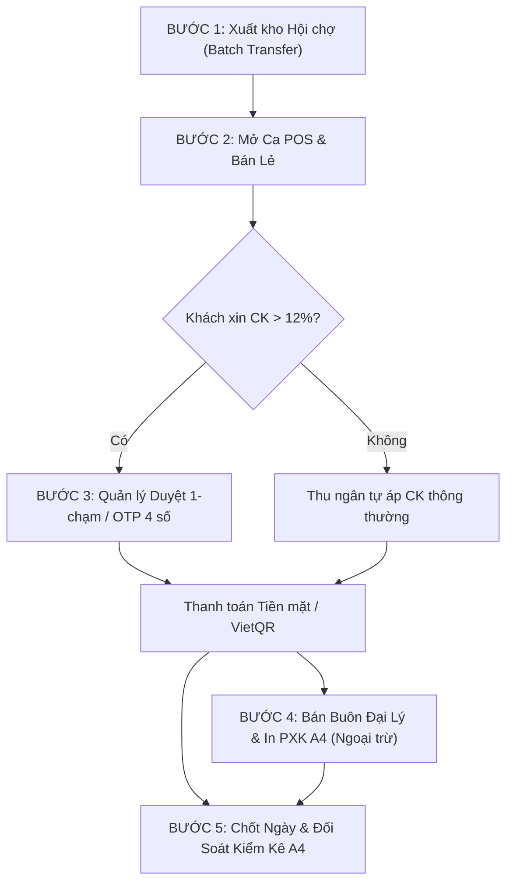

# KỊCH BẢN DIỄN TẬP VẬN HÀNH THỰC TẾ POS & HỘI CHỢ TỪ ĐẦU ĐẾN CUỐI
**Hệ thống:** Formapubli OS (Bản V4.1 Locked)  
**Tài liệu dành cho:** Quản lý gian hàng, Thủ kho, Thu ngân hội chợ

---

## 🎯 MỤC TIÊU DIỄN TẬP
Đảm bảo toàn bộ nhân sự nắm vững và phối hợp trơn tru 5 giai đoạn vận hành tại hội chợ sách:
1. **Chuẩn bị trước giờ mở cửa:** Xuất kho hàng loạt từ Kho Âu Cơ $\rightarrow$ Kho Hội Chợ.
2. **Mở quầy & Bán lẻ:** POS theo kho độc lập, quét barcode, thanh toán Tiền mặt / VietQR.
3. **Phê duyệt chiết khấu an toàn:** Xử lý đơn chiết khấu cao bằng duyệt 1-chạm hoặc OTP 4 số (cấm mật khẩu tại quầy).
4. **Bán buôn đại lý:** Xuất kho số lượng lớn với chiết khấu đại lý, in phiếu PXK A4 chuẩn kế toán VN.
5. **Chốt ngày & Kiểm kê:** Đối soát két tiền mặt, kiểm kê tồn kệ thực tế vs máy tính, in biên bản chốt ngày.

---

## 📋 BẢNG PHÂN VAI TRONG DIỄN TẬP

| Vai trò | Nhân sự đảm nhiệm | Nhiệm vụ chính |
| :--- | :--- | :--- |
| **Thủ kho** | Quản lý kho / Thủ kho | Lập phiếu điều chuyển hàng loạt, xuất kho bán buôn, kiểm kê kệ. |
| **Thu ngân** | Nhân viên thu ngân | Bán hàng tại quầy POS, quét mã, gửi yêu cầu duyệt chiết khấu, đếm két. |
| **Quản lý** | Trưởng gian hàng / Owner | Duyệt chiết khấu 1-chạm trên điện thoại, ký duyệt xuất kho & biên bản chốt ngày. |

---

## 🔄 QUY TRÌNH 5 BƯỚC VẬN HÀNH CHI TIẾT

---

### BƯỚC 1: XUẤT KHO HÀNG LOẠT CHO HỘI CHỢ (TRƯỚC GIỜ MỞ CỬA)

* **Người thực hiện:** Thủ kho / Quản lý
* **Vị trí thao tác:** Module Quản lý Kho $\rightarrow$ Nút **"Chuyển Kho Hàng Loạt"** (hoặc mở `BatchTransferModal`).

1. **Chọn kho:**
   - **Kho xuất:** `Kho 1 - Âu Cơ` (hoặc kho nguồn chính).
   - **Kho nhập:** `Kho 3 - Hội Chợ` (kho sự kiện có cờ `isSellableOnPos: true`).
2. **Lên danh sách sách mang đi sự kiện:**
   - Bấm **"Thêm ấn bản"** để chọn các đầu sách dự kiến mang đi (ví dụ: 20-40 đầu sách).
   - Nhập số lượng dự kiến cho từng đầu sách (ví dụ: 10 - 20 cuốn/đầu).
3. **Kiểm tra tồn (Dry-Run Check):**
   - Bấm nút **"Kiểm tra tồn kho"**.
   - Hệ thống kiểm tra ATP thực tế tại Kho Âu Cơ. Nếu có cuốn nào kho nguồn không đủ số lượng:
     - Hệ thống cảnh báo màu vàng và hiển thị nút **"Hạ về tồn tối đa (Cap-to-Max)"**.
     - Bấm nút để tự động điều chỉnh số lượng về mức kho nguồn đang có sẵn (1-chạm, chống lỗi TOCTOU).
4. **Xác nhận xuất chuyển kho:**
   - Bấm **"Xác nhận chuyển kho"**.
   - Hệ thống tự động sinh mã phiếu điều chuyển liên tục (ví dụ: `PCK-2026-0001`).
   - Thẻ kho Âu Cơ bị trừ `TRANSFER_OUT`, Thẻ kho Hội chợ được cộng `TRANSFER_IN`.

---

### BƯỚC 2: MỞ QUẦY POS & BÁN HÀNG TẠI HỘI CHỢ

* **Người thực hiện:** Thu ngân
* **Vị trí thao tác:** Module **Quầy Thu Ngân (POS)**.

1. **Chọn kho bán hàng:**
   - Ở thanh điều hướng POS, chọn kho: **"Kho 3 - Hội Chợ"**.
   - *Lưu ý:* Danh mục sách tại POS sẽ **chỉ hiển thị những đầu sách đã được chuyển đến Kho Hội Chợ**. Số tồn hiển thị là tồn thực tế tại gian hàng, không bị lẫn với kho khác.
2. **Khai báo đầu ca:**
   - Khai báo tiền lẻ chuẩn bị ban đầu trong két (ví dụ: 1.000.000đ).
3. **Bán lẻ thông thường:**
   - Thu ngân dùng máy quét mã vạch (hoặc camera điện thoại / webcam) quét ISBN trên bìa sách.
   - Sách tự động thêm vào giỏ hàng.
   - Nếu áp dụng chiết khấu lẻ cho khách: Thu ngân bấm chọn hoặc gõ mức chiết khấu thông thường (tối đa 12%).
   - Thu ngân bấm **"Thanh Toán"**:
     - Nếu khách trả **Tiền mặt**: Nhập số tiền khách đưa $\rightarrow$ Máy tính tiền thừa.
     - Nếu khách trả **Chuyển khoản**: Màn hình hiện mã **VietQR động** chứa chính xác số tiền $\rightarrow$ Khách quét app ngân hàng.
   - Bấm **"Hoàn tất đơn"** $\rightarrow$ Tồn kho tại gian hàng giảm ngay lập tức.

---

### BƯỚC 3: PHÊ DUYỆT CHIẾT KHẤU ĐẶC BIỆT AN TOÀN (KHI CK > 12%)

* **Tình huống:** Khách mua nhiều (giáo viên, khách quen, nhà tài trợ...) yêu cầu chiết khấu 15%, 20% hoặc 25%.
* **Quy tắc bảo mật tối cao:** **TUYỆT ĐỐI KHÔNG GÕ MẬT KHẨU QUẢN LÝ TẠI QUẦY!**

1. **Thu ngân gửi yêu cầu duyệt:**
   - Khi chọn mức chiết khấu > 12%, POS tự động kích hoạt **Modal Phê Duyệt Chiết Khấu**.
   - Màn hình POS hiển thị:
     - Tỷ lệ CK yêu cầu (ví dụ: 20%).
     - **Mã OTP 4 số (ShortCode)** (ví dụ: `4821`).
     - **Mã QR JWT** mã hóa giỏ hàng và thời gian hiệu lực (120 giây).
2. **Quản lý phê duyệt (Có 3 phương án linh hoạt):**
   - **Phương án 1 (Duyệt 1-chạm từ xa - Khuyên dùng):**
     - Quản lý mở điện thoại/máy tính cá nhân, bấm vào biểu tượng **"Duyệt CK POS"** (Manager Drawer).
     - Thấy đơn hàng của thu ngân đang chờ với giỏ hàng tương ứng.
     - Quản lý bấm nút **"Duyệt 1-chạm"**.
     - Máy POS của thu ngân tự động chuyển sang trạng thái xanh **"ĐÃ ĐƯỢC DUYỆT"** mà không cần trao đổi mã!
   - **Phương án 2 (Duyệt bằng ShortCode):**
     - Thu ngân đọc mã 4 số: *"Anh Đức ơi duyệt giúp em mã 4821"*.
     - Quản lý nhập `4821` trên màn hình của mình và bấm Xác nhận.
   - **Phương án 3 (Sự cố mất mạng Internet - Mã khẩn cấp):**
     - Quản lý đọc mã offline theo ngày (ví dụ: `EMG-8392`) với giới hạn trần cứng tối đa 25%.
3. **Chống tráo đổi giỏ hàng (Anti-Tampering):**
   - Nếu thu ngân cố tình thêm/bớt sách sau khi quản lý đã duyệt $\rightarrow$ Cart Hash thay đổi $\rightarrow$ Đơn duyệt bị hủy ngay lập tức (`SUPERSEDED`), bắt buộc phải xin duyệt lại từ đầu.

---

### BƯỚC 4: BÁN BUÔN CHO ĐẠI LÝ & IN PHIẾU XUẤT KHO A4 (KHI PHÁT SINH)

* **Tình huống:** Nhà sách đối tác hoặc trường học ghé gian hàng nhập 50 - 100 cuốn với chiết khấu đại lý (35% - 50%).
* **Người thực hiện:** Thủ kho / Quản lý
* **Vị trí thao tác:** Module Quản lý Kho $\rightarrow$ Nút **"Bán Buôn PXK"**.

1. **Lập phiếu xuất kho:**
   - Chọn đối tác (ví dụ: `Nhà sách Cá Chép`, `Thư viện đối tác`...).
   - Nhập danh sách các đầu sách và số lượng sỉ.
   - Áp mức chiết khấu bán buôn theo hợp đồng.
2. **Ký xuất kho bất biến:**
   - Bấm **"Ký xuất kho"**.
   - Hệ thống tự động cấp số liên tục **`PXK-2026-XXXX`** và khóa sổ (`DISPATCHED_LOCKED`).
3. **In phiếu A4 chuẩn kế toán Việt Nam:**
   - Bấm nút **"In Phiếu Xuất Kho A4"**.
   - Hệ thống hiển thị bản in A4 sắc nét:
     - Số tiền đọc thành chữ tiếng Việt chuẩn xác (VD: *Ba triệu hai trăm nghìn đồng chẵn*).
     - Đầy đủ 4 cột chữ ký: **Người lập phiếu, Người nhận hàng, Thủ kho, Kế toán trưởng/Giám đốc**.
     - Mã QR bảo mật xác thực nguồn gốc phiếu.
4. **Xử lý trả hàng/hủy đơn buôn (Đảo bút toán):**
   - Nếu đối tác trả hàng, thủ kho mở **Sổ Phiếu Xuất Kho**, bấm **"Hủy & Đảo bút toán"**.
   - Hệ thống tự động sinh phiếu hoàn kho **`PXK_R-2026-XXXX`**, ghi nhận hoàn kho chuẩn chỉnh.

---

### BƯỚC 5: CHỐT NGÀY HỘI CHỢ & ĐỐI SOÁT KIỂM KÊ (KẾT THÚC NGÀY)

* **Người thực hiện:** Thu ngân + Thủ kho + Quản lý
* **Vị trí thao tác:** Bấm nút **"Chốt Ngày (S4)"** trên POS hoặc trên Executive Dashboard.

1. **Đối soát Doanh thu & Két tiền (Tab 1):**
   - Xem tổng doanh số bán lẻ trong ngày.
   - Xem tỷ lệ tiền thu về: bao nhiêu % Tiền mặt, bao nhiêu % Chuyển khoản VietQR.
   - Thu ngân đếm tiền mặt thực tế trong két, nhập vào ô **"Tiền thực kiểm"**.
   - Hệ thống tự động tính độ lệch: Khớp 100% (màu xanh) hoặc Lệch thừa/thiếu (màu đỏ).
2. **Kiểm kê tồn kho sách trên kệ (Tab 2):**
   - Thủ kho đếm số sách còn lại trên các kệ sách tại gian hàng.
   - Nhập số lượng thực đếm vào cột **"Thực kiểm trên kệ"**.
   - Hệ thống tự động tính chênh lệch so với Tồn trên máy:
     - Báo xanh nếu khớp hoàn toàn.
     - Báo đỏ cảnh báo thất thoát hoặc thiếu hụt để kiểm tra camera ngay lập tức.
3. **Giám sát Chiết khấu (Tab 3):**
   - Xem tỷ lệ chiết khấu trung bình của cả gian hàng trong ngày (cảnh báo nếu vượt trần an toàn > 12%).
   - Rà soát danh sách các đơn hàng được duyệt đặc biệt (> 20%) và ai là người chịu trách nhiệm phê duyệt.
4. **In Biên Bản Chốt Ngày Khổ A4:**
   - Bấm nút **"In Biên Bản Chốt Ngày A4"**.
   - Mẫu in thể hiện đầy đủ doanh thu, phân bổ tiền mặt, chênh lệch kiểm kê kệ sách và chữ ký nghiệm thu của cả 3 bên: **Thu ngân, Thủ kho, Quản lý gian hàng**.

---

## 🛑 CHECKLIST XỬ LÝ SỰ CỐ TẠI HỘI CHỢ (TROUBLESHOOTING)

| Tình huống sự cố | Cách xử lý tức thì |
| :--- | :--- |
| **Mất kết nối mạng Internet tại gian hàng** | 1. Hệ thống vẫn lưu giỏ hàng và danh mục local. 2. Chuyển sang thanh toán Tiền mặt. 3. Khi cần duyệt chiết khấu, Quản lý cấp **Mã Khẩn Cấp (Offline Emergency Code)** trần tối đa 25%. |
| **Kho Âu Cơ bị thiếu tồn khi xuất đi hội chợ** | Bấm nút **"Hạ về tồn tối đa (Cap-to-Max)"** trong modal chuyển kho để lấy đúng số lượng cao nhất hiện có mà không bị treo transaction. |
| **Thu ngân bán nhầm sách không có ở hội chợ** | Không thể xảy ra: POS đã được khóa chỉ hiển thị danh mục sách thuộc Kho Hội Chợ có tồn khả dụng (ATP > 0). |
| **Khách đổi ý trả lại sách ngay tại quầy** | Thu ngân mở nút **"Trả Hàng"** trên POS $\rightarrow$ Chọn hóa đơn cũ $\rightarrow$ Nhập số lượng trả $\rightarrow$ Tiền mặt hoàn lại và sách tự động cộng lại vào kho hội chợ. |
