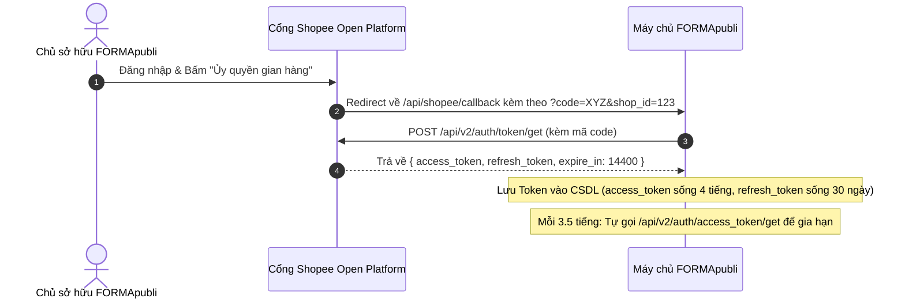

# TÀI LIỆU 01: KIẾN TRÚC NỀN TẢNG & XÁC THỰC OAUTH 2.0 (SHOPEE API V2)

---

## 1. PHÂN LOẠI ỨNG DỤNG (APP TYPES) TRÊN SHOPEE

Trên cổng [Shopee Open Platform](https://open.shopee.com), có 2 loại ứng dụng chính:
1. **Seller In-house System (Ứng dụng nội bộ của Người bán - FORMApubli dùng loại này):**
   * Dành riêng cho doanh nghiệp tự xây dựng phần mềm để quản lý gian hàng của chính mình.
   * **Đặc quyền:** Được cấp quyền truy cập toàn bộ các API quản lý đơn hàng, kho vận, tài chính của Shop mà không cần phải qua quy trình kiểm thử đối tác bên thứ ba khắt khe.
   * **Cơ chế ủy quyền:** Có nút "Authorize" ngay trên giao diện điều khiển (Console) của Shopee.
2. **Third-party App (Dành cho các công ty phần mềm như Sapo, Haravan):**
   * Dành cho đơn vị bán phần mềm cho nhiều người bán khác nhau. Phải đăng ký giấy phép ISV và xây dựng luồng OAuth đa tài khoản phức tạp.

---

## 2. MÔI TRƯỜNG MÁY CHỦ (BASE URLS)

Shopee cung cấp 2 môi trường độc lập:
* **Môi trường Test / Sandbox (UAT):**
  * Base URL: `https://partner.test-stable.shopeemobile.com`
  * Dùng tài khoản Test Shop để tạo đơn ảo, test kéo đơn và in đơn mà không ảnh hưởng đến gian hàng thật.
* **Môi trường Chạy Thật (Live / Production):**
  * Base URL: `https://partner.shopeemobile.com`
  * Dùng cho gian hàng thật của FORMApubli.

---

## 3. THUẬT TOÁN KÝ SỐ HMAC-SHA256 (`sign`)

Mọi yêu cầu gửi đến Shopee API v2 (dù là GET hay POST) đều bắt buộc phải có chữ ký số `sign` đính kèm trên Query Parameter để bảo đảm tính toàn vẹn dữ liệu.

### 3.1. Quy tắc ghép chuỗi cơ sở (Base String)
* **Đối với các API công khai / Ủy quyền (chưa có access_token):**
  ```text
  base_string = partner_id + api_path + timestamp
  ```
* **Đối với các API nghiệp vụ của Shop (đã có access_token & shop_id):**
  ```text
  base_string = partner_id + api_path + timestamp + access_token + shop_id
  ```

### 3.2. Thuật toán băm
```text
sign = crypto.createHmac('sha256', partner_key).update(base_string).digest('hex')
```

### 3.3. Mã nguồn mẫu chuẩn hóa bằng TypeScript (chạy trên Node.js / Cloudflare Worker)
```typescript
import crypto from 'node:crypto';

export interface ShopeeRequestParams {
  partnerId: number;
  partnerKey: string;
  apiPath: string; // Ví dụ: "/api/v2/order/get_order_list"
  accessToken?: string;
  shopId?: number;
}

export function generateShopeeSign(params: ShopeeRequestParams): { timestamp: number; sign: string } {
  const timestamp = Math.floor(Date.now() / 1000);
  let baseString = `${params.partnerId}${params.apiPath}${timestamp}`;

  if (params.accessToken && params.shopId) {
    baseString += `${params.accessToken}${params.shopId}`;
  }

  const sign = crypto
    .createHmac('sha256', params.partnerKey)
    .update(baseString)
    .digest('hex');

  return { timestamp, sign };
}
```

---

## 4. QUY TRÌNH ỦY QUYỀN VÀ QUẢN LÝ VÒNG ĐỜI TOKEN (OAUTH 2.0)



### 4.1. Bước 1: Tạo đường dẫn ủy quyền Shop
Chủ shop truy cập URL sau trên trình duyệt:
```text
https://partner.shopeemobile.com/api/v2/shop/auth_partner?partner_id={PARTNER_ID}&timestamp={TIMESTAMP}&sign={SIGN}&redirect={REDIRECT_URL}
```
*(Trong đó `sign = HMAC_SHA256(partner_id + "/api/v2/shop/auth_partner" + timestamp, partner_key)`)*

### 4.2. Bước 2: Đổi mã `code` lấy Token
Khi Shop đồng ý, Shopee điều hướng về `REDIRECT_URL` với tham số `code` và `shop_id`.
Hệ thống gọi ngay:
* **API:** `POST /api/v2/auth/token/get`
* **Body:**
  ```json
  {
    "code": "XYZ...",
    "shop_id": 12345678,
    "partner_id": 987654
  }
  ```
* **Kết quả trả về:**
  ```json
  {
    "error": "",
    "message": "",
    "response": {
      "access_token": "acc_token_abcdef123...",
      "refresh_token": "ref_token_uvwxyz789...",
      "expire_in": 14400,
      "shop_id": 12345678
    }
  }
  ```

### 4.3. Bước 3: Tự động gia hạn Token ngầm (Auto Refresh Token)
`access_token` có tuổi thọ là 14.400 giây (đúng **4 giờ**). 
`refresh_token` có tuổi thọ là **30 ngày**.

Trước khi hết hạn 4 giờ, hệ thống gọi API sau để cấp lại cặp token mới:
* **API:** `POST /api/v2/auth/access_token/get`
* **Body:**
  ```json
  {
    "refresh_token": "ref_token_uvwxyz789...",
    "shop_id": 12345678,
    "partner_id": 987654
  }
  ```
* **Lưu ý sống còn:** Mỗi lần gọi lấy `access_token` mới, Shopee cũng trả về một `refresh_token` mới. Hệ thống bắt buộc phải cập nhật cả 2 token này vào CSDL để không bị đứt chuỗi ủy quyền.
