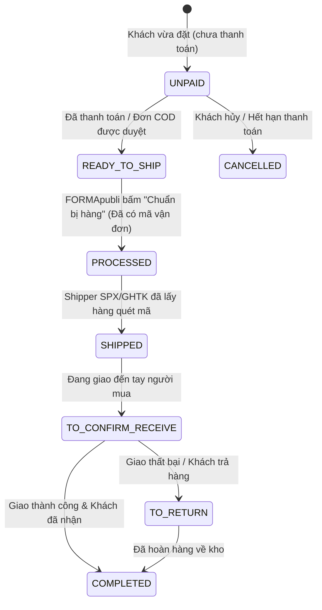

# TÀI LIỆU 02: QUẢN LÝ ĐƠN HÀNG (OMS) — SHOPEE API V2

---

## 1. VÒNG ĐỜI TRẠNG THÁI ĐƠN HÀNG (ORDER STATUS LIFECYCLE)

Một đơn hàng phát sinh trên Shopee sẽ trải qua các trạng thái sau:



### BẢNG MA TRẬN ÁNH XẠ TRẠNG THÁI (SHOPEE -> FORMAPUBLI)

Hệ thống FORMApubli kết hợp giữa **`orders.status`** (`src/db/schema.ts:301`), **`orders.shippingStatus`** (`schema.ts:314`) và **`orders.codStatus`** (`schema.ts:317`) để quản lý toàn diện đơn hàng mà không làm sai lệch báo cáo doanh thu:

| Trạng thái Shopee (`order_status`) | `orders.status` | `orders.shippingStatus` | `orders.codStatus` | Ý nghĩa nghiệp vụ kho & Báo cáo doanh thu |
|---|---|---|---|---|
| `UNPAID` | *(Chưa tạo)* | `NONE` | `NONE` | Khách chưa thanh toán. **Chưa tạo đơn trong CSDL, chưa trừ kho**. |
| `READY_TO_SHIP` | `COMPLETED` | `CREATED` | COD: `PENDING`<br>Khác: `NONE` | Đơn hợp lệ. **Tạo đơn, xuất kho `DISPATCH_SALE`**, sinh vận đơn. Doanh thu đang ở trạng thái *"Chờ giao"* (lọc theo `shippingStatus`). |
| `PROCESSED` | `COMPLETED` | `CREATED` | Như trên | Đã đóng gói xong, đã in phiếu gửi hàng A6. Chờ shipper đến lấy. |
| `SHIPPED` | `COMPLETED` | `PICKED_UP` $\rightarrow$ `IN_TRANSIT` | Như trên | Shipper SPX/GHTK đã nhận hàng và đang vận chuyển. |
| `TO_CONFIRM_RECEIVE` | `COMPLETED` | `IN_TRANSIT` | Như trên | Đang phát hàng đến tay người mua. |
| `COMPLETED` | `COMPLETED` | `DELIVERED` | COD: `RECEIVED`<br>Khác: `NONE` | **Giao thành công 100%**. Tiền Shopee giải ngân về Escrow. Ghi nhận doanh thu tài chính ròng thực tế cho tab **"Chủ"**. |
| `CANCELLED` | `CANCELLED` | `FAILED` | `NONE` | Khách hủy đơn hoặc boom hàng. **Kích hoạt hoàn trả kho `RETURN_INBOUND`** để sách về lại Kho Chính. |
| `TO_RETURN` / Khách đổi trả | `COMPLETED` | `RETURNED` | `NONE` | Hàng hoàn về kho FORMApubli. Lập phiếu hoàn kho, không ghi nhận doanh thu ròng. |

> ⚠️ **ĐẦU VIỆC CHẶN (BLOCKING TASK — BẮT BUỘC SỬA TẦNG BÁO CÁO KHI CODE):**
> * Hiện tại toàn bộ service báo cáo doanh thu (`analytics.service.ts:48,174,280,338`, `executive-digest.service.ts`, `daily-settlement.service.ts`) đều query:
>   `WHERE status = 'COMPLETED'` mà **HOÀN TOÀN CHƯA LỌC `shippingStatus`**.
> * **Nguy cơ phồng ảo:** Nếu đơn Shopee `READY_TO_SHIP` ghi `status: 'COMPLETED'` thì code hiện tại sẽ tính tiền ngay vào doanh số ngày dù hàng mới đóng gói trong kho!
> * **Yêu cầu khi triển khai code:** Bắt buộc phải vá tầng báo cáo: Đơn Shopee chỉ được tính doanh thu khi `shippingStatus = 'DELIVERED'` (hoặc câu query: `WHERE status = 'COMPLETED' AND (channel != 'SHOPEE' OR shippingStatus = 'DELIVERED')`).

---

## 2. API LẤY DANH SÁCH ĐƠN HÀNG: `v2.order.get_order_list`

Dùng để quét và lấy danh sách các mã đơn hàng (`order_sn`) mới phát sinh.

* **Phương thức:** `GET`
* **Đường dẫn API:** `/api/v2/order/get_order_list`
* **Tham số truy vấn (Query Parameters):**
  * `time_range_field`: Loại thời gian lọc (`create_time` - thời điểm tạo đơn, hoặc `update_time` - thời điểm cập nhật).
  * `time_from`: Thời gian bắt đầu (Unix timestamp).
  * `time_to`: Thời gian kết thúc (Unix timestamp, không được cách `time_from` quá 15 ngày).
  * `page_size`: Số đơn trên 1 trang (tối đa 100 đơn).
  * `cursor`: Con trỏ phân trang (dùng cho trang tiếp theo, lần đầu để trống `""`).
  * `order_status`: Lọc trạng thái (Ví dụ: `READY_TO_SHIP`).
* **Ví dụ Kết quả trả về (Response):**
  ```json
  {
    "error": "",
    "message": "",
    "response": {
      "more": false,
      "next_cursor": "",
      "order_list": [
        {
          "order_sn": "241004ABCD1234"
        },
        {
          "order_sn": "241004EFGH5678"
        }
      ]
    }
  }
  ```

---

## 3. API LẤY CHI TIẾT ĐƠN HÀNG: `v2.order.get_order_detail`

Sau khi có danh sách `order_sn`, API này sẽ trả về chi tiết toàn bộ sách trong đơn, địa chỉ người nhận và thông tin thanh toán.

* **Phương thức:** `GET`
* **Đường dẫn API:** `/api/v2/order/get_order_detail`
* **Tham số truy vấn:**
  * `order_sn_list`: Danh sách mã đơn (cách nhau bởi dấu phẩy, tối đa 50 đơn 1 lần gọi).
  * `response_optional_fields`: Các trường thông tin cần lấy thêm:
    * `item_list`: Danh sách sản phẩm trong đơn.
    * `recipient_address`: Địa chỉ, số điện thoại, tên người nhận.
    * `buyer_user`: Thông tin người mua.
    * `pay_time`: Thời gian thanh toán.
    * `total_amount`: Tổng giá trị đơn hàng.
* **Ví dụ Cấu trúc Dữ liệu Sản phẩm (`item_list`):**
  ```json
  {
    "item_list": [
      {
        "item_id": 1982736451,
        "item_name": "Sách: Cháu trai Wittgenstein",
        "item_sku": "9786049679377",
        "model_id": 0,
        "model_sku": "9786049679377",
        "model_quantity_purchased": 2,
        "model_original_price": 120000,
        "model_discounted_price": 96000
      }
    ]
  }
  ```

---

## 4. QUY TẮC BÓC TÁCH VÀ ÁNH XẠ VÀO FORMAPUBLI

Khi nhận được gói tin chi tiết đơn hàng từ Shopee:
1. **Tìm sách theo SKU:** 
   * Đọc trường `item_sku` hoặc `model_sku`.
   * So khớp với cột `isbn` hoặc `code` trong bảng `editions` của FORMApubli.
2. **Xử lý số lượng:** 
   * Trừ tồn kho số lượng tương ứng trong Kho chính (`PHYSICAL_MAIN`).
   * Ghi vào sổ thẻ kho (`inventory_ledger`) với loại sự kiện `DISPATCH_SALE` và ghi chú: `"Đơn Shopee #241004ABCD1234"`.
3. **Lưu đơn vào bảng `orders`:**
   * `channel`: `'SHOPEE'`
   * `paymentMethod`: 
     * Đơn đã thanh toán trước (ShopeePay/Thẻ/Ví): `'BANK_TRANSFER'`
     * Đơn nhận hàng trả tiền: `'COD'` (theo đúng chuẩn `OrderPaymentMethod` tại `src/services/order.service.ts:34,40`)
   * `carrier`: Tên đơn vị vận chuyển Shopee gán (VD: `'SPX'`, `'GHTK'`) — *cột có sẵn trong schema.ts:312*
   * `trackingCode`: Mã vận đơn Shopee cấp — *cột có sẵn trong schema.ts:313*
   * `shippingFee`: Phí ship — *schema.ts:315*
   * `codAmount`: Tiền COD cần thu hộ nếu là đơn COD — *schema.ts:316*
   * `customerName`: Tên người nhận (`recipient_address.name`)
   * `note`: Địa chỉ nhận hàng chi tiết + số điện thoại người nhận (do `orders` không có cột `shipping_recipient`, địa chỉ chi tiết đưa vào `note` hoặc bảng `delivery_orders`)

---

## 5. CẢNH BÁO BẮT BUỘC KHI CODE: KHÔNG TÁI SỬ DỤNG `OrderService.confirmOrder()`

* **Cạm bẫy:** Trong POS bán hàng trực tiếp, luồng duyệt đơn `confirmOrder()` (`src/services/order.service.ts:1668`) bắt buộc phải tải lên ảnh chụp bill chuyển khoản (`paymentProofRequired`) đối với các đơn `BANK_TRANSFER`.
* **Hậu quả nếu gọi nhầm:** Nếu luồng kéo đơn Shopee cố tình gọi hàm `confirmOrder()`, hệ thống sẽ ném lỗi: `AppError.invalid('Thiếu ảnh bằng chứng chuyển khoản')` $\rightarrow$ Toàn bộ việc kéo đơn Shopee sẽ bị tê liệt.
* **Quy chuẩn đúng:** 
  * Luồng đồng bộ Shopee phải **tạo đơn trực tiếp vào CSDL** qua `db.insert(orders)` và ghi sổ kho qua `InventoryService.recordMovementsBatch()`.
  * Tuyệt đối không đi qua luồng duyệt bằng chứng thanh toán của thu ngân quầy.
