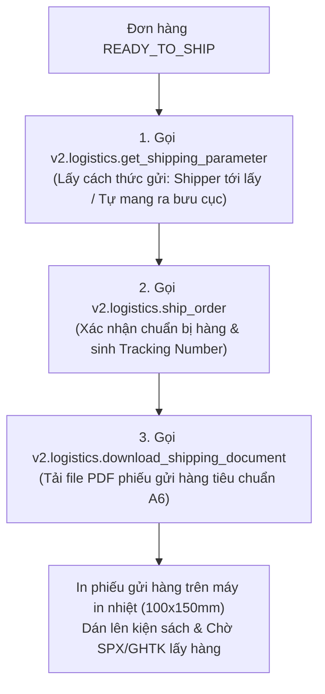

# TÀI LIỆU 04: VẬN CHUYỂN & IN VẬN ĐƠN (LOGISTICS & AWB)

---

## 1. QUY TRÌNH XỬ LÝ ĐƠN HÀNG VẬN CHUYỂN TRÊN SHOPEE

Quy trình fulfillment (chuẩn bị hàng và giao cho shipper) được thực hiện qua 3 bước API liên hoàn:



---

## 2. CHI TIẾT CÁC API VẬN CHUYỂN

### 2.1. Bước 1: Lấy tham số gửi hàng (`v2.logistics.get_shipping_parameter`)
* **Phương thức:** `GET`
* **Đường dẫn:** `/api/v2/logistics/get_shipping_parameter`
* **Tham số:** `order_sn`
* **Mục đích:** Xác định đơn vị vận chuyển này (SPX Express, Viettel Post, GHTK) cho phép:
  * `pickup`: Đơn vị vận chuyển đến tận kho FORMApubli lấy hàng.
  * `dropoff`: Nhân viên FORMApubli mang ra điểm gửi hàng gần nhất.

### 2.2. Bước 2: Xác nhận giao hàng (`v2.logistics.ship_order`)
* **Phương thức:** `POST`
* **Đường dẫn:** `/api/v2/logistics/ship_order`
* **Request Body:**
  ```json
  {
    "order_sn": "241004ABCD1234",
    "pickup": {
      "address_id": 123456,
      "pickup_time_id": "2026-10-04 14:00-17:00"
    }
  }
  ```
* **Ý nghĩa:** Chuyển trạng thái đơn từ `READY_TO_SHIP` sang `PROCESSED`. Đơn hàng chính thức được cấp Mã vận đơn (`tracking_number`).

### 2.3. Bước 3: Tạo và Tải Phiếu gửi hàng (`download_shipping_document`)
Shopee hỗ trợ xuất phiếu gửi hàng định dạng chuẩn A6 (100x150mm) có sẵn mã vạch để shipper quét khi nhận:
* **API yêu cầu tạo phiếu:** `POST /api/v2/logistics/create_shipping_document`
* **API tải file PDF:** `POST /api/v2/logistics/download_shipping_document`
  ```json
  {
    "order_list": [
      {
        "order_sn": "241004ABCD1234"
      }
    ],
    "shipping_document_type": "NORMAL_AIR_WAYBILL"
  }
  ```
* **Kết quả:** Shopee trả về luồng dữ liệu nhị phân PDF (Binary Stream). Trình duyệt của FORMApubli chỉ việc kích hoạt lệnh in hoặc gửi thẳng tới máy in nhiệt qua cổng USB/LAN.
