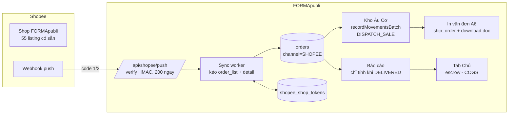

# KẾ HOẠCH TRIỂN KHAI TÍCH HỢP SHOPEE — MASTER PLAN

> **Trạng thái thực thi (cập nhật 06/10/2026, trên `main`):**
> Task 1–9 + Tab+Role ĐÃ MERGE `main` (`0aa605c`), chưa deploy.
> Test: 12 suite Shopee xanh, `test-shopee-tab-scope` 17/17, full runner 176/177
> (`eval-executive-ai` 23/26 drift theo copilot mới — việc của chủ copilot).
> `tsc` + `npm run build` sạch. Cửa ải còn lại: sandbox (mục Open items).
> Chi tiết từng task: xem bảng bên dưới.
>
> **Agent mới đọc trước (theo thứ tự):**
> 1. `docs/shopee/11-quyet-dinh-tab-shopee-va-role.md` — 5 quyết định đã chốt với Chủ (tab riêng, role mới, 2 cấu hình kho, ai xem tab, tab Chủ làm sau).
> 2. `docs/superpowers/specs/2026-10-06-tab-shopee-design.md` — spec tab + role.
> 3. `docs/superpowers/plans/2026-10-06-tab-shopee.md` — plan 5 task đã thực thi xong.
> 4. File này — master plan Task 1–9 + trạng thái.
> 5. `docs/shopee/12-nghiem-thu-sandbox.md` — checklist nghiệm thu sandbox khi có key (script `scripts/verify-shopee-sandbox.ts` sẵn sàng).

| Task | Nội dung | Commit | Suite kiểm chứng |
|---|---|---|---|
| 1 | Bảng token + ký HMAC | `3210e5e` | `test-shopee-auth-foundation` 6/6 (vector .NET độc lập) |
| 2 | OAuth callback + refresh 1 lần | `d8894b5` | `test-shopee-oauth-refresh` 8/8 (mock mạng) |
| 3 | Kéo đơn + trừ kho Âu Cơ + cách ly SKU lạ | `3adcbf8` | `test-shopee-order-pull` 16/16 |
| 4 | Vá báo cáo: chỉ tính khi DELIVERED (+hồi quy 8 suite cũ xanh) | `588d608` | `test-shopee-revenue-guard` 5/5 |
| 5 | Giao hàng + vận đơn A6 + lưu carrier | `d6ad2f6` | `test-shopee-shipment` 9/9 |
| 6 | Đẩy tồn trừ buffer + bảng map item | `f0885e1` | `test-shopee-stock-push` 6/6 |
| 7 | Webhook + hủy đơn hoàn kho | `7894bc6` | `test-shopee-webhook` 12/12 |
| 8 | Đối soát escrow + lãi ròng | `186084d` | `test-shopee-escrow` 10/10 |
| 9 | Công tắc COD (mặc định tắt) | `630cf91` | `test-shopee-cod-flag` 6/6 |
| — | Suite chạy lại trên DB bẩn (id duy nhất + assert chênh lệch) | `21f9a7b` | 9/9 × 3 vòng |
| UI | Nhãn Shopee + nhóm Online; panel Cài Đặt ẩn theo cờ server; config runtime (kho/COD); hàng đợi + đơn lỗi; 4 API (status/auth-url/queue/ship/config) | `7cac3a6` | `test-shopee-shop-config` 6/6, `test-shopee-ui-hidden` 10/10 |
| Tab+Role | Tab Shopee riêng + `ROLE_SHOPEE_OPS` (hiện picker, PIN dev 6789); phạm vi kho nhiều-kho do quản lý cấp, ép ở server; route AWB; panel gọn còn cấu hình Chủ | `f307907` | `test-shopee-tab-scope` 17/17, 12 suite Shopee xanh, `tsc` + `build` sạch |
| Merge | Merge nhánh vào `main` (`0aa605c`): gộp guard DELIVERED + hàm ngày VN 2 bên; sửa nhãn nút "Báo Cáo Ngày" (`3512f54`, settlement-ui 29/29) | `ec22426` | full runner 174/177 (3 đỏ tồn đọng trước merge) |

> **For agentic workers:** REQUIRED SUB-SKILL: Use superpowers:subagent-driven-development (recommended) or superpowers:executing-plans to implement this plan task-by-task. Steps use checkbox (`- [ ]`) syntax for tracking.

**Goal:** Kéo đơn Shopee về FORMApubli, trừ kho Âu Cơ, in vận đơn, đối soát phí sàn vào tab Chủ — toàn bộ tự vận hành, không thuê OMS ngoài.

**Architecture:** Lớp `src/services/shopee/` gọn nhẹ gọi thẳng Shopee API v2 bằng `fetch`原生 của Workers (không cài SDK nguyên gói). Đơn vào `orders.channel='SHOPEE'`, trừ kho qua `InventoryService.recordMovementsBatch`, token trong bảng Turso, webhook trả 200 trước xử lý sau.

**Tech Stack:** Next 14 API routes, Drizzle ORM + Turso/LibSQL, Cloudflare Workers (`nodejs_compat` đã bật), `node:crypto` cho HMAC, test bằng `scripts/test-*.ts` + `scripts/run-isolated.ts`.

**Spec:** `docs/shopee/00-kien-truc-tich-hop-tinh-tuy.md` (thiết kế) + `docs/shopee/02-quan-ly-don-hang-oms.md` (ma trận trạng thái + đầu việc chặn). Plan này suy ra từ 2 file đó — executor đọc cả 3.

## Global Constraints

- `orders.channel` thêm đúng 1 giá trị `'SHOPEE'` (`src/db/schema.ts:288`).
- `orders.paymentMethod` chỉ nhận `CASH | BANK_TRANSFER | QR_CODE | COD` (`src/services/order.service.ts:34,40`). Đơn trả trước → `'BANK_TRANSFER'`, COD → `'COD'`. CẤM giá trị tự chế.
- Bảng tồn là `stock_balances`, hàm trừ kho là `InventoryService.recordMovementsBatch` (`src/services/inventory.service.ts:335`). CẤM `UPDATE` tồn bằng tay.
- CẤM đi qua `OrderService.confirmOrder` cho luồng Shopee (bẫy `paymentProof`, `order.service.ts:1668`).
- Đơn Shopee chỉ tính doanh thu khi `shippingStatus='DELIVERED'` — vá tầng báo cáo cùng đợt (đầu việc chặn trong file 02).
- Giá đẩy lên Shopee ≤ giá bìa (`products`/niêm yết). Không bao giờ tăng trên giá bìa.
- Kho xuất là cấu hình, mặc định kho Âu Cơ. CẤM hardcode id kho trong code.
- Token trong bảng `shopee_shop_tokens`, webhook tại `POST /api/shopee/push`. CẤM token trong RAM/file.
- CẤM commit secret (`partner_key`, token) — đọc từ biến môi trường.
- Mỗi suite test đăng ký vào `scripts/run-isolated.ts`; test dùng hằng từ `src/db/schema.ts`, không tự chế giá trị. `tsc` sạch + `npm run build` sạch trước khi push (sửa CSS cũng phải build).

## Review Focus

- Đơn Shopee `READY_TO_SHIP` bị báo cáo cũ tính vào doanh thu ngay (thiếu lọc `DELIVERED`) — test phải assert đơn chưa giao không chui vào tổng doanh thu.
- SKU Shopee không khớp `editions.isbn`/`code` — hệ thống phải cách ly đơn (quarantine) thay vì crash hoặc trừ nhầm sách.
- Webhook Shopee retry 3–5 lần khi quá 3s — test phải chứng minh xử lý 2 lần cùng `order_sn` chỉ trừ kho 1 lần.
- `refresh_token` chết (quá 30 ngày/shop đổi pass) — hệ thống báo lên tab Chủ thay vì lặp refresh vô tận (tối đa 1 lần retry).
- POS hội chợ và Shopee cùng mua cuốn cuối cùng — tồn đẩy lên sàn luôn trừ buffer, race phải có 1 người thắng, không âm kho.

---

## Sơ đồ luồng

## File Structure

- Tạo: `src/db/migrations/00XX_shopee_tokens.sql` (số tiếp theo còn trống — hiện 0036 đã dùng, xác minh lại lúc code) + khai báo bảng trong `src/db/schema.ts`.
- Tạo: `src/services/shopee/sign.ts` — `generateShopeeSign(partnerId, partnerKey, apiPath, timestamp, accessToken?, shopId?)` trả `{ timestamp, sign }`.
- Tạo: `src/services/shopee/token-store.ts` — `TursoTokenStorage(shopId)` với `store(token)`, `get()`, `refreshOnce()` (đúng 1 lần, thất bại ném `SHOPEE_AUTH_EXPIRED`).
- Tạo: `src/services/shopee/order-sync.ts` — `pullShopeeOrders(timeFrom, timeTo)`, `mapShopeeOrder(detail)` → bản ghi `orders` + `order_items`, `quarantineUnmatchedSku(orderSn, sku)`.
- Tạo: `src/app/api/shopee/push/route.ts` — verify HMAC `url|rawBody`, trả 200 trong mọi nhánh hợp lệ, ghi hàng đợi xử lý.
- Tạo: `src/app/api/shopee/callback/route.ts` — đổi `code` lấy token, lưu `shopee_shop_tokens`.
- Tạo: `src/services/shopee/stock-push.ts` — `pushStockToShopee(editionId)`, công thức `max(0, tồn - 2)`.
- Tạo: `src/services/shopee/escrow-sync.ts` — `syncEscrow(orderSn)` → phí + `escrow_amount` cho tab Chủ.
- Tạo: `scripts/test-shopee-*.ts` — mỗi phase 1 suite, đăng ký vào `scripts/run-isolated.ts`.
- Sửa: `src/services/analytics.service.ts` (+ các service báo cáo liệt kê trong file 02) — lọc `DELIVERED` cho kênh SHOPEE.
- Sửa: `src/lib/roles.ts` — quyền thao tác đơn Shopee: `ROLE_WAREHOUSE`, `ROLE_MANAGER`, `ROLE_OWNER`.

---

### Task 1: Bảng token + chữ ký HMAC (nền móng)

**Files:**
- Create: migration `00XX_shopee_tokens.sql`, khai báo trong `src/db/schema.ts`
- Create: `src/services/shopee/sign.ts`
- Test: `scripts/test-shopee-auth-foundation.ts`

**Interfaces:**
- Consumes: Drizzle `sqliteTable`, `node:crypto`.
- Produces: `generateShopeeSign(p: { partnerId: number; partnerKey: string; apiPath: string; accessToken?: string; shopId?: number }) => { timestamp: number; sign: string }`; bảng `shopeeShopTokens { shopId, shopName, accessToken, refreshToken, expiredAt, refreshExpiredAt }`.

- [ ] **Step 1: Viết migration và khai báo schema.** SQL tạo bảng đúng 6 cột trên; cột thời gian dạng INTEGER (timestamp mili-giây). Chạy migrate DB dev, xác minh bảng có mặt.
- [ ] **Step 2: Viết test đỏ.** Trong `scripts/test-shopee-auth-foundation.ts`: gọi `generateShopeeSign` với `partnerKey` cố định + `timestamp` cố định (mock `Date.now`), assert `sign` bằng chuỗi hex đã tính tay trước; assert `store→get` tròn 1 vòng trên DB test.
- [ ] **Step 3: Chạy test, xác nhận ĐỎ** (`DATABASE_URL=file:formapubli_test.db npx tsx scripts/test-shopee-auth-foundation.ts`). Kỳ vọng: FAIL "function not defined".
- [ ] **Step 4: Implement tối thiểu.** `baseString = partnerId + apiPath + timestamp (+ accessToken + shopId nếu có)`; `createHmac('sha256', partnerKey).update(baseString).digest('hex')`. `TursoTokenStorage` đọc/ghi bảng mới.
- [ ] **Step 5: Chạy lại, xác nhận XANH.** Sau đó đăng ký suite vào `scripts/run-isolated.ts`.
- [ ] **Step 6: Commit.** `git add` từng file (không `-A`), message `feat(shopee): nen mong token + ky HMAC`.

### Task 2: OAuth callback + tự refresh (đóng vòng xác thực)

**Files:**
- Create: `src/app/api/shopee/callback/route.ts`
- Modify: `src/services/shopee/token-store.ts` (thêm `refreshOnce`)
- Test: `scripts/test-shopee-oauth-refresh.ts` (mock fetch Shopee, không gọi mạng thật)

**Interfaces:**
- Consumes: `TursoTokenStorage`, `generateShopeeSign` (Task 1).
- Produces: `GET /api/shopee/callback?code&shop_id` lưu token; `refreshOnce(shopId)` — thành công cập nhật cả 2 token, thất bại ném `SHOPEE_AUTH_EXPIRED` đúng 1 lần không lặp.

- [ ] **Step 1: Viết test đỏ.** Mock `fetch` trả `{ access_token, refresh_token, expire_in: 14400 }`; assert sau callback DB có dòng token; mock refresh trả 401 lần 2 → assert ném `SHOPEE_AUTH_EXPIRED` và chỉ gọi API đúng 2 lần (1 thử + 1 refresh, không vòng lặp).
- [ ] **Step 2: Chạy, xác nhận ĐỎ.**
- [ ] **Step 3: Implement.** Callback đổi code qua `POST /api/v2/auth/token/get`; refresh qua `POST /api/v2/auth/access_token/get`, cập nhật cả `refresh_token` mới (Shopee xoay refresh mỗi lần). `partner_key` từ env, không hardcode.
- [ ] **Step 4: Chạy lại, xác nhận XANH + đăng ký suite.**
- [ ] **Step 5: Commit** `feat(shopee): oauth callback + auto refresh`.

### Task 3: Kéo đơn + ánh xạ + trừ kho Âu Cơ (lõi OMS)

**Files:**
- Create: `src/services/shopee/order-sync.ts`
- Test: `scripts/test-shopee-order-pull.ts` (mock API Shopee + DB test có tồn thật)

**Interfaces:**
- Consumes: token-store, sign (Task 1–2), `InventoryService.recordMovementsBatch`.
- Produces: `pullShopeeOrders(timeFrom, timeTo): Promise<{ pulled: number; quarantined: string[] }>`; `mapShopeeOrder(detail)` trả bản ghi `orders` với `channel:'SHOPEE'`, `idempotencyKey:'shopee-'+order_sn`, `paymentMethod` theo quy tắc Task-0 (trả trước `BANK_TRANSFER`, COD `COD`).

- [ ] **Step 1: Viết test đỏ.** Seed kho Âu Cơ 10 cuốn `ed-test`; mock Shopee trả 1 đơn 2 cuốn SKU khớp + 1 đơn SKU lạ. Assert: đơn khớp tạo `orders` + tồn còn 8 + ledger có `DISPATCH_SALE` ghi `SHOPEE_<sn>`; đơn lạ vào quarantine, tồn không đổi, không ném lỗi.
- [ ] **Step 2: Chạy, xác nhận ĐỎ.**
- [ ] **Step 3: Implement.** Cursor loop (`cursor=""` đến `more===false`, mỗi cửa sổ ≤15 ngày); detail tối đa 50 `order_sn`/lần; SKU khớp `editions.isbn` hoặc `editions.code`; kho xuất đọc từ cấu hình (mặc định id kho Âu Cơ — tra id thật trong `warehouses`, cấm ghi cứng chuỗi id lạ); prepay→`BANK_TRANSFER`, COD→`COD` (+`codAmount=finalAmount`, `codStatus='PENDING'`).
- [ ] **Step 4: Chạy lại XANH + kiểm `Balance == LedgerSum` (bài học mục 7.4 bàn giao 02/10: nạp tồn test phải ghi cả ledger). Đăng ký suite.**
- [ ] **Step 5: Commit** `feat(shopee): keo don + tru kho Au Co`.

### Task 4: Vá tầng báo cáo — ĐẦU VIỆC CHẶN (đi cùng Task 3, không tách release)

**Files:**
- Modify: `src/services/analytics.service.ts:48,174,280,338` + mọi service báo cáo liệt kê trong file 02 (`executive-digest`, `daily-settlement`, ...)
- Test: mở rộng `scripts/test-shopee-order-pull.ts` hoặc suite riêng `scripts/test-shopee-revenue-guard.ts`

**Interfaces:**
- Consumes: cột `orders.channel`, `orders.shippingStatus`.
- Produces: tổng doanh thu kênh SHOPEE chỉ tính đơn `shippingStatus='DELIVERED'`; kênh khác giữ nguyên.

- [ ] **Step 1: Viết test đỏ.** Seed 2 đơn SHOPEE (1 `CREATED`, 1 `DELIVERED`) + 1 đơn FAIR_EVENT `COMPLETED`. Assert tổng doanh thu = FAIR_EVENT + đơn DELIVERED; đơn CREATED không có mặt.
- [ ] **Step 2: Chạy, xác nhận ĐỎ (đơn CREATED đang lọt vào tổng).**
- [ ] **Step 3: Implement.** Thêm điều kiện `(channel != 'SHOPEE' OR shippingStatus = 'DELIVERED')` vào mọi query doanh thu. Chạy lại toàn bộ suite báo cáo cũ — đơn quầy/hội chợ không được đổi số (hồi quy).
- [ ] **Step 4: XANH + đăng ký suite. Commit** `fix(shopee): doanh thu Shopee chi tinh khi DELIVERED`.

### Task 5: Giao hàng + in vận đơn (thủ kho thao tác)

**Files:**
- Create: `src/services/shopee/shipment.ts` (`getShippingParameter`, `shipOrder`, `downloadAwb`)
- Modify: UI kho (vị trí theo luồng `TransitPanel`/`StockOverviewMatrix` — đặt nút cạnh thao tác kho sẵn có, không trang mới nếu nhét vừa)
- Test: `scripts/test-shopee-shipment.ts` (mock API)

**Interfaces:**
- Consumes: order-sync (Task 3).
- Produces: `shipShopeeOrder(orderSn)` chuyển `shippingStatus CREATED→PICKED_UP`, lưu `trackingCode`, `carrier`; `getAwbPdf(orderSn)` trả binary PDF A6.

- [ ] **Step 1: Test đỏ.** Mock `ship_order` trả tracking; assert `shippingStatus` và `trackingCode` cập nhật; assert role `ROLE_WAREHOUSE`/`MANAGER`/`OWNER` được phép, role khác bị từ chối.
- [ ] **Step 2: Chạy ĐỎ → implement → XANH.** `get_shipping_parameter` trước để biết pickup/dropoff; `create_shipping_document` + `download_shipping_document` cho PDF.
- [ ] **Step 3: Commit** `feat(shopee): giao hang + in van don A6`.

### Task 6: Đẩy tồn lên sàn (chống phạt Sao Quả Tạ)

**Files:**
- Create: `src/services/shopee/stock-push.ts`
- Test: `scripts/test-shopee-stock-push.ts` (mock `update_stock`)

**Interfaces:**
- Consumes: `InventoryService.getBalance`.
- Produces: `pushStockToShopee(editionId)` đẩy `max(0, tồn Âu Cơ - 2)`; hook sau mỗi `DISPATCH_SALE` và chuyển kho; cron đối soát 60 phút.

- [ ] **Step 1: Test đỏ.** Tồn 10 → assert payload `stock: 8`; tồn 2 → `stock: 0`; tồn 0 → không gọi API.
- [ ] **Step 2: Chạy ĐỎ → implement → XANH.** Dùng `item_id`/`model_id` đã map từ SKU (danh sách 55 listing có sẵn — tra id thật trên Seller Center, cấm bịa).
- [ ] **Step 3: Commit** `feat(shopee): day ton tru buffer`.

### Task 7: Webhook push (realtime, 200 trước xử lý sau)

**Files:**
- Create: `src/app/api/shopee/push/route.ts`
- Test: `scripts/test-shopee-webhook.ts` (ký HMAC thật bằng `partner_key` test, bắn 2 lần cùng payload)

**Interfaces:**
- Consumes: order-sync (Task 3), token-store.
- Produces: `POST /api/shopee/push` verify `HMAC(url|rawBody)`; sai chữ ký → 401; đúng → 200 ngay, xử lý sau; `idempotencyKey` chặn trừ kho 2 lần.

- [ ] **Step 1: Test đỏ.** Gửi payload `READY_TO_SHIP` ký đúng 2 lần → assert tồn chỉ trừ 1 lần; gửi chữ ký sai → 401 và tồn không đổi.
- [ ] **Step 2: Chạy ĐỎ → implement → XANH.** Không `await` kéo đơn trước khi trả 200 (tránh bão retry 3s của Shopee).
- [ ] **Step 3: Commit** `feat(shopee): webhook push + idempotency`.

### Task 8: Đối soát escrow → tab Chủ

**Files:**
- Create: `src/services/shopee/escrow-sync.ts`
- Test: `scripts/test-shopee-escrow.ts` (mock `get_escrow_detail`)

**Interfaces:**
- Consumes: Task 3 (đơn DELIVERED).
- Produces: `syncEscrow(orderSn)` trả `{ buyerTotal, commissionFee, transactionFee, serviceFee, shopeeDiscount, escrowAmount, netProfit }` với `netProfit = escrowAmount - COGS - phí đóng gói`.

- [ ] **Step 1: Test đỏ.** Mock escrow đơn 192.000đ phí như file 06 → assert `escrowAmount` và `netProfit` đúng từng đồng.
- [ ] **Step 2: Chạy ĐỎ → implement → XANH.** Chỉ sync khi đơn `DELIVERED`; số đổ về báo cáo kênh online tab Chủ.
- [ ] **Step 3: Commit** `feat(shopee): doi soat escrow ve tab Chu`.

### Task 9: Công tắc COD + nghiệm thu vận hành

**Files:**
- Modify: cấu hình (env hoặc bảng settings): `SHOPEE_COD_ENABLED=false`
- Test: `scripts/test-shopee-cod-flag.ts`

- [ ] **Step 1: Test đỏ.** Tắt cờ → đơn COD bị từ chối map (quarantine với lý do rõ ràng); bật cờ → map `paymentMethod:'COD'`, `codStatus:'PENDING'`.
- [ ] **Step 2: Implement + XANH + commit** `feat(shopee): cong tac COD`.
- [ ] **Step 3: Nghiệm thu tầng 3** (khi có sandbox): 1 đơn sandbox đi hết luồng kéo→trừ kho→ship→delivered→escrow, số khớp từng đồng. Ghi kết quả vào file này.

---

## Self-Review (đã chạy trước khi lưu)

1. **Spec coverage:** 5 mảnh file 00 → Task 1–2 (auth), 3 (đơn+kho), 5–6 (ship+tồn), 7 (webhook), 8 (escrow). Ma trận file 02 → Task 3–4. Cảnh báo confirmOrder → Task 3 + step ghi explicit. Ràng buộc Anh (kho Âu Cơ config, giá trần bìa, COD flag, role thủ kho+, 55 SKU tay) → Task 3, 5, 9, toàn cục.
2. **Placeholder scan:** không TBD/TODO; mọi step có lệnh chạy và kỳ vọng cụ thể; ID kho/Shopee yêu cầu tra thật, không bịa.
3. **Type consistency:** `generateShopeeSign`, `TursoTokenStorage`, `pullShopeeOrders`, `shipShopeeOrder`, `pushStockToShopee`, `syncEscrow` — tên thống nhất toàn plan.
4. **Review Focus:** 5 dòng đều có test sở hữu (Task 4, 3, 7, 2, 6).

## Open items (ngoài code, chờ bên ngoài — CẬP NHẬT 04/10: vẫn treo cả 4)

1. **Tài khoản dev + sandbox + `partner_id/key`** (chờ nhân viên Shopee). Có là chạy Task "nghiệm thu tầng 3": 1 đơn sandbox đi hết luồng kéo→trừ kho→ship→delivered→escrow.
2. **`item_id`/`model_id` của 55 listing** (lấy trên Seller Center, cấm bịa) → nhập vào bảng `shopee_item_map`, code đã sẵn sàng đọc.
3. **`category_id`/`attribute_id` thật** nếu sau này dùng `add_item` (hiện chưa cần — đăng tay xong rồi).
4. **Webhook code 3 "365 ngày"** đối chiếu console khi cấu hình push + bấm Verify URL trỏ về `/api/shopee/push`.

## Việc tồn đọng sau merge 0aa605c (06/10)

| Suite | Trạng thái cuối 06/10 | Ghi chú |
|---|---|---|
| `test-settlement-ui` | ✅ Xanh 29/29 (`3512f54`) | Nhãn nút "Báo Cáo Ngày" |
| `test-auditC-nplus1` | ✅ Xanh 8/8 (`ff74055`: tin `isBook` explicit, 70→50 câu, slope 4.0) | Cấm nâng ngân sách — đã sửa gốc |
| `run-real-pos-terminal-test` | ✅ Xanh, exit 0 (xác nhận 2 vòng) | Test 6 cần đúng nhãn trên cho MANAGER |
| `test-settlement-range` | ✅ Xanh (lỗi 1 vòng full-suite là nhiễu do cây bị đổi nhánh giữa lúc chạy — xem dưới) | — |
| `eval-executive-ai` | ❌ Còn đỏ 23/26 — 3 case drift theo router/tool copilot mới (INJECT-02, PARA-04, PARA-06). CẤM nới eval cho qua — cần chủ copilot gia cố prompt + cập nhật kỳ vọng trong cùng 1 đợt | copilot |

> **Sự cố 06/10 13:23–13:34 (bài học vận hành):** agent khác (nhánh `feat/ho-guom-summary-csv`)
> checkout qua lại đúng giữa các vòng suite ⇒ runner đọc nhầm code cũ, sinh lỗi ma
> (auditC 70 câu trở lại, settlement-range đỏ). Bằng chứng: reflog + chạy lại trên
> `main` ổn định thì xanh hết. Quy tắc: 1 cây 1 agent tại 1 thời điểm; agent thứ hai
> phải dùng worktree riêng + `node_modules` riêng (không junction).
