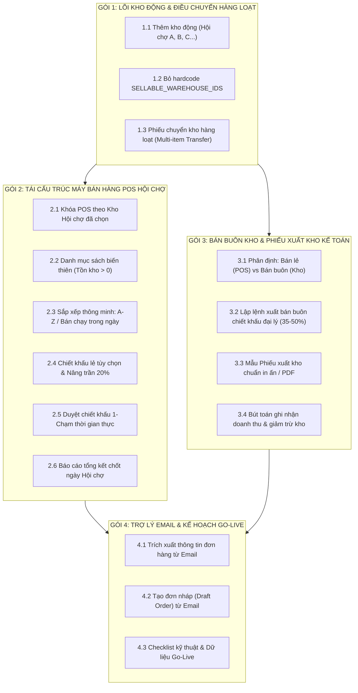
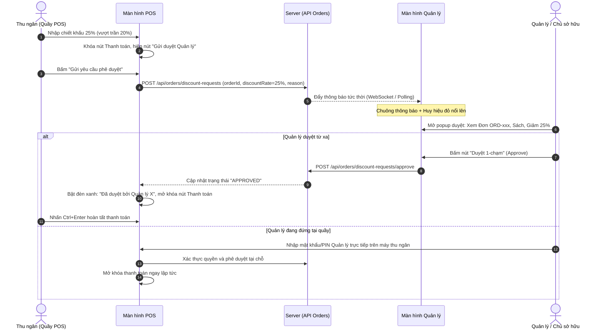

# ĐẶC TẢ THIẾT KẾ KỸ THUẬT & NGHIỆP VỤ HỆ THỐNG FORMAPUBLI OS
## Đợt Cải Tiến Lớn: POS Bán Lẻ Hội Chợ, Quản Trị Kho Động & Bán Buôn Phiếu Xuất Kho

- **Ngày ban hành:** 22/09/2026
- **Trạng thái:** DRAFT FOR TEAM REVIEW (Trình đội ngũ Kỹ sư / Coder họp triển khai)
- **Kiến trúc áp dụng:** Next.js 14 App Router + Drizzle ORM + SQLite (LibSQL / Cloudflare D1) + Tailwind CSS + WebSockets/SSE Polling Fallback

---

## 1. BỐI CẢNH & MỤC TIÊU CẢI TỔ

Sau đợt tổng duyệt vận hành thực tế (Big Review), hệ thống Formapubli OS cần định vị lại ranh giới giữa 3 phân hệ cốt lõi:
1. **POS Bán Lẻ (Quầy Hội Chợ & Cửa Hàng):** Tối ưu tốc độ, linh hoạt theo từng kho hội chợ, hiển thị danh mục theo kho, kiểm soát chiết khấu thông minh per-order, chốt ca cuối ngày đầy đủ.
2. **Quản Trị Kho Hàng (Kho Chính & Kho Vệ Tinh):** Bỏ giới hạn cứng 3 kho, cho phép tạo kho hội chợ động, điều chuyển hàng loạt nhiều đầu sách trong một chứng từ.
3. **Bán Buôn Đại Lý & Phiếu Xuất Kho:** Tách biệt hoàn toàn khỏi POS bán lẻ, quản lý xuất bán buôn tập trung tại phân hệ Kho, xuất phiếu giao nhận hàng (Delivery Order) chuẩn kế toán và ghi nhận doanh thu/công nợ chính thức.
4. **Trợ lý Email & Chuẩn bị Go-live:** Lên đơn tự động từ nội dung email và chuẩn hóa danh mục, dữ liệu trước khi vận hành thực tế.

---

## 2. PHÂN RÃ 4 GÓI CÔNG VIỆC CHÍNH (SYSTEM DECOMPOSITION)



---

## 3. CHI TIẾT KỸ THUẬT TỪNG PHÂN HỆ

### GÓI 1: LÕI KHO ĐỘNG & ĐIỀU CHUYỂN HÀNG LOẠT (WAREHOUSE REFACTOR)

#### 1.1 Thêm kho mới linh hoạt (Dynamic Warehouses)
- **Hiện trạng:** Hệ thống đang cố định 3 kho: Âu Cơ (`wh-au-co`), Quỳnh Mai (`wh-quynh-mai`), Dự phòng (`wh-du-phong`). Bảng `StockOverviewMatrix` và `order.service.ts` đang hardcode logic theo 3 mã này.
- **Giải pháp:**
  - Bổ sung UI modal *"Thêm kho mới"* tại màn hình Quản lý Kho (`WarehouseManagement` / `StockOverviewMatrix`).
  - Thêm trường `warehouse_type` vào bảng `warehouses`: `PHYSICAL_MAIN` (Kho chính), `FAIR_EVENT` (Kho hội chợ sự kiện), `CONSIGNMENT` (Kho ký gửi đại lý), `IN_TRANSIT` (Kho trung chuyển).
  - API `POST /api/warehouses`: Tạo kho mới, tự động khởi tạo bản ghi trong bảng cân đối tồn kho `stock_balances` cho các đầu sách với số lượng 0.

#### 1.2 Bỏ hardcode `SELLABLE_WAREHOUSE_IDS`
- **Hiện trạng:** `export const SELLABLE_WAREHOUSE_IDS = ['wh-au-co', 'wh-quynh-mai', 'wh-du-phong']` trong `src/services/order.service.ts`.
- **Giải pháp:**
  - Thay đổi quy tắc kiểm tra kho được phép bán: Mọi kho có `is_active = true` và `warehouse_type IN ('PHYSICAL_MAIN', 'FAIR_EVENT')` đều được phép bán lẻ trên POS.
  - Loại trừ kho ảo ký gửi hoặc trung chuyển (`CONSIGNMENT`, `IN_TRANSIT`).

#### 1.3 Chức năng Điều chuyển hàng loạt nhiều đầu sách (Multi-Item Stock Transfer)
- **Hiện trạng:** `InventoryService.transfer` và `StockMovementModal` chỉ cho phép chuyển từng cuốn một (`editionId`, `quantity`). Khi chuẩn bị 40 đầu sách cho Hội chợ A, nhân viên phải thao tác 40 lần.
- **Giải pháp thiết kế:**
  - Nâng cấp API `POST /api/inventory/transfer-batch`:
    ```json
    {
      "fromWarehouseId": "wh-au-co",
      "toWarehouseId": "wh-hoi-cho-a",
      "documentRef": "PCK-HC-20260922-01",
      "note": "Xuất kho sách tham gia Hội chợ Sách Quốc tế",
      "items": [
        { "editionId": "ed-h01", "quantity": 50 },
        { "editionId": "ed-h21", "quantity": 30 },
        { "editionId": "ed-h36", "quantity": 40 }
      ]
    }
    ```
  - **Tính toàn vẹn dữ liệu (Atomic Transaction):** Toàn bộ danh sách sách chuyển kho được thực thi trong một `db.transaction()` duy nhất. Nếu bất kỳ đầu sách nào không đủ số dư tồn khả dụng (ATP) tại kho nguồn, toàn bộ giao dịch bị hủy bỏ (Rollback 100%), không gây ra tình trạng xuất dở dang.
  - Giao diện `MultiItemTransferModal`: Cho phép tìm nhanh sách bằng barcode/tên, nhập số lượng dạng bảng, kiểm tra tức thời số dư tồn kho nguồn trước khi bấm *"Xác nhận chuyển kho"*.

---

### GÓI 2: TÁI CẤU TRÚC MÁY BÁN HÀNG POS HỘI CHỢ (POS RETAIL REDESIGN)

#### 2.1 Định vị Quầy POS theo Kho Hội Chợ
- Khi thu ngân bắt đầu ca làm việc (hoặc mở quầy POS), hệ thống yêu cầu chọn **Kho làm việc** (Ví dụ: `Kho Hội chợ A`).
- Khóa cứng phạm vi bán hàng: Mọi giao dịch tạo ra từ quầy này sẽ tự động gắn `warehouseId = 'wh-hoi-cho-a'` và `channel = 'FAIR_EVENT'`. Thu ngân không thể vô tình bán nhầm sang sách của kho khác.

#### 2.2 Danh mục sách biến thiên thông minh (Dynamic Catalog Filter)
- **Hiện trạng:** POS nạp toàn bộ danh mục 81 đầu sách của công ty, dù kho hội chợ chỉ mang đi 20 đầu sách. Nhân viên tìm sách rất dễ nhầm và danh sách hiển thị dài lê thê.
- **Giải pháp:**
  - Bộ lọc thông minh: `books.filter(book => book.stockInSelectedWarehouse > 0)`.
  - Tùy chọn bật/tắt: Mặc định bật chế độ *"Chỉ hiển thị sách có hàng tại kho này"*, có nút gạt *"Hiện tất cả"* khi cần tra cứu thông tin sách khác để tư vấn cho khách.

#### 2.3 Sắp xếp sản phẩm thông minh (Intelligent Sorting)
- Bổ sung thanh công cụ sắp xếp nhanh ngay trên danh mục sản phẩm:
  1. **Theo Tên (A → Z)**: Thuận tiện tìm nhanh theo bảng chữ cái.
  2. **Bán chạy nhất trong ngày (Top Sellers Today)**: Tự động đưa các đầu sách có số lượng bán ra nhiều nhất trong ca/ngày hôm đó lên đầu danh sách. Thu ngân bấm 1 chạm thêm vào giỏ hàng siêu tốc.
  3. **Theo Mã SKU / Năm xuất bản**: Trật tự mặc định của danh mục gốc.

#### 2.4 Chiết khấu linh hoạt & Nâng trần hạn mức Thu ngân
- **Nâng trần chiết khấu thu ngân từ 15% lên 20%**: Thu ngân toàn quyền áp dụng mọi mức chiết khấu từ `0%` đến `20%` mà không cần quản lý phê duyệt.
- **Ô nhập phần trăm chiết khấu tự do (Custom Discount Input)**:
  - Bên cạnh các nút chọn nhanh (0%, 5%, 10%, 15%, 20%), bổ sung ô nhập số lẻ tự do: Nhân viên gõ `21`, `22`, `25`... hệ thống tự động tính lại tiền hàng.
  - Nếu số nhập vào `<= 20%`: Tự động duyệt và cho phép thanh toán ngay.
  - Nếu số nhập vào `> 20%`: Kích hoạt cơ chế *"Yêu cầu Quản lý phê duyệt"*.

#### 2.5 Cơ chế Duyệt Chiết Khấu 1-Chạm Thời Gian Thực (Single-Touch Approval Workflow)



- **Quy trình hoạt động:**
  1. Khi chiết khấu > 20%, POS tạo 1 yêu cầu duyệt gắn với đơn hàng tạm thời (`PENDING_DISCOUNT_APPROVAL`).
  2. Quản lý nhận thông báo trên thiết bị cá nhân (điện thoại, tablet, laptop) hiển thị tóm tắt:
     > *"Đơn hàng #ORD-089 (Thu ngân Lan Anh) xin chiết khấu 25% (Tổng bìa: 800.000đ → Giảm: 200.000đ → Thu: 600.000đ). Lý do: Khách quen mua trọn bộ."*
  3. Quản lý chỉ cần ấn **"DUYỆT"** (1 chạm duy nhất).
  4. Màn hình POS của thu ngân tự động lắng nghe (SSE / Polling 2 giây), lập tức chuyển sang trạng thái: **"Đã được Quản lý [Tên] phê duyệt"**, mở khóa nút thanh toán `Ctrl + Enter`.
  5. **Dự phòng tại quầy:** Nếu Quản lý đang đứng ngay cạnh quầy thu ngân, có nút *"Quản lý duyệt tại chỗ"*: Quản lý gõ mật khẩu quản lý của mình vào máy thu ngân để duyệt ngay trong 3 giây.
  6. **Tính bảo mật:** Không còn mã PIN tĩnh dùng chung lưu trên máy; mỗi lần duyệt được gắn với đúng mã đơn hàng và lưu vết trong `audit_logs`.

#### 2.6 Bảng Tổng Kết & Báo Cáo Doanh Thu Cuối Ngày Hội Chợ (Daily Fair Settlement Report)
- Khi kết thúc ngày bán hàng tại hội chợ, thu ngân bấm nút *"Báo cáo chốt ngày hội chợ"*:
  - **Doanh thu thực thu:** Tổng tiền thực nhận sau chiết khấu.
  - **Cơ cấu thanh toán:** Tiền mặt (đối chiếu két tiền), Chuyển khoản QR (đối chiếu ngân hàng).
  - **Chi tiết đầu sách bán ra:** Bảng kê từng mã sách, tên sách, số lượng bán trong ngày, đơn giá, tổng tiền.
  - **Tổng chiết khấu đã cấp:** Thống kê tổng số tiền giảm giá và các đơn được duyệt chiết khấu đặc biệt.
  - **Bảng tồn kho còn lại của Kho Hội chợ:** Thống kê số lượng sách còn lại trên kệ để đóng thùng kiểm đếm hoặc nhập hoàn kho chính.
  - **In ấn & Xuất file:** Xuất báo cáo ra định dạng in nhiệt K80 hoặc file PDF/Excel gửi ban lãnh đạo.

---

### GÓI 3: BÁN BUÔN KHO, PHIẾU XUẤT KHO KẾ TOÁN & DOANH THU (WHOLESALE & DISPATCH)

#### 3.1 Phân định ranh giới Bán lẻ vs Bán buôn
- **Quầy POS:** Chỉ phục vụ bán lẻ (khách cá nhân, độc giả hội chợ, đơn lẻ online). Mức chiết khấu thông thường 0-20% (ngoại lệ duyệt tới 30%).
- **Phân hệ Quản Lý Kho:** Chuyên trách xử lý Bán buôn / Đại lý phát hành (chiết khấu 35% - 50%, số lượng lớn hàng trăm cuốn).

#### 3.2 Quy trình Lập Lệnh Xuất Bán Buôn & Phiếu Xuất Kho (Delivery Order)
1. **Lập đơn xuất buôn:**
   - Chọn Đối tác / Đại lý (liên kết bảng `partners`, ví dụ: Nhà sách Đinh Lễ, Fahasa, Tiệm sách Nhã Nam).
   - Chọn Kho xuất hàng (Kho Âu Cơ hoặc Quỳnh Mai).
   - Chọn danh sách đầu sách và số lượng sỉ.
   - Áp dụng tỷ lệ chiết khấu hợp đồng đại lý (ví dụ: 40%).
2. **Xuất Phiếu Xuất Kho chuẩn kế toán:**
   - Hệ thống sinh mã chứng từ: `PXK-YYYYMMDD-XXXX`.
   - Mẫu in A4/A5 tiêu chuẩn gồm các trường:
     - Đơn vị xuất hàng (Formapubli).
     - Đơn vị nhận hàng (Tên đại lý, địa chỉ, người liên hệ, SĐT).
     - Bảng kê chi tiết: STT, Mã SKU, Tên sách, Tác giả, ĐVT, Số lượng, Giá bìa, Tỷ lệ CK, Đơn giá sau CK, Thành tiền.
     - Tổng cộng tiền hàng bằng số và bằng chữ.
     - 4 chữ ký bắt buộc: Người lập phiếu, Thủ kho xuất, Người giao hàng, Người nhận hàng (Đại lý).
3. **Ghi nhận Doanh thu & Thẻ kho:**
   - Tự động ghi nhận xuất kho trong `inventory_ledger` với `eventType = 'DISPATCH_SALE'`.
   - Ghi nhận đơn hàng bán buôn vào sổ cái doanh thu bán sỉ (`fiscalScope = 'OFFICIAL_TAX'` hoặc `'INTERNAL_MANAGEMENT'`).
   - Cập nhật công nợ đại lý (nếu thanh toán sau / công nợ 30 ngày).

---

### GÓI 4: TRỢ LÝ EMAIL (SMART EMAIL INGESTION) & KẾ HOẠCH GO-LIVE

#### 4.1 Cơ chế Nhận Đơn Hàng Qua Email (Email Smart Order Ingestion)
- **Cơ chế thu thập:**
  - Tích hợp Webhook hoặc tác vụ định kỳ đọc hòm thư tiếp nhận đơn hàng (ví dụ: `orders@formapubli.com`).
  - Hỗ trợ nhân viên dán trực tiếp nội dung email đơn hàng vào ô *"Trợ lý nhận đơn Email"* (tương tự như công cụ `SmartOrderParser` hiện có).
- **Thuật toán xử lý nội dung email (Parser Engine):**
  - Tự động tách: Tên khách hàng, Số điện thoại, Địa chỉ giao hàng, Ghi chú giao hàng.
  - Nhận diện tên sách theo thuật toán bỏ dấu tiếng Việt và ngữ âm (`matchesVietnameseSearch`).
  - Nhận diện số lượng sách theo cú pháp: "2 cuốn Bệnh tưởng", "1 bộ Baudelaire", "x3 H01".
  - Tự động tạo **Đơn nháp (Draft Order)** để nhân viên kiểm tra lại và ấn nút *"Xác nhận lên đơn"* chỉ với 1 click.

#### 4.2 Kế hoạch Kiểm Thử & Chuẩn Bị Go-Live (Go-Live Readiness Checklist)
1. **Kiểm thử dữ liệu:**
   - Chạy kịch bản kiểm thử tự động toàn diện: Luồng chuyển kho nhiều sách, luồng bán lẻ POS trừ kho chuẩn 100%, luồng duyệt chiết khấu 1-chạm.
2. **Kiểm tra chịu tải & mất mạng (Offline Resilience):**
   - Đảm bảo quầy POS tại hội chợ khi mất mạng vẫn lưu đơn vào IndexedDB và đồng bộ an toàn ngay khi có kết nối trở lại.
3. **Phân quyền người dùng (RBAC):**
   - Kiểm tra chặt chẽ: Thu ngân chỉ thấy kho của mình, không xem được báo cáo doanh thu tổng; Quản lý duyệt được chiết khấu; Kế toán xem đầy đủ phiếu xuất kho.
4. **Bàn giao vận hành:**
   - Cung cấp tài liệu hướng dẫn 1 trang tóm tắt (Cheatsheet) cho thu ngân hội chợ và quản lý gian hàng.

---

## 4. KẾ HOẠCH THI CÔNG & PHÂN CÔNG CODER (SPRINT ROADMAP)

| Bước | Nhiệm vụ kỹ thuật | Đầu ra cụ thể (Deliverables) |
| :---: | :--- | :--- |
| **Giai đoạn 1** | **Backend Kho Động & Chuyển Kho Hàng Loạt** | - Bổ sung bảng/cột `warehouse_type`<br/>- Bỏ hardcode `SELLABLE_WAREHOUSE_IDS`<br/>- API `POST /api/inventory/transfer-batch` chạy transaction an toàn<br/>- Modal chuyển nhiều đầu sách trên UI |
| **Giai đoạn 2** | **Tái Cấu Trúc Giao Diện & Logic Bán Hàng POS** | - Selector chọn kho ca làm việc<br/>- Danh mục lọc sách tồn > 0<br/>- Bộ lọc sắp xếp A-Z / Bán chạy trong ngày<br/>- Ô nhập chiết khấu lẻ tự do |
| **Giai đoạn 3** | **Cơ Chế Phê Duyệt Chiết Khấu 1-Chạm & Báo Cáo Ngày** | - Bảng lưu yêu cầu duyệt `discount_approval_requests`<br/>- Giao diện duyệt 1-chạm cho Quản lý (Web & Mobile)<br/>- Lắng nghe cập nhật real-time trên POS<br/>- Bảng tổng kết & In báo cáo chốt ngày hội chợ |
| **Giai đoạn 4** | **Phân Hệ Bán Buôn & Phiếu Xuất Kho Kế Toán** | - Giao diện lập lệnh xuất bán sỉ đại lý trong Quản lý Kho<br/>- Template in Phiếu xuất kho chuẩn A4/A5<br/>- Bút toán ghi nhận doanh thu xuất buôn |
| **Giai đoạn 5** | **Trợ Lý Đơn Email & Tổng Duyệt Go-Live** | - Smart Email Order Parser tạo đơn nháp<br/>- Chạy toàn bộ Test Suite & Hướng dẫn sử dụng quầy |

---
*Tài liệu được chuẩn bị để làm việc trực tiếp cùng đội ngũ kỹ thuật trong buổi họp lập trình.*
