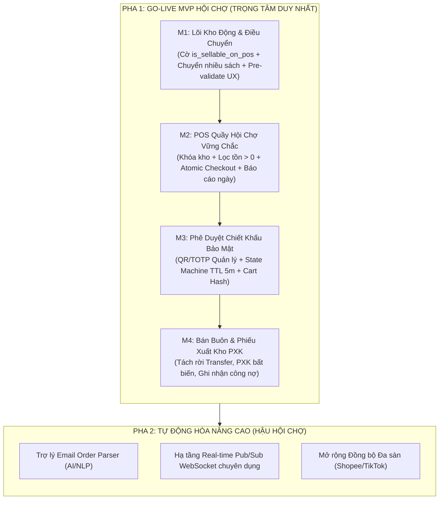
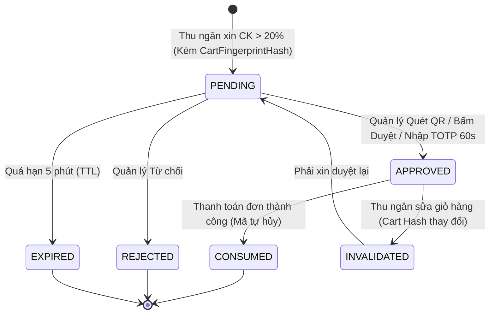

# ĐẶC TẢ THIẾT KẾ KỸ THUẬT & KIẾN TRÚC FORMAPUBLI OS (BẢN V2 ĐÃ TIẾP THU PHẢN BIỆN)
## Tối Ưu Hóa Vận Hành Hội Chợ, Quản Trị Kho Động & Phân Hệ Phiếu Xuất Kho

- **Ngày ban hành:** 22/09/2026 (Cập nhật phiên bản V2 sau phản biện chuyên gia)
- **Trạng thái:** APPROVED SPEC FOR IMPLEMENTATION
- **Đối tượng:** Đội ngũ Lập trình viên, Kỹ sư CSDL, Kế toán trưởng & Quản lý vận hành

---

## 1. TỔNG QUAN ĐÁNH GIÁ PHẢN BIỆN TỪ CHUYÊN GIA

Toàn bộ 7 điểm phản biện của Chuyên gia A là **hoàn toàn chính xác, sắc bén và phản ánh đúng thực tế vận hành khắc nghiệt tại hội chợ**. 

Hệ thống ghi nhận và tiếp thu 100% các điều chỉnh kỹ thuật sau:
1. **Cắt giảm Scope thực tế:** Tách Email Parser và WebSocket phức tạp sang Pha 2. Đợt Go-Live MVP tập trung 100% vào: **Kho động + POS Quầy Hội Chợ + Bán buôn Phiếu Xuất Kho (PXK)**.
2. **Sửa UX Chuyển kho:** Xóa bỏ cơ chế "Rollback 100% khi thiếu 1 cuốn". Thay bằng **Kiểm tra trước (Pre-validation) + Highlight đỏ dòng thiếu + 1-Click tự điều chỉnh về tồn tối đa hoặc tách phiếu**.
3. **Chuẩn hóa State Machine cho Duyệt Chiết Khấu:** Bổ sung `orderFingerprintHash` (chống sửa đơn sau khi duyệt), cơ chế khóa Idempotent, TTL 5 phút tự hủy và chống spam DB SQLite/Cloudflare D1.
4. **Xóa bỏ triệt để lỗ hổng Shoulder-Surfing:** Tuyệt đối cấm Quản lý gõ mật khẩu lên máy thu ngân. Thay bằng **Quét mã QR 1-chạm từ điện thoại Quản lý** hoặc **Mã Token động TOTP 60 giây**.
5. **Thiết kế CSDL chuẩn mực:** Thay vì gán cứng enum trong code, bổ sung cờ tường minh `is_sellable_on_pos` trên bảng `warehouses`.
6. **Rạch ròi Kế toán:** Tách biệt tuyệt đối giữa **TRANSFER** (luân chuyển nội bộ, doanh thu = 0, thuế = 0) và **DISPATCH_SALE** (xuất bán buôn, ghi nhận doanh thu, công nợ). Phiếu xuất kho (PXK) đánh số liên tục không nhảy cóc và bất biến (Immutable) sau khi ký.
7. **Bảo vệ Concurrency & Quản trị Margin:** Trừ kho nguyên tử với Optimistic Locking tại thời điểm Checkout để chống Oversell khi nhiều quầy cùng bán cuốn cuối; thêm Dashboard giám sát biên lợi nhuận ca.

---

## 2. PHÂN KỲ TRIỂN KHAI THỰC TẾ (PHASED ROADMAP)



---

## 3. THIẾT KẾ KỸ THUẬT CHI TIẾT (BẢN V2)

### 3.1 CƠ SỞ DỮ LIỆU: BỎ HẾT MỌI HARDCODE

#### Bảng `warehouses`:
```sql
ALTER TABLE warehouses ADD COLUMN is_sellable_on_pos INTEGER NOT NULL DEFAULT 0;
ALTER TABLE warehouses ADD COLUMN warehouse_type TEXT NOT NULL DEFAULT 'PHYSICAL_MAIN'; 
-- warehouse_type: PHYSICAL_MAIN, FAIR_EVENT, CONSIGNMENT, IN_TRANSIT
```
*Nguyên tắc:* POS chỉ hiển thị và cho phép chọn các kho có `is_active = 1` VÀ `is_sellable_on_pos = 1`. Quản lý bật/tắt quyền bán của bất kỳ kho nào (kể cả kho ký gửi nếu sau này muốn bán thử) ngay trên bảng Cài Đặt Kho, **0 dòng code nào bị hardcode lại**.

---

### 3.2 ĐIỀU CHUYỂN NHIỀU SÁCH: UX THỰC TẾ CHO THỦ KHO

#### Quy trình xử lý lỗi tồn kho (Partial & Edit-in-Place):
1. Khi thủ kho chọn 40 đầu sách và bấm *"Kiểm tra tồn kho"*:
   - Hệ thống thực hiện snapshot kiểm tra ATP (Available to Promise) tại kho nguồn.
2. Nếu có 3 đầu sách bị thiếu số lượng:
   - **Giao diện KHÔNG xóa dữ liệu:** Giữ nguyên toàn bộ 40 dòng đã nhập.
   - Dòng thiếu chuyển sang nền đỏ cảnh báo: `"Cần chuyển 50, tồn kho Âu Cơ chỉ còn 32"`.
   - Cung cấp 2 nút bấm thao tác nhanh 1-chạm:
     - **"Hạ về tồn tối đa" (Cap to Max):** Tự động sửa số lượng của các dòng thiếu về đúng số tồn hiện có (ví dụ từ 50 thành 32).
     - **"Tách các dòng thiếu sang đợt sau":** Giữ lại các dòng đủ để chuyển ngay thành Phiếu 1, chuyển các dòng thiếu vào Phiếu nháp 2.
3. Khi bấm *"Xác nhận chuyển kho"*, API `POST /api/inventory/transfer-batch` thực thi trong `db.transaction()` đảm bảo tính nguyên tử: hoặc thành công 100% danh sách đã xác nhận, hoặc trả về lỗi có cấu trúc.

---

### 3.3 MÁY BÁN HÀNG POS: CHỐNG OVERSELL & BẢO VỆ DOANH THU

1. **Khóa kho làm việc theo ca:** Khi mở quầy, thu ngân chọn kho (ví dụ: `Kho Hội Chợ A`). Mọi đơn hàng sinh ra đều gắn chặt với kho này.
2. **Danh mục biến thiên:**
   - Mặc định chỉ hiển thị sách có `physicalQuantity > 0` tại kho đã chọn.
   - Bổ sung bộ lọc sắp xếp:
     - `A → Z` (theo tên sách).
     - `Bán chạy trong ngày` (lấy từ aggregate đơn `COMPLETED` trong ngày của kho đó).
3. **Bảo vệ Concurrency (Chống bán âm khi nhiều máy cùng checkout):**
   - Không phụ thuộc vào số hiển thị trên màn hình.
   - Tại thời điểm thu ngân ấn `Ctrl + Enter` thanh toán:
     - Backend mở transaction `IMMEDIATE`.
     - Kiểm tra lại tồn ATP ngay trong transaction với khóa `idempotencyKey`.
     - Nếu tồn không đủ (do quầy bên cạnh vừa bán trước 0.5s): Từ chối thanh toán với mã lỗi `INSUFFICIENT_STOCK_RACE`, trả về số lượng thực tế còn lại để thu ngân xử lý ngay tại quầy.

---

### 3.4 CƠ CHẾ DUYỆT CHIẾT KHẤU (>20%): BẢO MẬT & STATE MACHINE CHUẨN MỰC



#### Chi tiết thiết kế an toàn:
1. **Khóa vân tay giỏ hàng (`cartFingerprintHash`):**
   - `cartHash = sha256(items + subtotal + requestedDiscountRate)`.
   - Yêu cầu duyệt được gắn chặt với `cartHash`.
   - **Chống gian lận:** Nếu thu ngân sau khi được duyệt 25% lại tự ý thêm 1 cuốn sách đắt tiền vào giỏ, `cartHash` thay đổi ngay lập tức → Phiếu duyệt cũ trở thành `INVALIDATED`, bắt buộc phải xin duyệt lại từ đầu!
2. **State Machine rõ ràng:**
   - Hạn ngạch thời gian (TTL): 5 phút. Quá 5 phút tự động chuyển thành `EXPIRED`.
   - Duyệt idempotent: 2 quản lý cùng bấm duyệt thì chỉ ghi nhận 1 lần, lần sau trả về trạng thái hiện tại.
3. **Phương thức duyệt an toàn tuyệt đối (Nói KHÔNG với gõ password lên máy thu ngân):**
   - **Cách 1 (Từ xa / Quản lý có điện thoại):** Thu ngân bấm gửi duyệt, màn hình quản lý hiện popup có tóm tắt chi tiết, quản lý ấn "Chấp thuận". POS dùng polling có điều kiện (chỉ poll 3 giây/lần khi đang có modal xin duyệt, không spam DB thường trực).
   - **Cách 2 (Tại quầy / Siêu tốc):** Màn hình POS hiện **Mã QR của Đơn hàng**. Quản lý mở camera điện thoại quét mã QR -> app mở trang duyệt của Quản lý và ấn xác nhận. Hoặc Quản lý đọc **Mã TOTP 6 số (đổi mỗi 60 giây)** sinh ra từ ứng dụng cá nhân của Quản lý.

---

### 3.5 TÁCH RẠCH RÒI BÁN BUÔN (DISPATCH_SALE) VS LUÂN CHUYỂN NỘI BỘ (TRANSFER)

| Tiêu chí | Luân chuyển nội bộ (TRANSFER) | Xuất Bán Buôn Đại Lý (DISPATCH_SALE) |
| :--- | :--- | :--- |
| **Bản chất** | Chuyển hàng giữa các kho của công ty (Âu Cơ → Hội chợ) | Bán đứt/ký gửi cho đối tác (Đinh Lễ, Fahasa...) |
| **Ghi nhận Doanh thu** | **KHÔNG (0 VNĐ)** | **CÓ (Ghi nhận Doanh thu Bán Buôn)** |
| **Sổ cái Kho** | Cặp `TRANSFER_OUT` (-Qty) và `TRANSFER_IN` (+Qty) | `DISPATCH_SALE` (-Qty) |
| **Nghĩa vụ Thuế** | Không xuất hóa đơn VAT, chỉ có Phiếu điều chuyển nội bộ | Xuất hóa đơn VAT nếu đại lý yêu cầu (`OFFICIAL_TAX`) |
| **Chứng từ kế toán** | Phiếu điều chuyển kho (`PCK-xxx`) | **Phiếu Xuất Kho chuẩn (`PXK-YYYY-XXXX`)** |
| **Tính bất biến (Immutability)** | Hoàn thành khi cả 2 kho ký nhận | **Tuyệt đối bất biến sau khi ký duyệt** |

#### Quy tắc Phiếu Xuất Kho (PXK):
- Mã PXK tăng tuần tự liên tục theo năm: `PXK-2026-0001`, `PXK-2026-0002` (chống nhảy cóc số chứng từ kế toán).
- Sau khi Quản lý/Kế toán ký xác nhận, bản ghi chuyển sang trạng thái `LOCKED_IMMUTABLE`. Không ai (kể cả Admin) được sửa trực tiếp.
- Mọi điều chỉnh sau khi xuất hàng bắt buộc phải đi qua **Phiếu Nhập Hàng Trả Về (Return Voucher)** hoặc **Phiếu Điều Chỉnh Bổ Sung**, đảm bảo vẹn toàn lịch sử kiểm toán kế toán.

---

## 4. KẾ HOẠCH THỰC HIỆN MVP HỘI CHỢ (3 SPRINT TINH GỌN)

Thay vì dàn trải 5 Sprint ôm đồm cả NLP Email và WebSocket, chúng ta tập trung toàn lực vào **3 Sprint chất lượng cao**:

### 🎯 Sprint 1: Lõi Kho Động & Chuyển Hàng Loạt Chuẩn UX (3 ngày)
- Thêm cột `is_sellable_on_pos` và `warehouse_type` vào `warehouses`.
- Gỡ bỏ hoàn toàn `SELLABLE_WAREHOUSE_IDS` trong backend.
- API `POST /api/inventory/transfer-batch` hỗ trợ pre-validation, cảnh báo thiếu hàng, 1-click chỉnh số lượng.
- Test case: Chuyển 40 sách đồng thời, test xử lý khi 1 sách thiếu tồn, test đối soát thẻ kho 2 đầu.

### 🎯 Sprint 2: Tái Cấu Trúc POS Hội Chợ & Cơ Chế Duyệt Chiết Khấu An Toàn (3 - 4 ngày)
- Giao diện POS: Chọn kho bán làm việc, filter chỉ hiển thị sách có tồn > 0 tại kho đó.
- Sắp xếp A-Z & Sắp xếp theo sách bán chạy trong ngày.
- Nâng trần chiết khấu 20% + ô nhập số lẻ tự do.
- Xây dựng bảng `discount_approval_requests` với State Machine (`PENDING`, `APPROVED`, `REJECTED`, `EXPIRED`), TTL 5 phút, khóa theo `cartFingerprintHash`.
- Cơ chế duyệt: Quản lý duyệt 1-chạm qua web/mobile hoặc Quét QR tại quầy.
- Atomic guard chống oversell khi nhiều quầy checkout cùng lúc.

### 🎯 Sprint 3: Bán Buôn Kho, Phiếu Xuất Kho Bất Biến & Báo Cáo Chốt Ngày (3 ngày)
- Màn hình Lập đơn Bán buôn đại lý riêng biệt tại Quản lý Kho.
- Mẫu in Phiếu Xuất Kho (PXK) chuẩn A4/A5 (đánh số liên tục, mã QR xác thực, 4 chữ ký, khóa bất biến).
- Báo cáo chốt ngày hội chợ: Tổng doanh thu, tiền mặt, QR, thống kê sách bán, tồn mang về.
- Chạy toàn bộ Test Suite & Diễn tập quy trình quầy trước ngày ra quân hội chợ.

---
*Bản thiết kế V2 đã giải quyết triệt để toàn bộ 7 lỗ hổng do Chuyên gia A chỉ ra, đảm bảo tính thực chiến cao nhất và an toàn tuyệt đối cho hệ thống.*
