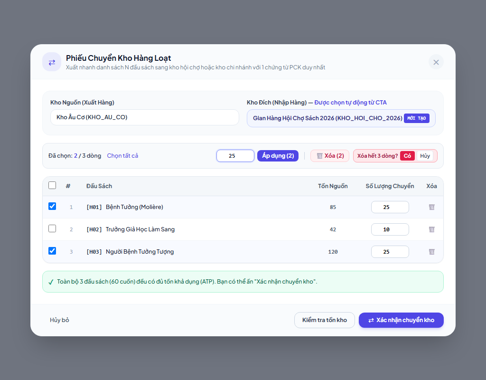
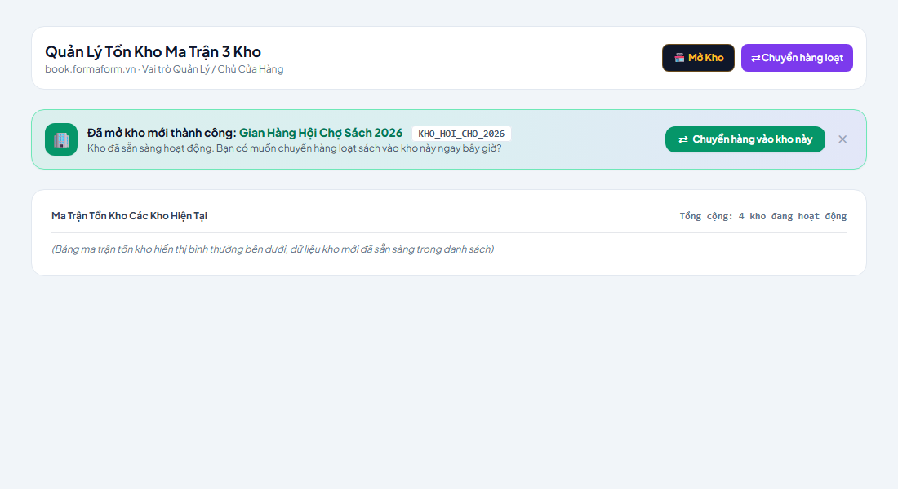

# Báo Cáo Nghiệm Thu Kỹ Thuật Wave 2 (Agent C)
**Tickets:** #5 (Chuyển kho hàng loạt — Thao tác bulk) & #10-CTA (Phản hồi sau tạo kho & CTA điều chuyển)

---

## 1. Tóm Tắt & Giải Quyết Phản Hồi [P1] và [P2] Của Agent A

| Phản hồi | Nguyên nhân gốc (Root Cause) | Giải pháp xử lý triệt để |
|---|---|---|
| **[P1] Kẹt `isValidating=true` khi sửa dữ liệu lúc đang kiểm tra tồn** | Khi sửa dòng, `validationRequestIdRef` tăng lên khiến `finally` bỏ qua `setIsValidating(false)`. Khi đóng/mở lại modal cũng không reset cờ này. | Tạo hàm `invalidateValidation()` dùng chung: lập tức gọi `validationAbortControllerRef.current?.abort()`, tăng `validationRequestId`, và **lập tức đặt `setIsValidating(false)` và `setValidationSuccess(null)`**. Trong `finally`, cờ `isValidating` luôn được hạ xuống `false`. Đóng modal (`!isOpen`) cũng tự động gọi `invalidateValidation()`. |
| **[P2] Đổi kho nguồn/đích không vô hiệu hóa request kiểm tra đang chạy** | Handler `onChange` của 2 thẻ `<select>` chọn kho trước đây chỉ gọi `setValidationSuccess(null)`, không tăng request ID và không abort request cũ. | Tích hợp gọi `invalidateValidation()` vào cả 2 sự kiện đổi `fromWarehouseId` và `toWarehouseId`. Request cũ lập tức bị abort và response cũ bị hủy bỏ hoàn toàn; modal không bao giờ nhận kết quả của kho cũ. |

---

## 2. Bảng Đối Soát Tính Năng Hoàn Chỉnh

| Hạng mục | Ticket #5 (Batch Transfer Bulk Edit) | Ticket #10-CTA (Warehouse Creation CTA) |
|---|---|---|
| **File thay đổi** | [BatchTransferModal.tsx](../../src/components/inventory/BatchTransferModal.tsx) | [StockOverviewMatrix.tsx](../../src/components/StockOverviewMatrix.tsx) |
| **Quyền / Server** | UI thuần túy — Không can thiệp API/Migration | UI thuần túy — Không reload toàn trang |
| **Trạng thái Type Check** | `tsc --noEmit` → **Exit code 0** (PASS) | `tsc --noEmit` → **Exit code 0** (PASS) |
| **Lifecycle & Contract Tests** | 9/9 test cases PASS ([smoke-batch-transfer-logic.ts](../../scripts/smoke-batch-transfer-logic.ts)) | Tích hợp trong contract test suite |
| **Ảnh chụp Headless Chrome** | [batch-transfer-bulk-ui.png](./batch-transfer-bulk-ui.png) | [warehouse-creation-cta-ui.png](./warehouse-creation-cta-ui.png) |

---

## 3. Chi Tiết Tính Năng

### Ticket #5: Thao tác hàng loạt trên Phiếu Chuyển Kho
1. **Hệ thống Checkbox & Tri-State Master Checkbox:**
   - Cột checkbox trên từng dòng sách và checkbox tổng ở header table.
   - Master checkbox tự động hiển thị trạng thái chọn một phần (**indeterminate**) qua `selectAllCheckboxRef.current.indeterminate = isSomeSelected`.
   - Đếm rõ ràng số lượng: `Đã chọn: X / Y dòng`.
2. **Thanh Thao Tác Hàng Loạt (Bulk Toolbar):**
   - Chỉ hiện khi có ít nhất 1 dòng trong danh sách.
   - **Áp dụng số lượng hàng loạt:**
     - Validate phòng thủ: chỉ nhận số nguyên dương hữu hạn (`val > 0 && Number.isInteger(val)`). Từ chối số âm, số 0, NaN, số thập phân.
     - Khóa nút "Áp dụng" (`disabled`) khi chưa chọn dòng nào.
     - Chỉ áp dụng lên các dòng được chọn trong `selectedIds`, không chạm vào dòng chưa chọn.
   - **Xóa dòng đã chọn:** Xóa chính xác các dòng được chọn, tự động dọn dẹp `selectedIds`.
   - **Xóa tất cả có xác nhận an toàn:** Hiển thị khối xác nhận inline `[Có] [Hủy]` trước khi dọn sạch giỏ để tránh bấm nhầm khi danh sách dài (chỉ dọn giỏ chuyển kho, không xóa sản phẩm hệ thống).
3. **Quy Tắc Chống Lỗi TOCTOU / Anti-Stale Validation & Hủy Request:**
   - Mọi thao tác sửa đổi dòng (đổi SL từng dòng, đổi SL hàng loạt, thêm sách, xóa dòng, đổi kho nguồn/đích) đều tự động gọi `invalidateValidation()`:
     - Abort in-flight fetch qua `AbortController`.
     - Reset `isValidating = false` ngay lập tức (không kẹt nút).
     - Reset `validationSuccess = null`.
     - Tăng counter `validationRequestIdRef.current++` để hủy hiệu lực mọi response về muộn.
   - Nút **"Xác nhận chuyển kho"** bị vô hiệu hóa (`disabled`) trừ khi `validationSuccess === true` và `lines.length > 0`.
4. **Hạ về tồn tối đa (1-Chạm) Chuẩn Spec:**
   - Khi gặp sách có tồn khả dụng $\le 0$, hệ thống tự động loại bỏ dòng khỏi danh sách (không nâng $0$ lên $1$).
   - Thông báo rõ ràng: `"Đã hạ số lượng về tồn tối đa và tự động loại bỏ X đầu sách có tồn khả dụng bằng 0."`
5. **Idempotency Key Bất Biến Khi Retry:**
   - Tính toán fingerprint của payload: `fromWarehouseId + toWarehouseId + note + items`.
   - Nếu submit lỗi mạng / retry với cùng payload, hệ thống tái sử dụng chính xác `Idempotency-Key` cũ, ngăn chặn việc tạo trùng 2 phiếu PCK trên server.
   - Khi có bất kỳ thay đổi nào trong payload, hệ thống tự động sinh `Idempotency-Key` mới (`UUIDv7`).

---

### Ticket #10-CTA: Banner & Nút CTA Sau Khi Mở Kho
1. **Phản hồi tức thì không gián đoạn:**
   - Thay vì gọi `window.location.reload()` (làm mất toàn bộ UI state), `StockOverviewMatrix` cập nhật danh sách kho cục bộ `localWarehouses` và kích hoạt `createdWarehouseToast`.
2. **Banner Thông Báo Nổi Bật:**
   - Hiển thị tên kho mới, mã kho trong thẻ font-mono, và câu thông báo sẵn sàng điều chuyển.
   - Nút đóng `✕` cho phép bỏ qua nếu không muốn điều chuyển ngay.
3. **Nút CTA "Chuyển hàng vào kho này":**
   - Bấm nút CTA sẽ:
     - Tự động đặt `presetTargetWarehouseId` bằng ID kho vừa tạo.
     - Mở ngay `BatchTransferModal`.
     - `BatchTransferModal` tự động chọn kho đích là kho mới tạo, đồng thời tự động kiểm tra và chọn kho nguồn khác với kho đích (tránh lỗi cùng kho).

---

## 4. Hình Ảnh Minh Họa Thực Tế (Headless Chrome)

### Giao Diện Phiếu Chuyển Kho Hàng Loạt (#5)


### Giao Diện Banner Tạo Kho & CTA Điều Chuyển (#10-CTA)


---

## 5. Kết Quả Kiểm Thử (9/9 Lifecycle & Contract Tests)

```text
--- Test P1: Mutation During Validation Never Leaves Modal Locked ---
✓ [P1] PASS: No stuck validating state, stale response dropped.
--- Test P2: Warehouse Change Invalidate In-Flight Request ---
✓ [P2] PASS: Warehouse change strictly invalidates in-flight validation.
--- Test P3: Modal Close Aborts & Unlocks State ---
✓ [P3] PASS: Modal close cleanly aborts and unlocks.
--- Test P4: Bulk Quantity Validation ---
✓ [P4] PASS: Bulk quantity validation.
--- Test P5: Tri-State Selection ---
✓ [P5] PASS: Tri-State selection logic.
--- Test P6: Bulk Actions (Apply Qty, Delete Selected) ---
✓ [P6] PASS: Bulk actions.
--- Test P7: Cap to Max with 0 Stock ---
✓ [P7] PASS: Cap to Max with 0 stock removes item.
--- Test P8: Idempotency Key Stability & Reset on Edit ---
✓ [P8] PASS: Idempotency fingerprint stability.
--- Test P9: Target Warehouse Preset (#10-CTA) ---
✓ [P9] PASS: Target warehouse preset & collision avoidance.

========================================
>>> ALL 9 LIFECYCLE & CONTRACT TESTS PASSED! <<<
========================================
```
